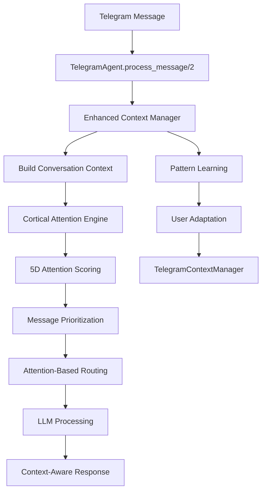

# Cortical Attention Integration with Telegram Bot

## Overview

The VSM Telegram Bot features advanced cortical attention processing that mimics neural attention mechanisms to intelligently prioritize and route messages. This integration ensures optimal resource allocation and context-aware response generation.

## Architecture Overview



## Core Components Integration

### 1. TelegramAgent Message Flow

Located in: `lib/vsm_phoenix/system1/agents/telegram_agent.ex:860-890`

```elixir
# Enhanced message context with conversation history
message_context = %{
  source: "telegram",
  chat_id: chat_id,
  user: from,
  message_type: classify_message_type(message),
  timestamp: DateTime.utc_now(),
  conversation_history: get_enhanced_conversation_state(chat_id, state)
}

# Score attention using cortical engine
{:ok, attention_score, score_components} = CorticalAttentionEngine.score_attention(
  message, 
  message_context
)
```

### 2. Enhanced Context Manager

Located in: `lib/vsm_phoenix/system1/agents/telegram_context_manager.ex`

**Key Functions:**

#### `build_conversation_context/2`
Constructs comprehensive conversation context including:
- Message history with enhanced metadata
- Topic continuity analysis
- User intent pattern detection
- Conversation coherence metrics
- Temporal interaction patterns

#### `update_conversation_context/4`
Updates context with pattern learning:
- User behavior analysis
- Emotional tone detection
- Complexity assessment
- Adaptation feedback generation

### 3. Cortical Attention Engine Enhancement

Located in: `lib/vsm_phoenix/system2/cortical_attention_engine.ex:316-354`

#### Enhanced Relevance Calculation

The attention engine now includes conversation continuity in relevance scoring:

```elixir
# NEW: Calculate conversation continuity relevance from TelegramContextManager
conversation_relevance = case context[:conversation_history] do
  %{context: %{semantic_continuity: semantic_continuity, conversation_coherence: coherence}} ->
    # Boost relevance based on conversation continuity and coherence
    base_continuity = (semantic_continuity || 0.5) * 0.3
    coherence_boost = (coherence || 0.5) * 0.2
    base_continuity + coherence_boost
  
  %{messages: messages} when length(messages) > 0 ->
    # Fallback: simple message history relevance
    min(0.4, length(messages) * 0.05)
  
  _ ->
    0.0
end
```

## 5-Dimensional Attention Scoring

### Scoring Components

1. **Novelty** (0.0-1.0)
   - Content uniqueness
   - Pattern deviation detection
   - New information identification

2. **Urgency** (0.0-1.0)
   - Time-sensitive keyword detection
   - Context-based priority assessment
   - Emergency signal identification

3. **Relevance** (0.0-1.0) - **ENHANCED**
   - Context memory patterns
   - Current focus similarity
   - **NEW: Conversation continuity integration**
   - **NEW: Semantic continuity boosting (30% weight)**
   - **NEW: Coherence factor (20% weight)**

4. **Intensity** (0.0-1.0)
   - Message volume and repetition
   - Source authority level
   - Content complexity

5. **Coherence** (0.0-1.0)
   - Learned pattern matching
   - Consistency with established behaviors
   - Structural coherence assessment

### Enhanced Relevance Logic

The relevance calculation now provides significant boosts for conversation continuity:

- **High Continuity Boost**: Messages with >30% conversation relevance get +20% attention score
- **Semantic Integration**: Semantic continuity weighted at 30% of relevance score
- **Coherence Factor**: Conversation coherence contributes 20% to relevance
- **Fallback Mechanisms**: Simple history-based relevance for basic cases

## Message Prioritization System

### Priority Levels

Based on final attention scores:

- **Critical** (0.9+): Emergency situations, system failures
- **High** (0.7-0.89): Important requests, admin commands, high-continuity conversations
- **Normal** (0.4-0.69): Regular conversation, information requests
- **Low** (0.0-0.39): Social messages, simple acknowledgments

### Priority-Based Processing

Located in: `lib/vsm_phoenix/system1/agents/telegram_agent.ex:3142-3210`

```elixir
case priority do
  :critical ->
    # Immediate processing with high resource allocation
    process_with_maximum_resources(message, state)
    
  :high ->
    # Expedited processing with enhanced context
    process_with_enhanced_context(message, state)
    
  :normal ->
    # Standard processing with full context
    process_with_standard_resources(message, state)
    
  :low ->
    # Efficient processing, possible batching
    process_with_minimal_resources(message, state)
end
```

## Conversation Context Enhancement

### Context Structure

The enhanced conversation state includes:

```elixir
%{
  messages: enhanced_context.history,
  context: %{
    topic: enhanced_context.current_topic,
    intent_pattern: enhanced_context.detected_intent,
    user_engagement: enhanced_context.user_engagement_level,
    conversation_coherence: enhanced_context.conversation_coherence,
    semantic_continuity: enhanced_context.semantic_continuity,
    temporal_patterns: enhanced_context.temporal_patterns,
    last_interaction: enhanced_context.last_message_time
  }
}
```

### Context Integration Points

1. **LLM Requests**: Full enhanced context sent to language models
2. **Attention Scoring**: Context influences relevance calculations
3. **Response Generation**: Context-aware response tailoring
4. **Pattern Learning**: Continuous adaptation based on context patterns

## Pattern Learning & Adaptation

### User Pattern Analysis

The system learns from user interactions:

- **Communication Patterns**: Preferred response styles and complexity
- **Temporal Behavior**: Activity patterns and response timing
- **Topic Preferences**: Subject matter interests and expertise areas
- **Interaction Styles**: Formal vs. casual, brief vs. detailed

### Adaptation Mechanisms

1. **Response Tailoring**: Adapts response style to user preferences
2. **Attention Weighting**: Adjusts attention weights based on user patterns
3. **Context Prioritization**: Emphasizes context elements important to specific users
4. **Learning Storage**: Persistently stores adaptation patterns in System5 AdaptationStore

## Performance Optimization

### Attention State Management

- **Fatigue Modeling**: Attention fatigue simulation prevents overload
- **Recovery Cycles**: Periodic attention system maintenance
- **State Transitions**: Dynamic attention state changes (focused, distributed, shifting, fatigued, recovering)

### Resource Allocation

- **Dynamic Routing**: Attention scores determine processing resource allocation
- **Load Balancing**: High-attention messages get priority processing
- **Efficient Filtering**: Low-attention messages processed with minimal resources

## Integration with VSM Systems

### System 2 (Coordination) Integration

- **Anti-Oscillation**: Prevents conversation loops through coherence tracking
- **Attention Coordination**: Manages attention across multiple conversation threads
- **Context Synchronization**: Ensures consistent context across system components

### System 5 (Policy) Integration

- **Pattern Storage**: Learned patterns stored in System5 AdaptationStore
- **Policy Adaptation**: Conversation patterns influence system policies
- **Governance Integration**: High-level conversation patterns inform governance decisions

## Configuration & Tuning

### Attention Weights

Default salience weights:
```elixir
salience_weights: %{
  novelty: 0.25,
  urgency: 0.30,
  relevance: 0.25,  # Enhanced with conversation continuity
  intensity: 0.10,
  coherence: 0.10
}
```

### Conversation Continuity Weights

- **Semantic Continuity**: 30% of conversation relevance
- **Coherence Boost**: 20% of conversation relevance
- **Continuity Bonus**: +20% attention score for high continuity

### Performance Tuning Parameters

- **Context History Length**: 50 messages (configurable)
- **Pattern Learning Rate**: 0.1 (exponential moving average)
- **Attention Fatigue Threshold**: 0.7
- **Context Decay Rate**: 0.95

## Monitoring & Metrics

### Attention Metrics

- **Score Distributions**: Histogram of attention scores
- **Priority Classifications**: Count by priority level
- **Continuity Effectiveness**: Conversation continuity impact measurement
- **Pattern Learning Progress**: Adaptation effectiveness tracking

### Performance Metrics

- **Processing Latency**: Time from message to response
- **Context Accuracy**: Relevance of retrieved context
- **User Satisfaction**: Response quality indicators
- **Resource Utilization**: Processing resource allocation efficiency

## Troubleshooting

### Common Issues

1. **Low Attention Scores**: Check context completeness and pattern learning
2. **Context Loss**: Verify TelegramContextManager integration
3. **Attention Fatigue**: Monitor attention state and recovery cycles
4. **Pattern Learning Failures**: Check AdaptationStore connectivity

### Debug Information

Key metrics to monitor:
- Attention score components breakdown
- Conversation continuity metrics
- Context manager pattern storage
- LLM request enhancement effectiveness

## Future Enhancements

### Planned Improvements

1. **Multi-User Context**: Attention coordination across multiple users
2. **Predictive Attention**: Anticipate user needs based on patterns
3. **Cross-Session Learning**: Long-term pattern persistence
4. **Advanced Coherence Models**: More sophisticated coherence detection

### Research Areas

- Neural attention model accuracy improvements
- Conversation flow prediction
- Context compression optimization
- Multi-modal attention integration

This integration provides a sophisticated, biologically-inspired attention mechanism that significantly enhances the Telegram bot's ability to provide contextually appropriate, continuity-aware responses while efficiently managing system resources.