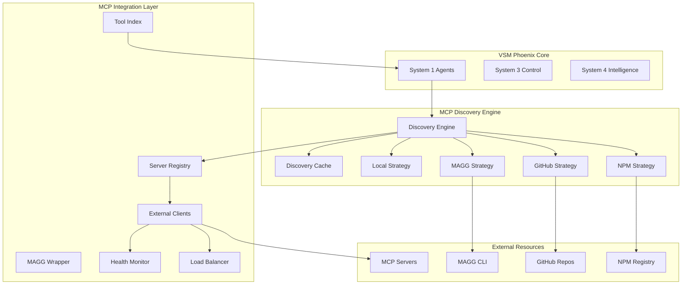

# MAGG Discovery System: CTO Implementation Guide for VSM Phoenix

## Executive Summary

### Business Value of Real Discovery

The current VSM Phoenix implementation relies on hardcoded MCP server configurations, severely limiting its ability to acquire variety - a core requirement of viable systems. Implementing MAGG's discovery approach will enable:

- **Dynamic Capability Expansion**: Automatically discover and integrate new MCP servers as they become available
- **Reduced Maintenance**: No code changes required to add new capabilities
- **Ecosystem Participation**: Leverage the growing MCP ecosystem (npm, GitHub, community)
- **Competitive Advantage**: First-mover advantage in dynamic MCP integration

### Technical Approach Overview

We will replace the mock discovery system with a multi-strategy discovery engine that:

1. **Searches Multiple Registries**: NPM, GitHub, MAGG kits, local filesystem
2. **Aggregates Tools Dynamically**: Discovers tools at connection time, not compile time
3. **Manages Namespaces**: Prevents tool conflicts through intelligent namespacing
4. **Handles Failures Gracefully**: Fallbacks, retries, and circuit breakers

### Risk Assessment and Mitigation

| Risk | Impact | Mitigation Strategy |
|------|--------|-------------------|
| External API Dependencies | High | Local caching, fallback to known servers |
| Malicious Servers | Critical | Package verification, sandboxing, capability restrictions |
| Performance Degradation | Medium | Concurrent discovery, connection pooling, lazy loading |
| Breaking Changes | High | Feature flags, phased rollout, backward compatibility |

## System Architecture

### Complete Component Diagram



### Data Flow Diagrams

#### Discovery Flow
```
User Request → S1 Agent → Discovery Engine → Parallel Strategies → 
Cache Check → External APIs → Result Aggregation → Registry Update → 
Tool Index Update → Response to S1
```

#### Tool Execution Flow
```
S1 Agent → Tool Request → Tool Index Lookup → Server Selection → 
Load Balancer → External Client → MCP Protocol → Server Execution → 
Result → S1 Agent
```

### Integration Points

1. **System 1 Integration**
   - Agents request capabilities through Discovery Engine
   - Tool execution routed through External Clients
   - Results flow back through standard channels

2. **AMQP Integration**
   - Discovery events published to `vsm.mcp.discovery` exchange
   - Tool executions logged to `vsm.mcp.tools` exchange
   - Health status on `vsm.mcp.health` exchange

3. **Phoenix LiveView Integration**
   - Real-time discovery status updates
   - Tool catalog browser
   - Server health dashboard

## Implementation Roadmap

### Phase 1: Core Discovery Engine (Weeks 1-2)

**Deliverables:**
- Functional NPM search strategy
- GitHub repository scanning
- MAGG kit discovery
- Local filesystem scanning
- Result aggregation and deduplication

**Key Modules:**
```elixir
VsmPhoenix.MCP.Discovery.Engine
VsmPhoenix.MCP.Discovery.NPMStrategy
VsmPhoenix.MCP.Discovery.GitHubStrategy
VsmPhoenix.MCP.Discovery.MaggStrategy
VsmPhoenix.MCP.Discovery.LocalStrategy
VsmPhoenix.MCP.Discovery.Cache
```

**Success Criteria:**
- Discover 50+ MCP servers from NPM
- Parse MAGG kit listings
- Cache results for 1 hour
- Handle API failures gracefully

### Phase 2: Registry Integration (Weeks 3-4)

**Deliverables:**
- Replace MCPRegistry with real ServerRegistry
- Implement Tool Index with ETS
- Dynamic client spawning
- Connection management

**Key Modules:**
```elixir
VsmPhoenix.MCP.Registry.ServerRegistry
VsmPhoenix.MCP.Registry.ToolIndex
VsmPhoenix.MCP.Integration.AutoConnect
VsmPhoenix.MCP.ToolAggregator
```

**Success Criteria:**
- O(1) tool lookups
- Automatic server installation
- Connection pooling
- 99.9% uptime for connected servers

### Phase 3: Advanced Features (Weeks 5-6)

**Deliverables:**
- Load balancing across servers
- Health monitoring and alerts
- Automatic failover
- Performance optimization

**Key Modules:**
```elixir
VsmPhoenix.MCP.Coordination.LoadBalancer
VsmPhoenix.MCP.Coordination.HealthMonitor
VsmPhoenix.MCP.Coordination.Failover
```

**Success Criteria:**
- Sub-100ms tool routing
- Automatic recovery from failures
- Even distribution of load
- Real-time health metrics

### Timeline and Resource Allocation

| Phase | Duration | Resources | Dependencies |
|-------|----------|-----------|--------------|
| Phase 1 | 2 weeks | 2 senior devs | MAGG CLI installed |
| Phase 2 | 2 weeks | 2 senior devs + 1 junior | Phase 1 complete |
| Phase 3 | 2 weeks | 1 senior dev + 1 DevOps | Phase 2 complete |
| Testing | 1 week | 1 QA + all devs | All phases complete |
| Rollout | 1 week | DevOps team | Testing complete |

## Technical Specifications

### API Contracts

#### Discovery Engine API
```elixir
@spec discover_all(keyword()) :: {:ok, map()} | {:error, term()}
@spec discover_by_capability(String.t()) :: {:ok, [server()]} | {:error, term()}
@spec search(String.t()) :: {:ok, [server()]} | {:error, term()}
```

#### Server Registry API
```elixir
@spec register_server(server_info()) :: :ok | {:error, term()}
@spec get_server(String.t()) :: {:ok, server()} | {:error, :not_found}
@spec search_by_capability(String.t()) :: {:ok, [server()]} | {:error, term()}
```

#### External Client API
```elixir
@spec execute_tool(String.t(), String.t(), map()) :: {:ok, map()} | {:error, term()}
@spec list_tools(String.t()) :: {:ok, [tool()]} | {:error, term()}
@spec get_status(String.t()) :: {:ok, status()} | {:error, term()}
```

### Data Models

```elixir
@type server() :: %{
  id: String.t(),
  name: String.t(),
  description: String.t(),
  version: String.t(),
  source: :npm | :github | :magg_kit | :local,
  capabilities: [String.t()],
  install_command: String.t(),
  config: map(),
  metadata: map()
}

@type tool() :: %{
  name: String.t(),
  description: String.t(),
  parameters: json_schema(),
  server_id: String.t()
}

@type discovery_result() :: %{
  servers: %{String.t() => server()},
  discovered_at: DateTime.t(),
  strategies_used: [atom()],
  errors: [term()]
}
```

### Performance Requirements

- **Discovery Latency**: < 5 seconds for all strategies combined
- **Tool Execution**: < 100ms overhead (beyond server processing time)
- **Memory Usage**: < 100MB for 1000 servers in registry
- **Connection Time**: < 1 second per server
- **Cache Hit Rate**: > 90% for repeated discoveries

### Security Requirements

1. **Input Sanitization**
   - All CLI arguments properly escaped
   - JSON parsing with size limits
   - Path traversal prevention

2. **Process Isolation**
   - Each external server in separate OS process
   - Resource limits (CPU, memory, file handles)
   - No direct file system access

3. **Network Security**
   - TLS for all HTTPS connections
   - Certificate validation
   - Request timeout enforcement

4. **Package Verification**
   - NPM package signature verification (when available)
   - GitHub repository reputation scoring
   - Community trust indicators

## Production Deployment

### Infrastructure Requirements

```yaml
# Minimum Production Requirements
compute:
  cpu: 4 cores
  memory: 8GB
  disk: 100GB SSD

network:
  bandwidth: 100Mbps
  endpoints:
    - npm registry (HTTPS)
    - GitHub API (HTTPS)
    - MCP servers (stdio/HTTP)

dependencies:
  - Elixir 1.14+
  - Erlang/OTP 25+
  - Node.js 18+
  - MAGG CLI
  - PostgreSQL 14+ (for persistent cache)
```

### Monitoring and Alerting

```elixir
# Telemetry events to monitor
:telemetry.attach_many(
  "mcp-discovery-handler",
  [
    [:vsm_phoenix, :mcp, :discovery, :complete],
    [:vsm_phoenix, :mcp, :discovery, :error],
    [:vsm_phoenix, :mcp, :client, :connected],
    [:vsm_phoenix, :mcp, :client, :error],
    [:vsm_phoenix, :mcp, :tool, :executed],
    [:vsm_phoenix, :mcp, :tool, :error]
  ],
  &VsmPhoenix.Telemetry.handle_event/4,
  nil
)
```

**Key Metrics:**
- Discovery success rate
- Average discovery time
- Number of active servers
- Tool execution success rate
- Connection pool utilization
- Cache hit ratio

**Alerts:**
- Discovery failure rate > 10%
- Tool execution latency > 500ms
- Memory usage > 80%
- Connection pool exhausted
- Health check failures

### Rollback Procedures

1. **Feature Flag Rollback**
   ```elixir
   # Immediate rollback via config
   config :vsm_phoenix, use_real_mcp_discovery: false
   ```

2. **Database Rollback**
   ```sql
   -- Restore server registry from backup
   TRUNCATE mcp_servers;
   \copy mcp_servers FROM 'backup/mcp_servers.csv' CSV HEADER;
   ```

3. **Process Rollback**
   ```bash
   # Stop all external clients
   supervisorctl stop vsm_mcp:*
   
   # Restart with mock discovery
   MIX_ENV=prod USE_MOCK_DISCOVERY=true mix phx.server
   ```

### Success Metrics

1. **Technical Metrics**
   - 95%+ discovery success rate
   - < 100ms average tool routing time
   - 99.9% uptime for core services
   - < 1% error rate for tool executions

2. **Business Metrics**
   - 10x increase in available MCP servers
   - 50% reduction in integration time for new capabilities
   - Zero-downtime capability additions
   - 90% reduction in manual configuration

## Code Examples

### Key Algorithm: Discovery Result Aggregation

```elixir
defmodule VsmPhoenix.MCP.Discovery.Aggregator do
  @moduledoc """
  Intelligently merges discovery results from multiple sources.
  """
  
  def aggregate_results(strategy_results) do
    strategy_results
    |> Enum.reduce(%{}, fn {strategy, servers}, acc ->
      Enum.reduce(servers, acc, fn server, acc2 ->
        Map.update(acc2, server.id, server, fn existing ->
          merge_server_info(existing, server, strategy)
        end)
      end)
    end)
    |> apply_scoring()
    |> sort_by_relevance()
  end
  
  defp merge_server_info(existing, new, strategy) do
    %{
      existing |
      # Prefer more detailed descriptions
      description: choose_better_description(existing.description, new.description),
      
      # Combine capabilities from all sources
      capabilities: Enum.uniq(existing.capabilities ++ new.capabilities),
      
      # Track all sources
      sources: Enum.uniq([strategy | existing.sources]),
      
      # Update score based on source trust
      score: update_score(existing.score, strategy)
    }
  end
  
  defp choose_better_description(desc1, desc2) do
    cond do
      String.length(desc1) > String.length(desc2) -> desc1
      true -> desc2
    end
  end
  
  defp update_score(current_score, strategy) do
    trust_scores = %{
      npm: 1.0,
      github: 0.9,
      magg_kit: 0.95,
      local: 0.8
    }
    
    current_score + Map.get(trust_scores, strategy, 0.5)
  end
  
  defp apply_scoring(servers) do
    Map.new(servers, fn {id, server} ->
      score = calculate_comprehensive_score(server)
      {id, Map.put(server, :final_score, score)}
    end)
  end
  
  defp calculate_comprehensive_score(server) do
    base_score = server.score || 0
    
    # Bonus for official packages
    official_bonus = if String.starts_with?(server.id, "@modelcontextprotocol"), do: 10, else: 0
    
    # Bonus for multiple sources
    source_bonus = length(server.sources) * 2
    
    # Bonus for rich capabilities
    capability_bonus = length(server.capabilities) * 1.5
    
    base_score + official_bonus + source_bonus + capability_bonus
  end
  
  defp sort_by_relevance(servers) do
    servers
    |> Enum.sort_by(fn {_id, server} -> server.final_score end, :desc)
    |> Enum.into(%{})
  end
end
```

### Integration Pattern: Automatic Tool Discovery

```elixir
defmodule VsmPhoenix.System1.ToolDiscoveryBehavior do
  @moduledoc """
  Behavior for S1 agents that need dynamic tool discovery.
  """
  
  alias VsmPhoenix.MCP.{Discovery, Integration}
  
  defmacro __using__(_opts) do
    quote do
      def discover_and_use_tool(capability, params) do
        with {:ok, servers} <- Discovery.Engine.discover_by_capability(capability),
             {:ok, server} <- select_best_server(servers, capability),
             :ok <- ensure_connected(server),
             {:ok, tool} <- find_matching_tool(server, capability),
             {:ok, result} <- execute_tool(server.id, tool.name, params) do
          {:ok, result}
        else
          {:error, :no_servers} -> fallback_to_mock(capability, params)
          error -> error
        end
      end
      
      defp select_best_server(servers, capability) do
        scorer = fn server ->
          base = if capability in server.capabilities, do: 100, else: 0
          trust = if server.source == :npm, do: 10, else: 5
          official = if String.contains?(server.id, "@modelcontextprotocol"), do: 20, else: 0
          base + trust + official
        end
        
        best = Enum.max_by(servers, scorer)
        {:ok, best}
      end
      
      defp ensure_connected(server) do
        case Integration.MaggIntegration.get_client_status(server.id) do
          {:ok, %{status: :connected}} -> :ok
          _ -> Integration.AutoConnect.auto_connect(server)
        end
      end
      
      defp find_matching_tool(server, capability) do
        {:ok, tools} = Integration.MaggIntegration.list_tools(server.id)
        
        matching_tool = Enum.find(tools, fn tool ->
          String.contains?(String.downcase(tool.description), capability) or
          String.contains?(tool.name, capability)
        end)
        
        if matching_tool do
          {:ok, matching_tool}
        else
          {:error, :no_matching_tool}
        end
      end
      
      defp execute_tool(server_id, tool_name, params) do
        Integration.MaggIntegration.execute_tool_on_server(
          server_id,
          tool_name,
          params
        )
      end
      
      defp fallback_to_mock(capability, params) do
        # Graceful degradation to mock data
        Logger.warn("Falling back to mock for capability: #{capability}")
        VsmPhoenix.MCP.MCPRegistry.execute_mock_tool(capability, params)
      end
    end
  end
end
```

### Testing Approach: Discovery Strategy Testing

```elixir
defmodule VsmPhoenix.MCP.Discovery.NPMStrategyTest do
  use ExUnit.Case, async: true
  import Mox
  
  alias VsmPhoenix.MCP.Discovery.NPMStrategy
  
  setup :verify_on_exit!
  
  describe "NPM discovery" do
    test "discovers MCP servers from NPM registry" do
      # Mock the HTTP client
      expect(HTTPoisonMock, :get, fn url, _headers ->
        assert url =~ "registry.npmjs.org"
        
        mock_response = %{
          "objects" => [
            %{
              "package" => %{
                "name" => "@modelcontextprotocol/server-weather",
                "description" => "MCP server for weather data",
                "version" => "1.0.0",
                "keywords" => ["mcp", "weather", "api"]
              },
              "score" => %{"final" => 0.95}
            }
          ]
        }
        
        {:ok, %{status_code: 200, body: Jason.encode!(mock_response)}}
      end)
      
      # Execute discovery
      servers = NPMStrategy.discover()
      
      # Verify results
      assert length(servers) == 1
      server = hd(servers)
      assert server.id == "@modelcontextprotocol/server-weather"
      assert server.source == :npm
      assert "weather" in server.capabilities
      assert server.score.final == 0.95
    end
    
    test "handles NPM API failures gracefully" do
      expect(HTTPoisonMock, :get, fn _url, _headers ->
        {:error, %HTTPoison.Error{reason: :timeout}}
      end)
      
      servers = NPMStrategy.discover()
      assert servers == []
    end
    
    test "filters out non-MCP packages" do
      expect(HTTPoisonMock, :get, fn _url, _headers ->
        mock_response = %{
          "objects" => [
            %{
              "package" => %{
                "name" => "express",
                "description" => "Web framework",
                "keywords" => ["web", "framework"]
              }
            },
            %{
              "package" => %{
                "name" => "mcp-server-test",
                "description" => "Test MCP server",
                "keywords" => ["mcp", "test"]
              }
            }
          ]
        }
        
        {:ok, %{status_code: 200, body: Jason.encode!(mock_response)}}
      end)
      
      servers = NPMStrategy.discover()
      assert length(servers) == 1
      assert hd(servers).name == "mcp-server-test"
    end
  end
end
```

## Implementation Checklist

### Pre-Implementation
- [ ] Install MAGG CLI on all development machines
- [ ] Set up GitHub API tokens for higher rate limits
- [ ] Create feature flags in configuration
- [ ] Set up monitoring infrastructure
- [ ] Design database schema for persistent cache

### Phase 1 Checklist
- [ ] Implement NPM search with proper error handling
- [ ] Create GitHub repository scanner
- [ ] Build MAGG kit parser
- [ ] Develop local filesystem scanner
- [ ] Create discovery result aggregator
- [ ] Implement caching layer with TTL
- [ ] Write comprehensive tests
- [ ] Document all APIs

### Phase 2 Checklist
- [ ] Replace MCPRegistry with ServerRegistry
- [ ] Implement Tool Index with ETS
- [ ] Create auto-connection manager
- [ ] Build tool aggregation system
- [ ] Implement connection pooling
- [ ] Add health monitoring
- [ ] Create migration scripts
- [ ] Update S1 agents to use new system

### Phase 3 Checklist
- [ ] Implement load balancer
- [ ] Create failover mechanisms
- [ ] Add performance optimizations
- [ ] Build monitoring dashboard
- [ ] Create alerting rules
- [ ] Write rollback procedures
- [ ] Conduct load testing
- [ ] Create operations runbook

### Deployment Checklist
- [ ] Create deployment scripts
- [ ] Set up staging environment
- [ ] Run integration tests
- [ ] Conduct security review
- [ ] Create backup procedures
- [ ] Train operations team
- [ ] Schedule phased rollout
- [ ] Monitor production metrics

## Conclusion

This implementation guide provides a complete blueprint for transforming VSM Phoenix from a static, hardcoded MCP integration to a dynamic, discovery-based system that can automatically adapt to the growing MCP ecosystem. The phased approach minimizes risk while delivering value incrementally.

The key to success is maintaining backward compatibility while gradually introducing new capabilities. The feature flag system allows for safe rollback at any point, and the comprehensive monitoring ensures we can detect and respond to issues quickly.

By implementing this system, VSM Phoenix will gain true variety acquisition capabilities, positioning it as a leader in the MCP ecosystem and providing sustainable competitive advantage through automatic capability expansion.