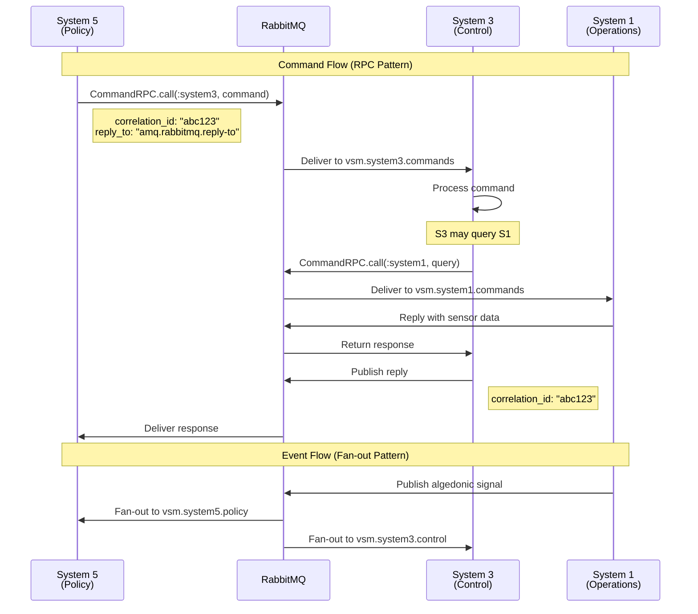

# VSM Phoenix Bidirectional AMQP with RPC Pattern

## Architecture Overview

The VSM Phoenix system now supports bidirectional communication:
- **Upward Flow (S1→S5)**: Events use fan-out exchanges for broadcasting
- **Downward Flow (S5→S1)**: Commands use RPC pattern for direct responses

## RPC Flow Diagram



## Message Flow Patterns

### 1. Direct-reply-to RPC Pattern

The RPC implementation uses RabbitMQ's special `amq.rabbitmq.reply-to` pseudo-queue:

```elixir
# From S5, issue a command to S3
{:ok, result} = CommandRPC.call(:system3, %{
  action: "allocate_resources",
  resource_type: "compute",
  amount: 10
})
```

**Benefits:**
- No need to declare response queues
- Automatic cleanup
- High performance
- Built-in correlation

### 2. Fan-out Event Pattern

Events continue to use fan-out exchanges for broadcasting:

```elixir
# From S1, publish an algedonic signal
CommandRouter.publish_event(:algedonic, %{
  type: "pain",
  intensity: 0.8,
  source: "production_line_1"
})
```

## Queue Structure

```
VSM RabbitMQ Topology
├── Exchanges
│   ├── vsm.commands (direct) - For RPC routing
│   ├── vsm.algedonic (fanout) - Pain/pleasure signals
│   ├── vsm.coordination (fanout) - Anti-oscillation
│   ├── vsm.control (fanout) - Resource control
│   ├── vsm.intelligence (fanout) - Environmental alerts
│   └── vsm.policy (fanout) - Policy broadcasts
│
├── Event Queues (Fan-out)
│   ├── vsm.system5.policy
│   ├── vsm.system4.intelligence
│   ├── vsm.system3.control
│   ├── vsm.system2.coordination
│   └── vsm.system1.operations
│
└── Command Queues (RPC)
    ├── vsm.system5.commands
    ├── vsm.system4.commands
    ├── vsm.system3.commands
    ├── vsm.system2.commands
    └── vsm.system1.commands
```

## Usage Examples

### S5 Commanding Lower Systems

```elixir
# S5 sets system-wide policy
{:ok, policy} = CommandRPC.call(:system5, %{
  "action" => "set_policy",
  "policy_type" => "resource_conservation",
  "parameters" => %{"threshold" => 0.8}
})

# S5 directly commands S3
{:ok, result} = CommandRPC.call(:system3, %{
  "action" => "allocate_resources",
  "resource_type" => "compute",
  "amount" => 20
})

# S5 emergency override
{:ok, result} = CommandRPC.call(:system5, %{
  "action" => "emergency_override",
  "target_system" => "system1",
  "override_command" => %{
    "action" => "emergency_shutdown",
    "reason" => "critical_failure"
  }
})
```

### S3 Controlling S1 Operations

```elixir
# S3 queries S1 status before making decisions
{:ok, status} = CommandRPC.call(:system1, %{
  "action" => "get_operational_status",
  "subsystem" => "production"
})

# S3 commands S1 to execute operation
{:ok, result} = CommandRPC.call(:system1, %{
  "action" => "execute_operation",
  "operation" => "adjust_throughput",
  "parameters" => %{"rate" => 0.75}
})
```

### Registering Command Handlers

```elixir
# Each system registers its command handler
CommandRPC.register_handler(:system3, fn command, meta ->
  case command["action"] do
    "allocate_resources" ->
      # Process allocation
      %{allocated: true, resource_id: "res_123"}
      
    "get_status" ->
      # Return status
      %{status: "operational", load: 0.65}
  end
end)
```

## Key Features

1. **Bidirectional Communication**
   - Events flow upward via fan-out
   - Commands flow downward via RPC

2. **Direct-reply-to Pattern**
   - Efficient RPC without queue management
   - Built-in correlation handling
   - Automatic timeout support

3. **Hierarchical Command Structure**
   - S5 can command any lower system
   - S3/S4 can query and control S1/S2
   - Maintains VSM hierarchy

4. **Parallel Operation**
   - Event broadcasting doesn't block
   - Multiple RPC calls can run concurrently
   - Systems remain loosely coupled

## Integration with VSM Principles

This implementation maintains core VSM principles:

- **Requisite Variety**: RPC allows precise control while events provide broad awareness
- **Autonomy**: Each system handles its own commands independently
- **Recursion**: Pattern can be applied at any level of system hierarchy
- **Feedback Loops**: Bidirectional flow enables closed-loop control