# VSM System Hierarchy Architecture

## Overview
This diagram shows the complete 5-level Viable Systems Model hierarchy implemented in VSM Phoenix, including recursive spawning capabilities and algedonic pathways.

```mermaid
graph TB
    subgraph "VSM Phoenix Application"
        S5[System 5 - Queen<br/>Policy & Identity]
        S4[System 4 - Intelligence<br/>Environment & Adaptation]
        S3[System 3 - Control<br/>Resource Management]
        S2[System 2 - Coordinator<br/>Anti-Oscillation]
        S1[System 1 - Operations<br/>Agents & Execution]
    end

    subgraph "System 5 Components"
        Queen[Queen GenServer]
        PolicySynth[Policy Synthesizer]
        AlgedProc[Algedonic Processor]
        ViabilityMon[Viability Monitor]
    end

    subgraph "System 4 Components"
        Intelligence[Intelligence GenServer]
        EnvScanner[Environmental Scanner]
        LLMVariety[LLM Variety Source]
        TidewaveInt[Tidewave Integration]
        AnomalyDet[Anomaly Detector]
    end

    subgraph "System 3 Components"
        Control[Control GenServer]
        ResourceAlloc[Resource Allocator]
        PerfOpt[Performance Optimizer]
        AuditChannel[Audit Channel]
        S3Star[S3* Audit Bypass]
    end

    subgraph "System 2 Components"
        Coordinator[Coordinator GenServer]
        InfoFlow[Information Flow Manager]
        AntiOsc[Anti-Oscillation]
        PubSubMgr[PubSub Manager]
    end

    subgraph "System 1 Components"
        S1Super[S1 Supervisor]
        AgentReg[Agent Registry]
        WorkerAgent[Worker Agents]
        LLMAgent[LLM Worker Agents]
        SensorAgent[Sensor Agents]
        APIAgent[API Agents]
    end

    %% Main Hierarchy
    S5 --> S4
    S4 --> S3
    S3 --> S2
    S2 --> S1

    %% System 5 Internal
    S5 --> Queen
    Queen --> PolicySynth
    Queen --> AlgedProc
    Queen --> ViabilityMon

    %% System 4 Internal
    S4 --> Intelligence
    Intelligence --> EnvScanner
    Intelligence --> LLMVariety
    Intelligence --> TidewaveInt
    Intelligence --> AnomalyDet

    %% System 3 Internal
    S3 --> Control
    Control --> ResourceAlloc
    Control --> PerfOpt
    Control --> AuditChannel
    Control --> S3Star

    %% System 2 Internal
    S2 --> Coordinator
    Coordinator --> InfoFlow
    Coordinator --> AntiOsc
    Coordinator --> PubSubMgr

    %% System 1 Internal
    S1 --> S1Super
    S1Super --> AgentReg
    S1Super --> WorkerAgent
    S1Super --> LLMAgent
    S1Super --> SensorAgent
    S1Super --> APIAgent

    %% Algedonic Pathways (Pain/Pleasure Signals)
    S1 -.->|Algedonic Signals| AlgedProc
    S2 -.->|Algedonic Signals| AlgedProc
    S3 -.->|Algedonic Signals| AlgedProc
    S4 -.->|Algedonic Signals| AlgedProc

    %% Policy Flow
    PolicySynth -.->|Policies| S4
    PolicySynth -.->|Policies| S3
    PolicySynth -.->|Policies| S2
    PolicySynth -.->|Policies| S1

    %% S3* Audit Bypass
    S3Star -.->|Direct Audit| S1

    %% Recursive Meta-System Spawning
    LLMVariety -.->|Meta-System Triggers| Queen
    AnomalyDet -.->|Critical Variety| Queen

    %% External Interfaces
    subgraph "External Systems"
        AMQP[AMQP/RabbitMQ]
        MCP[MCP Servers]
        LiveView[Phoenix LiveView]
        API[REST API]
    end

    S1 <--> AMQP
    S2 <--> AMQP
    S3 <--> AMQP
    S4 <--> AMQP
    S5 <--> AMQP

    LLMAgent <--> MCP
    APIAgent <--> API
    PubSubMgr <--> LiveView

    %% Styling
    classDef system5 fill:#ff9999,stroke:#333,stroke-width:3px
    classDef system4 fill:#99ccff,stroke:#333,stroke-width:3px
    classDef system3 fill:#99ff99,stroke:#333,stroke-width:3px
    classDef system2 fill:#ffcc99,stroke:#333,stroke-width:3px
    classDef system1 fill:#ffff99,stroke:#333,stroke-width:3px
    classDef external fill:#e6e6e6,stroke:#333,stroke-width:2px
    classDef algedonic stroke:#ff0000,stroke-width:2px,stroke-dasharray: 5 5

    class S5,Queen,PolicySynth,AlgedProc,ViabilityMon system5
    class S4,Intelligence,EnvScanner,LLMVariety,TidewaveInt,AnomalyDet system4
    class S3,Control,ResourceAlloc,PerfOpt,AuditChannel,S3Star system3
    class S2,Coordinator,InfoFlow,AntiOsc,PubSubMgr system2
    class S1,S1Super,AgentReg,WorkerAgent,LLMAgent,SensorAgent,APIAgent system1
    class AMQP,MCP,LiveView,API external
```

## Key Features

### Hierarchical Control
- **System 5 (Queen)**: Ultimate policy authority with algedonic processing
- **System 4 (Intelligence)**: Environmental scanning and adaptation proposals
- **System 3 (Control)**: Resource management and performance optimization
- **System 2 (Coordinator)**: Information flow and anti-oscillation
- **System 1 (Operations)**: Operational agents and execution

### Unique Cybernetic Features
- **Algedonic Pathways**: Pain/pleasure signals flow upward to System 5
- **Policy Synthesis**: LLM-powered autonomous policy generation
- **S3* Audit Bypass**: Direct System 3 inspection of System 1
- **Recursive Spawning**: Meta-system creation triggers from variety analysis

### External Integrations
- **AMQP Messaging**: All systems communicate via RabbitMQ exchanges
- **MCP Integration**: LLM agents connect to external MCP servers
- **Real-time Dashboard**: LiveView provides system monitoring
- **REST API**: External control and monitoring interfaces

## Implementation Files
- **System 5**: `/lib/vsm_phoenix/system5/queen.ex`
- **System 4**: `/lib/vsm_phoenix/system4/intelligence.ex`
- **System 3**: `/lib/vsm_phoenix/system3/control.ex`
- **System 2**: `/lib/vsm_phoenix/system2/coordinator.ex`
- **System 1**: `/lib/vsm_phoenix/system1/supervisor.ex`
- **Application**: `/lib/vsm_phoenix/application.ex`