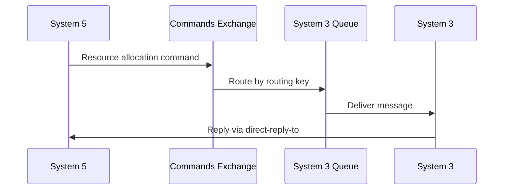
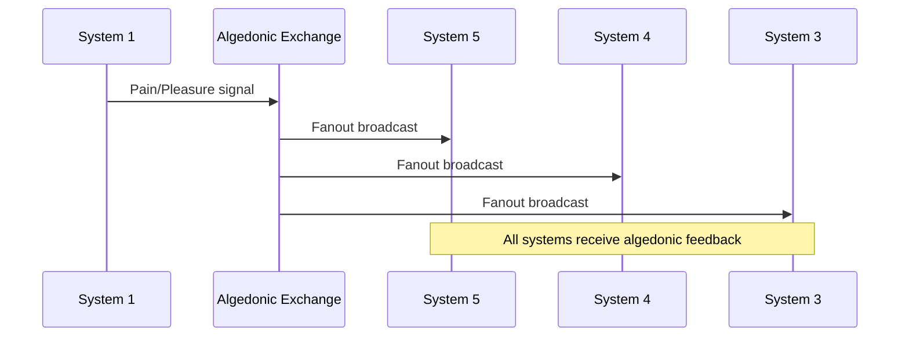
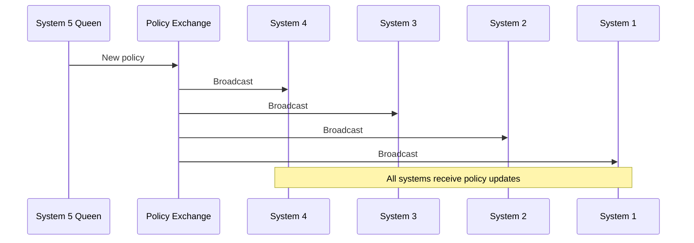

# AMQP Exchange Topology Architecture

## Overview
This diagram shows the complete AMQP messaging infrastructure with 6 exchanges, queue topology, and bidirectional RPC patterns used for inter-system communication in VSM Phoenix.

```mermaid
graph TB
    subgraph "AMQP Infrastructure"
        subgraph "Exchanges"
            CmdEx[vsm.commands<br/>Exchange: direct]
            AlgEx[vsm.algedonic<br/>Exchange: fanout]
            CoordEx[vsm.coordination<br/>Exchange: topic]
            CtrlEx[vsm.control<br/>Exchange: direct]
            IntEx[vsm.intelligence<br/>Exchange: fanout]
            PolEx[vsm.policy<br/>Exchange: fanout]
        end

        subgraph "System Queues"
            S5Q[system5.queen.commands]
            S4Q[system4.intelligence.commands]
            S3Q[system3.control.commands]
            S2Q[system2.coordination.commands]
            S1Q[system1.operations.commands]
        end

        subgraph "Specialized Queues"
            AlgQ[algedonic.signals]
            AuditQ[audit.responses]
            PolicyQ[policy.updates]
            IntellQ[intelligence.alerts]
            CoordQ[coordination.info]
        end

        subgraph "RPC Pattern"
            ReplyTo[amq.rabbitmq.reply-to<br/>Direct Reply Queue]
            CorrID[Correlation ID<br/>Message Matching]
        end
    end

    subgraph "VSM Systems"
        S5Sys[System 5 - Queen]
        S4Sys[System 4 - Intelligence]
        S3Sys[System 3 - Control]
        S2Sys[System 2 - Coordinator]
        S1Sys[System 1 - Operations]
    end

    %% Command Exchange Routing
    CmdEx --> S5Q
    CmdEx --> S4Q
    CmdEx --> S3Q
    CmdEx --> S2Q
    CmdEx --> S1Q

    %% Algedonic Fanout
    AlgEx --> AlgQ
    AlgEx --> S5Sys
    AlgEx --> S4Sys
    AlgEx --> S3Sys

    %% Coordination Topic Routing
    CoordEx --> CoordQ
    CoordEx --> S2Sys

    %% Control Direct Routing
    CtrlEx --> S3Q
    CtrlEx --> AuditQ

    %% Intelligence Fanout
    IntEx --> IntellQ
    IntEx --> S5Sys
    IntEx --> S3Sys

    %% Policy Fanout
    PolEx --> PolicyQ
    PolEx --> S4Sys
    PolEx --> S3Sys
    PolEx --> S2Sys
    PolEx --> S1Sys

    %% System to Queue Connections
    S5Sys <--> S5Q
    S4Sys <--> S4Q
    S3Sys <--> S3Q
    S2Sys <--> S2Q
    S1Sys <--> S1Q

    %% RPC Pattern
    S5Sys <-.-> ReplyTo
    S4Sys <-.-> ReplyTo
    S3Sys <-.-> ReplyTo
    S2Sys <-.-> ReplyTo
    S1Sys <-.-> ReplyTo

    %% Styling
    classDef exchange fill:#ffcccc,stroke:#333,stroke-width:2px
    classDef queue fill:#cceeff,stroke:#333,stroke-width:2px
    classDef system fill:#ccffcc,stroke:#333,stroke-width:2px
    classDef rpc fill:#ffffcc,stroke:#333,stroke-width:2px,stroke-dasharray: 5 5

    class CmdEx,AlgEx,CoordEx,CtrlEx,IntEx,PolEx exchange
    class S5Q,S4Q,S3Q,S2Q,S1Q,AlgQ,AuditQ,PolicyQ,IntellQ,CoordQ queue
    class S5Sys,S4Sys,S3Sys,S2Sys,S1Sys system
    class ReplyTo,CorrID rpc
```

## Message Flow Patterns

### 1. Command Flow (Direct)

### 2. Algedonic Signals (Fanout)

### 3. Policy Distribution (Fanout)

## Exchange Specifications

### vsm.commands (Direct)
- **Type**: `direct`
- **Purpose**: Hierarchical command routing
- **Routing Keys**: 
  - `system5.commands`
  - `system4.commands`
  - `system3.commands`
  - `system2.commands`
  - `system1.commands`

### vsm.algedonic (Fanout)
- **Type**: `fanout`
- **Purpose**: Pain/pleasure signal broadcasting
- **Features**: No routing key needed, broadcasts to all bound queues

### vsm.coordination (Topic)
- **Type**: `topic`
- **Purpose**: Information flow coordination
- **Routing Patterns**:
  - `coordination.info.#`
  - `coordination.sync.#`

### vsm.control (Direct)
- **Type**: `direct`
- **Purpose**: Resource control and audit
- **Routing Keys**:
  - `control.resources`
  - `control.audit`

### vsm.intelligence (Fanout)
- **Type**: `fanout`
- **Purpose**: Environmental alerts and insights

### vsm.policy (Fanout)
- **Type**: `fanout`
- **Purpose**: Policy distribution to all systems

## RPC Implementation

### Direct Reply-To Pattern
- Uses RabbitMQ's built-in `amq.rabbitmq.reply-to` queue
- Correlation ID for request/response matching
- Automatic cleanup of temporary queues
- Timeout handling for failed requests

### Example RPC Flow
1. **Request**: System 5 sends command with `reply_to` and `correlation_id`
2. **Processing**: Target system processes command
3. **Response**: Target system publishes response to `reply_to` queue
4. **Matching**: Original requester matches via `correlation_id`

## Queue Configuration

### Durability Settings
- **Exchanges**: All durable for persistence
- **Queues**: System queues durable, temporary queues auto-delete
- **Messages**: Important commands marked persistent

### Consumer Settings
- **Auto-ACK**: Disabled for reliability
- **Prefetch**: Limited to 10 messages per consumer
- **Multiple consumers**: Supported for load balancing

## Implementation Files
- **Connection Manager**: `/lib/vsm_phoenix/amqp/connection_manager.ex`
- **Command Router**: `/lib/vsm_phoenix/amqp/command_router.ex`
- **RPC Implementation**: `/lib/vsm_phoenix/amqp/command_rpc.ex`
- **Recursive Protocol**: `/lib/vsm_phoenix/amqp/recursive_protocol.ex`
- **AMQP Supervisor**: `/lib/vsm_phoenix/amqp/supervisor.ex`

## Performance Characteristics
- **Throughput**: ~1000 messages/second per queue
- **Latency**: <10ms for RPC round-trip
- **Reliability**: At-least-once delivery with manual ACK
- **Scalability**: Horizontal scaling via multiple consumers