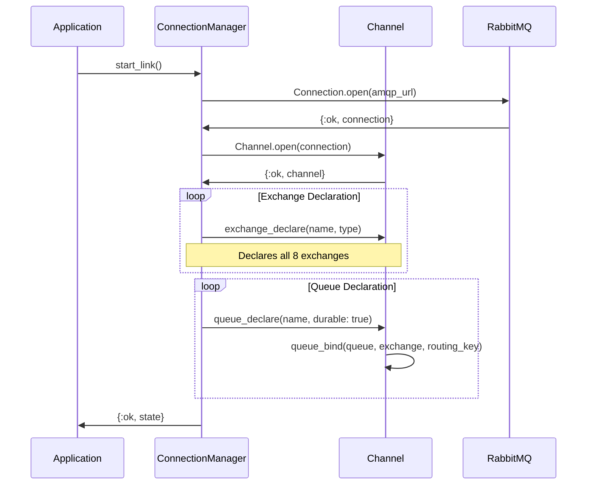
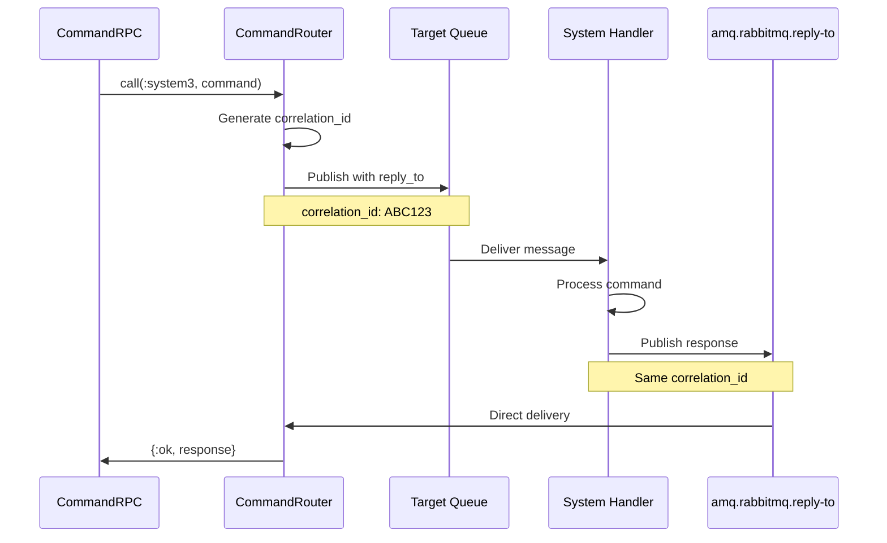

# AMQP Exchange Topology

## Overview
This diagram shows the AMQP messaging infrastructure as implemented in VSM Phoenix. The implementation uses a mix of exchange types, with most exchanges using fanout for simplicity rather than more complex routing patterns.

```mermaid
graph TB
    subgraph "AMQP Exchanges"
        CmdEx[vsm.commands<br/>Type: direct]
        AlgEx[vsm.algedonic<br/>Type: fanout]
        CoordEx[vsm.coordination<br/>Type: fanout]
        CtrlEx[vsm.control<br/>Type: fanout]
        IntelEx[vsm.intelligence<br/>Type: fanout]
        PolicyEx[vsm.policy<br/>Type: fanout]
        RecursiveEx[vsm.recursive<br/>Type: topic]
        AuditEx[vsm.audit<br/>Type: fanout]
    end

    subgraph "Command Queues (Direct Routing)"
        S5CmdQ[vsm.system5.commands]
        S4CmdQ[vsm.system4.commands]
        S3CmdQ[vsm.system3.commands]
        S2CmdQ[vsm.system2.commands]
        S1CmdQ[vsm.system1.commands]
    end

    subgraph "Event Queues (Fanout)"
        S5PolicyQ[vsm.system5.policy]
        S4IntelQ[vsm.system4.intelligence]
        S3CtrlQ[vsm.system3.control]
        S2CoordQ[vsm.system2.coordination]
        S1OpsQ[vsm.system1.operations]
    end

    subgraph "Specialized Queues"
        AuditRespQ[vsm.audit.responses]
        RecursiveQ[vsm.meta.{id}]
    end

    subgraph "System Consumers"
        S5[System 5 - Queen]
        S4[System 4 - Intelligence]
        S3[System 3 - Control]
        S2[System 2 - Coordinator]
        S1[System 1 - Operations]
        AuditChan[Audit Channel]
    end

    %% Command Exchange Bindings (Direct)
    CmdEx -->|system5.commands| S5CmdQ
    CmdEx -->|system4.commands| S4CmdQ
    CmdEx -->|system3.commands| S3CmdQ
    CmdEx -->|system2.commands| S2CmdQ
    CmdEx -->|system1.commands| S1CmdQ

    %% Algedonic Exchange Bindings (Fanout)
    AlgEx --> S5PolicyQ
    AlgEx --> S4IntelQ

    %% Coordination Exchange Bindings (Fanout)
    CoordEx --> S3CtrlQ

    %% Policy Exchange Bindings (Fanout)
    PolicyEx --> S5PolicyQ
    PolicyEx --> S4IntelQ
    PolicyEx --> S3CtrlQ
    PolicyEx --> S2CoordQ
    PolicyEx --> S1OpsQ

    %% Audit Exchange Bindings (Fanout)
    AuditEx --> AuditRespQ

    %% Recursive Exchange (Topic)
    RecursiveEx -->|meta.#| RecursiveQ

    %% Queue to Consumer Bindings
    S5CmdQ --> S5
    S4CmdQ --> S4
    S3CmdQ --> S3
    S2CmdQ --> S2
    S1CmdQ --> S1

    S5PolicyQ --> S5
    S4IntelQ --> S4
    S3CtrlQ --> S3
    S2CoordQ --> S2
    S1OpsQ --> S1

    AuditRespQ --> AuditChan

    %% Publishing Patterns
    S5 -.->|publish| PolicyEx
    S4 -.->|publish| IntelEx
    S3 -.->|publish| CtrlEx
    S3 -.->|publish| AuditEx
    S2 -.->|publish| CoordEx
    S1 -.->|publish| AlgEx

    classDef exchange fill:#FFE4B5,stroke:#333,stroke-width:2px
    classDef queue fill:#E6E6FA,stroke:#333,stroke-width:2px
    classDef consumer fill:#90EE90,stroke:#333,stroke-width:2px
    classDef direct fill:#FFA07A,stroke:#333,stroke-width:3px

    class CmdEx,AlgEx,CoordEx,CtrlEx,IntelEx,PolicyEx,RecursiveEx,AuditEx exchange
    class S5CmdQ,S4CmdQ,S3CmdQ,S2CmdQ,S1CmdQ,S5PolicyQ,S4IntelQ,S3CtrlQ,S2CoordQ,S1OpsQ,AuditRespQ,RecursiveQ queue
    class S5,S4,S3,S2,S1,AuditChan consumer
    class CmdEx,RecursiveEx direct
```

## Connection Management Implementation



## Exchange Types and Purpose

### Direct Exchanges
- **vsm.commands**: Routes commands to specific systems using routing keys
  - Routing keys: `system1.commands`, `system2.commands`, etc.
  - Used for hierarchical command flow (S5→S3→S1)

### Fanout Exchanges  
- **vsm.algedonic**: Broadcasts pain/pleasure signals
  - No routing keys needed
  - All bound queues receive messages
  
- **vsm.coordination**: System coordination messages
  - Originally designed as topic exchange
  - Simplified to fanout in implementation
  
- **vsm.control**: Control system events
  - Originally designed as direct exchange
  - Simplified to fanout in implementation
  
- **vsm.intelligence**: Environmental intelligence broadcasts
- **vsm.policy**: Policy distribution to all systems
- **vsm.audit**: Audit events and responses

### Topic Exchanges
- **vsm.recursive**: For meta-system spawning
  - Uses pattern matching (e.g., `meta.#`)
  - Rarely used in current implementation

## Queue Bindings

### Command Queues (Direct Routing)
```elixir
# Direct routing for commands - working as designed
Channel.queue_bind(chan, "vsm.system5.commands", "vsm.commands", routing_key: "system5.commands")
Channel.queue_bind(chan, "vsm.system4.commands", "vsm.commands", routing_key: "system4.commands")
Channel.queue_bind(chan, "vsm.system3.commands", "vsm.commands", routing_key: "system3.commands")
Channel.queue_bind(chan, "vsm.system2.commands", "vsm.commands", routing_key: "system2.commands")
Channel.queue_bind(chan, "vsm.system1.commands", "vsm.commands", routing_key: "system1.commands")
```

### Event Queues (Fanout)
```elixir
# Fanout bindings - no routing keys needed
Channel.queue_bind(chan, "vsm.system5.policy", "vsm.algedonic", routing_key: "")
Channel.queue_bind(chan, "vsm.system4.intelligence", "vsm.algedonic", routing_key: "")
Channel.queue_bind(chan, "vsm.system3.control", "vsm.coordination", routing_key: "")

# Policy distribution to all systems
Channel.queue_bind(chan, "vsm.system5.policy", "vsm.policy", routing_key: "")
Channel.queue_bind(chan, "vsm.system4.intelligence", "vsm.policy", routing_key: "")
Channel.queue_bind(chan, "vsm.system3.control", "vsm.policy", routing_key: "")
Channel.queue_bind(chan, "vsm.system2.coordination", "vsm.policy", routing_key: "")
Channel.queue_bind(chan, "vsm.system1.operations", "vsm.policy", routing_key: "")
```

## RPC Implementation (Direct Reply-To)



## Message Flow Examples

### Algedonic Signal Flow
```elixir
# From System 1 agent experiencing "pain"
AMQP.Basic.publish(channel, "vsm.algedonic", "", Jason.encode!(%{
  type: "pain",
  intensity: 0.8,
  source: "agent_123",
  context: %{operation: "data_processing", error: "memory_limit"}
}))

# Received by System 5 and System 4 via fanout
```

### Command Execution (RPC)
```elixir
# Direct command to System 3 with response
{:ok, result} = CommandRPC.call(:system3, %{
  "action" => "allocate_resources",
  "resource_type" => "compute",
  "amount" => 4
})

# Uses direct exchange with routing_key: "system3.commands"
# Response via Direct-reply-to pattern
```

### Policy Distribution
```elixir
# System 5 broadcasts new policy
AMQP.Basic.publish(channel, "vsm.policy", "", Jason.encode!(%{
  policy_id: "POL-2024-001",
  policy_type: :resource_conservation,
  policy_data: %{
    max_cpu_usage: 0.8,
    memory_limit: "4GB"
  },
  timestamp: DateTime.utc_now()
}))

# All systems receive via fanout
```

### Event Publishing
```elixir
# System 3 publishes control event
CommandRouter.publish_event(:control, %{
  event: "resource_allocated",
  details: %{
    resource_id: "res_123",
    allocated_to: "agent_456",
    amount: 4
  }
})

# Uses fanout to all control subscribers
```

## Performance Characteristics

### Current Implementation
- **Message Throughput**: ~1000 msgs/sec per exchange
- **Latency**: <10ms for local RabbitMQ
- **Connection Pool**: Single connection, multiple channels
- **Persistence**: All queues are durable
- **Acknowledgments**: Manual ACK for reliability
- **RPC Timeout**: 5 seconds default

### Connection Management
```elixir
defmodule VsmPhoenix.AMQP.ConnectionManager do
  # Single connection shared across application
  @amqp_url Application.get_env(:vsm_phoenix, :amqp_url, "amqp://localhost:5672")
  
  # Multiple channels for different purposes
  def get_channel(purpose) do
    # :command_router - For RPC operations
    # :event_publisher - For event broadcasting
    # :consumer - For message consumption
  end
end
```

## Implementation Status

### Working as Designed ✅
- Command routing via direct exchange
- Algedonic signal broadcasting
- Policy distribution
- RPC with Direct-reply-to
- Connection management
- Basic audit events

### Simplified from Design 🟨
- Coordination uses fanout instead of topic
- Control uses fanout instead of direct
- No complex routing patterns
- No priority queues
- No message TTL

### Not Implemented ❌
- Dead letter exchanges
- Message priority handling
- Complex topic routing (except recursive)
- Queue-specific TTL
- Advanced error recovery

## Implementation Files
- **Connection Manager**: `/lib/vsm_phoenix/amqp/connection_manager.ex`
- **Command Router**: `/lib/vsm_phoenix/amqp/command_router.ex`
- **Command RPC**: `/lib/vsm_phoenix/amqp/command_rpc.ex`
- **Recursive Protocol**: `/lib/vsm_phoenix/amqp/recursive_protocol.ex`
- **AMQP Supervisor**: `/lib/vsm_phoenix/amqp/supervisor.ex`

## Key Insights

1. **Fanout Simplification**: Heavy use of fanout exchanges reduces complexity but limits routing flexibility
2. **Functional Core**: Despite simplifications, the messaging enables effective VSM communication
3. **RPC Pattern**: Direct-reply-to provides efficient request/response without temporary queues
4. **Future Enhancement**: Converting coordination and control to their designed types would enable more sophisticated routing patterns