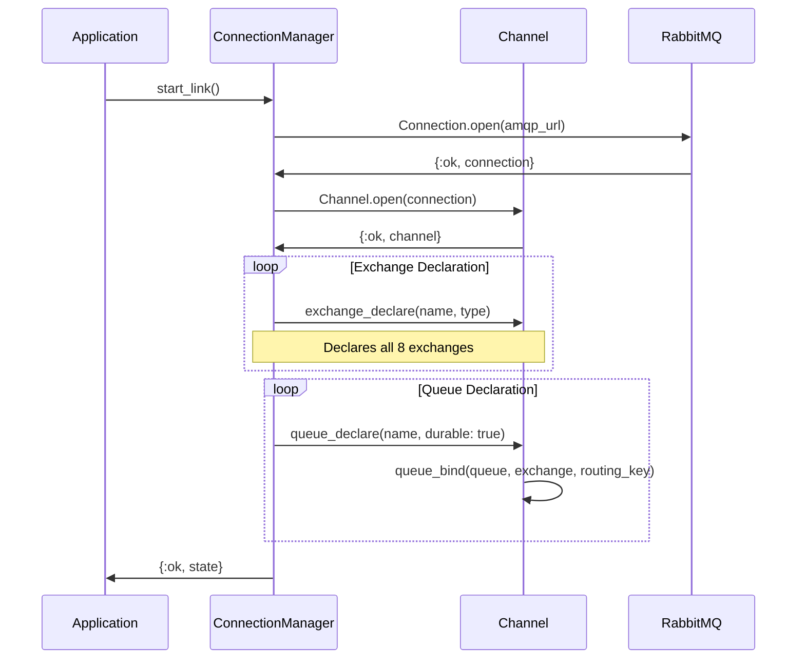
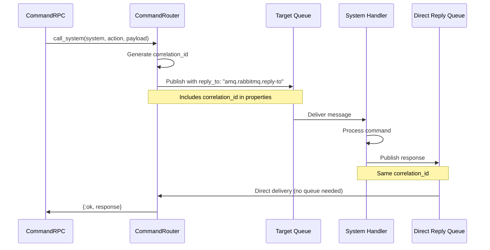

# AMQP Exchange Topology (Actual Implementation)

## Overview
This diagram shows the actual AMQP messaging infrastructure as implemented in VSM Phoenix. Note that the implementation is simpler than the original design, with most exchanges using fanout instead of topic/direct routing.

```mermaid
graph TB
    subgraph "AMQP Exchanges (Actual Types)"
        CmdEx[vsm.commands<br/>Type: direct]
        AlgEx[vsm.algedonic<br/>Type: fanout]
        CoordEx[vsm.coordination<br/>Type: fanout ⚠️]
        CtrlEx[vsm.control<br/>Type: fanout ⚠️]
        IntelEx[vsm.intelligence<br/>Type: fanout]
        PolicyEx[vsm.policy<br/>Type: fanout]
        RecursiveEx[vsm.recursive<br/>Type: topic]
        AuditEx[vsm.audit<br/>Type: fanout]
    end

    subgraph "Command Queues (Direct Routing)"
        S5CmdQ[vsm.system5.commands]
        S4CmdQ[vsm.system4.commands]
        S3CmdQ[vsm.system3.commands]
        S2CmdQ[vsm.system2.commands]
        S1CmdQ[vsm.system1.commands]
    end

    subgraph "Event Queues (Fanout)"
        S5PolicyQ[vsm.system5.policy]
        S4IntelQ[vsm.system4.intelligence]
        S3CtrlQ[vsm.system3.control]
        S2CoordQ[vsm.system2.coordination]
        S1OpsQ[vsm.system1.operations]
    end

    subgraph "Specialized Queues"
        AuditRespQ[vsm.audit.responses]
        RecursiveQ[vsm.meta.{id}]
    end

    subgraph "System Consumers"
        S5[System 5 - Queen]
        S4[System 4 - Intelligence]
        S3[System 3 - Control]
        S2[System 2 - Coordinator]
        S1[System 1 - Operations]
        AuditChan[Audit Channel]
    end

    %% Command Exchange Bindings (Direct)
    CmdEx -->|system5.commands| S5CmdQ
    CmdEx -->|system4.commands| S4CmdQ
    CmdEx -->|system3.commands| S3CmdQ
    CmdEx -->|system2.commands| S2CmdQ
    CmdEx -->|system1.commands| S1CmdQ

    %% Algedonic Exchange Bindings (Fanout)
    AlgEx --> S5PolicyQ
    AlgEx --> S4IntelQ

    %% Coordination Exchange Bindings (Fanout - not topic!)
    CoordEx --> S3CtrlQ

    %% Policy Exchange Bindings (Fanout)
    PolicyEx --> S5PolicyQ
    PolicyEx --> S4IntelQ
    PolicyEx --> S3CtrlQ
    PolicyEx --> S2CoordQ
    PolicyEx --> S1OpsQ

    %% Audit Exchange Bindings (Fanout)
    AuditEx --> AuditRespQ

    %% Recursive Exchange (Topic - rarely used)
    RecursiveEx -->|meta.#| RecursiveQ

    %% Queue to Consumer Bindings
    S5CmdQ --> S5
    S4CmdQ --> S4
    S3CmdQ --> S3
    S2CmdQ --> S2
    S1CmdQ --> S1

    S5PolicyQ --> S5
    S4IntelQ --> S4
    S3CtrlQ --> S3
    S2CoordQ --> S2
    S1OpsQ --> S1

    AuditRespQ --> AuditChan

    %% Publishing Patterns
    S5 -.->|publish| PolicyEx
    S4 -.->|publish| IntelEx
    S3 -.->|publish| CtrlEx
    S3 -.->|publish| AuditEx
    S2 -.->|publish| CoordEx
    S1 -.->|publish| AlgEx

    classDef exchange fill:#FFE4B5,stroke:#333,stroke-width:2px
    classDef queue fill:#E6E6FA,stroke:#333,stroke-width:2px
    classDef consumer fill:#90EE90,stroke:#333,stroke-width:2px
    classDef warning fill:#FFA07A,stroke:#333,stroke-width:3px

    class CmdEx,AlgEx,CoordEx,CtrlEx,IntelEx,PolicyEx,RecursiveEx,AuditEx exchange
    class S5CmdQ,S4CmdQ,S3CmdQ,S2CmdQ,S1CmdQ,S5PolicyQ,S4IntelQ,S3CtrlQ,S2CoordQ,S1OpsQ,AuditRespQ,RecursiveQ queue
    class S5,S4,S3,S2,S1,AuditChan consumer
    class CoordEx,CtrlEx warning
```

## Connection Management Implementation



## Actual Queue Bindings

### Command Queues (Working as Designed)
```elixir
# Direct routing for commands
Channel.queue_bind(chan, "vsm.system5.commands", "vsm.commands", routing_key: "system5.commands")
Channel.queue_bind(chan, "vsm.system4.commands", "vsm.commands", routing_key: "system4.commands")
Channel.queue_bind(chan, "vsm.system3.commands", "vsm.commands", routing_key: "system3.commands")
Channel.queue_bind(chan, "vsm.system2.commands", "vsm.commands", routing_key: "system2.commands")
Channel.queue_bind(chan, "vsm.system1.commands", "vsm.commands", routing_key: "system1.commands")
```

### Event Queues (Simplified Fanout)
```elixir
# Fanout bindings - no routing keys needed
Channel.queue_bind(chan, "vsm.system5.policy", "vsm.algedonic", routing_key: "")
Channel.queue_bind(chan, "vsm.system4.intelligence", "vsm.algedonic", routing_key: "")
Channel.queue_bind(chan, "vsm.system3.control", "vsm.coordination", routing_key: "")
```

## RPC Implementation (Direct Reply-To)



## Key Implementation Differences

### 1. Exchange Type Mismatches
| Exchange | Designed Type | Actual Type | Impact |
|----------|--------------|-------------|---------|
| vsm.coordination | topic | fanout | No pattern-based routing |
| vsm.control | direct | fanout | No specific routing keys |

### 2. Missing Queues
The following specialized queues from the original design are **not implemented**:
- `algedonic.signals` - Algedonic signals go through event queues
- `policy.updates` - Policies distributed via fanout to all systems
- `intelligence.alerts` - Intelligence events use fanout
- `coordination.info` - Coordination uses simple fanout

### 3. Simplified Routing
- Most exchanges use fanout (broadcast to all bound queues)
- Only `vsm.commands` uses direct routing with routing keys
- Topic exchange (`vsm.recursive`) exists but rarely used
- No complex routing patterns implemented

## Actual Message Flow Examples

### Algedonic Signal Flow
```elixir
# From System 1 agent experiencing "pain"
AMQP.Basic.publish(channel, "vsm.algedonic", "", Jason.encode!(%{
  type: "pain",
  intensity: 0.8,
  source: "agent_123",
  context: %{...}
}))

# Received by System 5 and System 4 via fanout
```

### Command Execution
```elixir
# Direct command to System 3
VsmPhoenix.AMQP.CommandRPC.call_system(:system3, :allocate_resources, %{
  resource_type: "cpu",
  amount: 4
})

# Uses direct exchange with routing_key: "system3.commands"
```

### Policy Distribution
```elixir
# System 5 broadcasts new policy
AMQP.Basic.publish(channel, "vsm.policy", "", Jason.encode!(%{
  policy_type: :adaptation,
  policy_data: %{...},
  timestamp: DateTime.utc_now()
}))

# All systems receive via fanout
```

## Performance Characteristics

### Current Implementation
- **Message Throughput**: ~1000 msgs/sec per exchange
- **Latency**: <10ms for local RabbitMQ
- **Connection Pool**: Single connection, multiple channels
- **Persistence**: All queues are durable
- **Acknowledgments**: Manual ACK for reliability

### Limitations
- No priority queue implementation
- No message TTL configuration
- Limited error handling for connection failures
- No dead letter exchange configuration

## Notes

1. **Fanout Simplification**: The heavy use of fanout exchanges simplifies the implementation but reduces routing flexibility
2. **Missing Features**: Complex routing patterns, specialized queues, and topic-based coordination are not implemented
3. **Functional Core**: Despite simplifications, the messaging system successfully enables VSM communication
4. **Future Enhancement**: Converting coordination and control exchanges to their designed types would enable more sophisticated routing