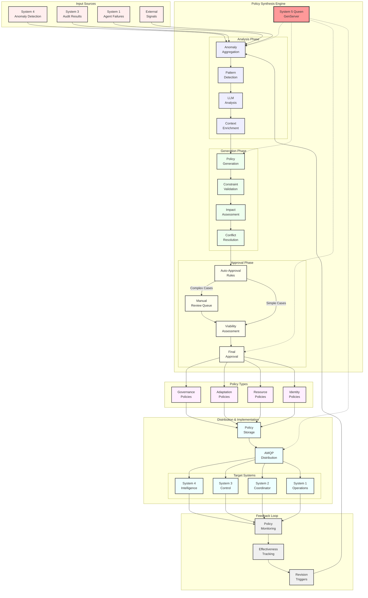
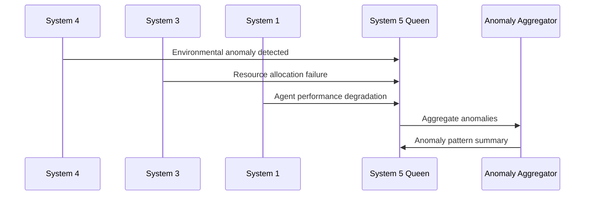
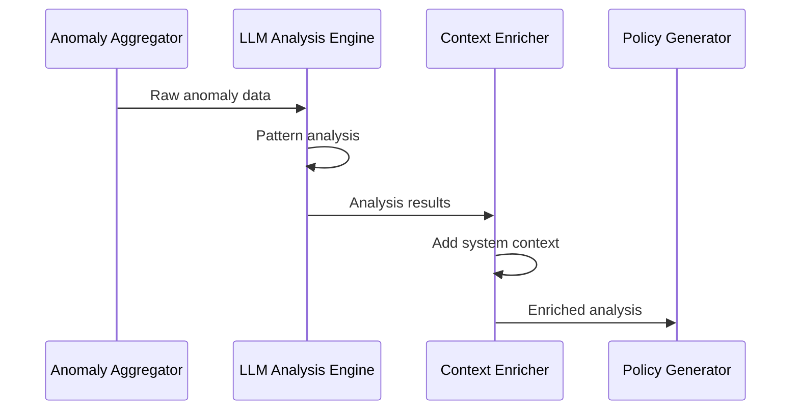
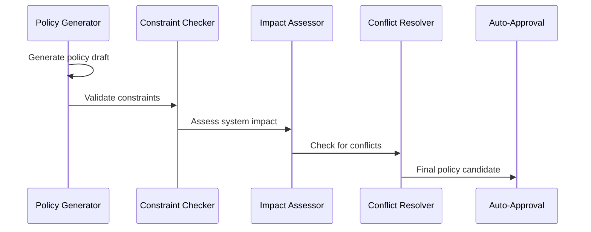

# Policy Synthesis Workflow

## Overview
This diagram shows the autonomous policy synthesis system where System 5 (Queen) automatically generates policies from anomaly data using LLM analysis, representing a unique cybernetic governance capability.



## Detailed Process Flow

### 1. Anomaly Detection and Aggregation


### 2. LLM-Powered Analysis


### 3. Policy Generation and Validation


## Policy Types and Examples

### Governance Policies
- **System boundaries and responsibilities**
- **Decision-making authority levels**
- **Escalation procedures**
- **Compliance requirements**

```elixir
%Policy{
  type: :governance,
  scope: [:system3, :system1],
  rule: "Resource allocation requires S3 approval for >80% capacity",
  auto_executable: true,
  constraints: [:capacity_limit, :approval_required]
}
```

### Adaptation Policies
- **Response to environmental changes**
- **Learning and improvement procedures**
- **Capability acquisition rules**
- **Evolution strategies**

```elixir
%Policy{
  type: :adaptation,
  scope: [:system4, :system1],
  rule: "Auto-acquire MCP capabilities when variety exceeds threshold",
  auto_executable: false,
  constraints: [:variety_threshold, :capability_validation]
}
```

### Resource Policies
- **Allocation priorities and limits**
- **Performance optimization rules**
- **Emergency reallocation procedures**
- **Capacity planning guidelines**

```elixir
%Policy{
  type: :resource,
  scope: [:system3],
  rule: "Emergency reallocation triggered at 95% capacity",
  auto_executable: true,
  constraints: [:capacity_threshold, :emergency_only]
}
```

### Identity Policies
- **System purpose and mission**
- **Core values and principles**
- **Boundary conditions**
- **Viability criteria**

```elixir
%Policy{
  type: :identity,
  scope: [:system5, :all_systems],
  rule: "Maintain cybernetic viability above 0.7 threshold",
  auto_executable: false,
  constraints: [:viability_threshold, :manual_review]
}
```

## LLM Analysis Prompts

### Pattern Detection Prompt
```
Analyze the following system anomalies and identify patterns:

Anomalies: #{anomaly_data}
System Context: #{system_state}
Historical Patterns: #{pattern_history}

Identify:
1. Root cause patterns
2. System impact scope
3. Urgency level
4. Recommended policy type
5. Auto-executable assessment
```

### Policy Generation Prompt
```
Generate a cybernetic policy based on this analysis:

Analysis: #{llm_analysis}
System Constraints: #{constraints}
Existing Policies: #{policy_context}

Generate policy with:
1. Clear rule statement
2. Scope definition
3. Implementation steps
4. Success criteria
5. Monitoring requirements
```

## Auto-Approval Rules

### Criteria for Automatic Approval
1. **Low Risk**: Impact score < 0.3
2. **Precedent Exists**: Similar policies previously approved
3. **Resource Bounded**: Limited scope and duration
4. **Reversible**: Can be easily undone if problematic

### Manual Review Triggers
1. **High Impact**: Affects multiple systems
2. **Novel Situation**: No historical precedent
3. **Resource Intensive**: Requires significant resources
4. **Identity Change**: Affects system identity or core purpose

## Implementation Details

### Core Components
- **File**: `/lib/vsm_phoenix/system5/policy_synthesizer.ex`
- **Queen Integration**: `/lib/vsm_phoenix/system5/queen.ex`
- **AMQP Distribution**: `/lib/vsm_phoenix/amqp/command_router.ex`

### State Management
```elixir
defmodule PolicySynthesizer.State do
  defstruct [
    :active_synthesis,
    :policy_queue,
    :approval_rules,
    :constraint_engine,
    :llm_client,
    :metrics
  ]
end
```

### Key Functions
- `synthesize_policy/2` - Main synthesis orchestration
- `analyze_anomalies/1` - LLM-powered pattern analysis
- `generate_policy/2` - Policy creation from analysis
- `validate_constraints/2` - Constraint checking
- `auto_approve/1` - Automatic approval evaluation
- `distribute_policy/1` - AMQP distribution to systems

## Monitoring and Metrics

### Policy Effectiveness Tracking
- **Implementation Success Rate**
- **Problem Resolution Time** 
- **Policy Revision Frequency**
- **System Stability Impact**
- **Auto-Approval Accuracy**

### Cybernetic Feedback
- **Algedonic Signals**: Pain/pleasure from policy effects
- **Viability Metrics**: System health improvements
- **Adaptation Success**: Environmental response effectiveness
- **Learning Rate**: Policy improvement over time

This autonomous policy synthesis system represents a breakthrough in cybernetic governance, enabling self-regulating organizational systems that can adapt and evolve their own policies based on environmental feedback and system performance.