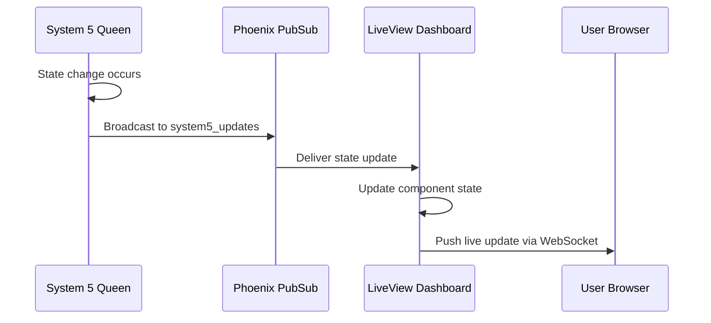
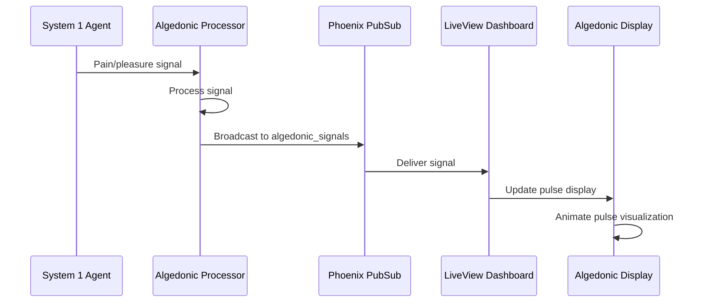
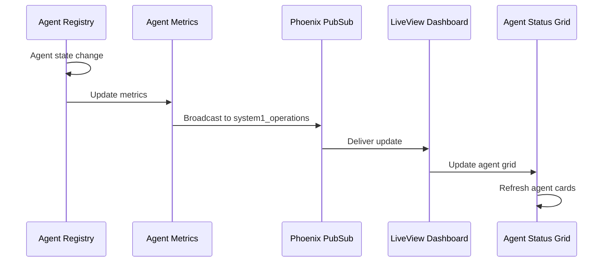

# LiveView Dashboard Architecture

## Overview
This diagram shows the real-time Phoenix LiveView dashboard architecture with 7 PubSub channels, algedonic signal processing, and comprehensive system monitoring capabilities.

```mermaid
graph TB
    subgraph "Phoenix LiveView Frontend"
        Dashboard[VSM Dashboard LiveView]
        
        subgraph "Dashboard Components"
            SystemMetrics[System Metrics<br/>Component]
            AlgedonicDisplay[Algedonic Pulse<br/>Display]
            AgentStatus[Agent Status<br/>Grid]
            PerformanceCharts[Performance<br/>Charts]
            PolicyStatus[Policy Status<br/>Panel]
            AlertPanel[Alert<br/>Panel]
            ControlPanel[Control<br/>Panel]
        end

        subgraph "Real-time Features"
            AutoRefresh[Auto-refresh<br/>Timer]
            WebSocketConn[WebSocket<br/>Connection]
            LiveUpdates[Live<br/>Updates]
        end
    end

    subgraph "PubSub System"
        PubSubCore[Phoenix.PubSub<br/>Core]
        
        subgraph "Subscription Channels"
            S5Chan[system5_updates]
            S4Chan[system4_updates]
            S3Chan[system3_updates]
            S2Chan[coordination_info]
            S1Chan[system1_operations]
            AlgChan[algedonic_signals]
            PolicyChan[policy_updates]
        end
    end

    subgraph "Data Sources"
        subgraph "System 5 Data"
            QueenState[Queen State<br/>& Policies]
            ViabilityMetrics[Viability<br/>Metrics]
            AlgedonicProc[Algedonic<br/>Processor]
        end

        subgraph "System 4 Data"
            IntelState[Intelligence<br/>State]
            EnvAlerts[Environmental<br/>Alerts]
            AdaptStatus[Adaptation<br/>Status]
        end

        subgraph "System 3 Data"
            ControlState[Control<br/>State]
            ResourceMetrics[Resource<br/>Metrics]
            PerfData[Performance<br/>Data]
        end

        subgraph "System 2 Data"
            CoordState[Coordinator<br/>State]
            InfoFlow[Information<br/>Flow Stats]
        end

        subgraph "System 1 Data"
            AgentRegistry[Agent<br/>Registry]
            AgentMetrics[Agent<br/>Metrics]
            OpStatus[Operations<br/>Status]
        end
    end

    subgraph "Background Processes"
        TelemetryCollector[Telemetry<br/>Collector]
        MetricsAggregator[Metrics<br/>Aggregator]
        HealthChecker[Health<br/>Checker]
        DataPolling[Data<br/>Polling]
    end

    %% Dashboard to Components
    Dashboard --> SystemMetrics
    Dashboard --> AlgedonicDisplay
    Dashboard --> AgentStatus
    Dashboard --> PerformanceCharts
    Dashboard --> PolicyStatus
    Dashboard --> AlertPanel
    Dashboard --> ControlPanel

    %% Real-time Infrastructure
    Dashboard <--> WebSocketConn
    Dashboard --> AutoRefresh
    Dashboard <--> LiveUpdates

    %% PubSub Subscriptions
    Dashboard --> PubSubCore
    PubSubCore --> S5Chan
    PubSubCore --> S4Chan
    PubSubCore --> S3Chan
    PubSubCore --> S2Chan
    PubSubCore --> S1Chan
    PubSubCore --> AlgChan
    PubSubCore --> PolicyChan

    %% Data Source Publishing
    QueenState --> S5Chan
    ViabilityMetrics --> S5Chan
    AlgedonicProc --> AlgChan

    IntelState --> S4Chan
    EnvAlerts --> S4Chan
    AdaptStatus --> S4Chan

    ControlState --> S3Chan
    ResourceMetrics --> S3Chan
    PerfData --> S3Chan

    CoordState --> S2Chan
    InfoFlow --> S2Chan

    AgentRegistry --> S1Chan
    AgentMetrics --> S1Chan
    OpStatus --> S1Chan

    PolicyStatus --> PolicyChan

    %% Background Processing
    TelemetryCollector --> MetricsAggregator
    MetricsAggregator --> PerformanceCharts
    HealthChecker --> SystemMetrics
    DataPolling --> AgentStatus

    %% Styling
    classDef dashboard fill:#e1f5fe,stroke:#333,stroke-width:3px
    classDef component fill:#f3e5f5,stroke:#333,stroke-width:2px
    classDef pubsub fill:#e8f5e8,stroke:#333,stroke-width:2px
    classDef channel fill:#fff3e0,stroke:#333,stroke-width:2px
    classDef datasource fill:#fce4ec,stroke:#333,stroke-width:2px
    classDef background fill:#f1f8e9,stroke:#333,stroke-width:2px
    classDef realtime fill:#e0f2f1,stroke:#333,stroke-width:2px

    class Dashboard dashboard
    class SystemMetrics,AlgedonicDisplay,AgentStatus,PerformanceCharts,PolicyStatus,AlertPanel,ControlPanel component
    class PubSubCore pubsub
    class S5Chan,S4Chan,S3Chan,S2Chan,S1Chan,AlgChan,PolicyChan channel
    class QueenState,ViabilityMetrics,AlgedonicProc,IntelState,EnvAlerts,AdaptStatus,ControlState,ResourceMetrics,PerfData,CoordState,InfoFlow,AgentRegistry,AgentMetrics,OpStatus datasource
    class TelemetryCollector,MetricsAggregator,HealthChecker,DataPolling background
    class AutoRefresh,WebSocketConn,LiveUpdates realtime
```



## Real-time Data Flow

### 1. System State Broadcasting


### 2. Algedonic Signal Display


### 3. Agent Status Updates


## Dashboard Components Detail

### System Metrics Component
```elixir
defmodule VsmPhoenixWeb.SystemMetricsComponent do
  use VsmPhoenixWeb, :live_component

  def render(assigns) do
    ~H"""
    <div class="system-metrics">
      <div class="metric-card">
        <h3>System 5 - Queen</h3>
        <div class="viability-score"><%= @s5_viability %></div>
        <div class="policy-count"><%= @active_policies %></div>
      </div>
      
      <div class="metric-card">
        <h3>System 4 - Intelligence</h3>
        <div class="scan-status"><%= @scan_status %></div>
        <div class="anomaly-count"><%= @anomaly_count %></div>
      </div>
      
      <div class="metric-card">
        <h3>System 3 - Control</h3>
        <div class="resource-usage"><%= @resource_usage %>%</div>
        <div class="performance-score"><%= @performance_score %></div>
      </div>
      
      <div class="metric-card">
        <h3>System 2 - Coordinator</h3>
        <div class="info-flow-rate"><%= @info_flow_rate %></div>
        <div class="coordination-health"><%= @coordination_health %></div>
      </div>
      
      <div class="metric-card">
        <h3>System 1 - Operations</h3>
        <div class="active-agents"><%= @active_agents %></div>
        <div class="operation-success"><%= @operation_success %>%</div>
      </div>
    </div>
    """
  end
end
```

### Algedonic Pulse Display
```elixir
defmodule VsmPhoenixWeb.AlgedonicDisplayComponent do
  use VsmPhoenixWeb, :live_component

  def render(assigns) do
    ~H"""
    <div class="algedonic-display">
      <div class="pulse-container">
        <div class="pulse-circle" style={"--pulse-rate: #{@pulse_rate}ms"}>
          <div class="pulse-inner" style={"background-color: #{pulse_color(@current_signal)}"}>
            <%= @current_signal %>
          </div>
        </div>
      </div>
      
      <div class="signal-history">
        <%= for signal <- @recent_signals do %>
          <div class="signal-bar" style={"height: #{abs(signal)}px; background-color: #{signal_color(signal)}"}>
          </div>
        <% end %>
      </div>
      
      <div class="algedonic-stats">
        <div class="stat">
          <label>Current Pulse Rate</label>
          <value><%= @pulse_rate %>ms</value>
        </div>
        <div class="stat">
          <label>Average Signal</label>
          <value><%= @average_signal %></value>
        </div>
      </div>
    </div>
    """
  end

  defp pulse_color(signal) when signal > 0, do: "#4CAF50"  # Green for pleasure
  defp pulse_color(signal) when signal < 0, do: "#F44336"  # Red for pain
  defp pulse_color(_), do: "#FFC107"                       # Yellow for neutral
end
```

### Agent Status Grid
```elixir
defmodule VsmPhoenixWeb.AgentStatusComponent do
  use VsmPhoenixWeb, :live_component

  def render(assigns) do
    ~H"""
    <div class="agent-grid">
      <%= for agent <- @agents do %>
        <div class="agent-card" data-agent-id={agent.id}>
          <div class="agent-header">
            <h4><%= agent.id %></h4>
            <span class={"status-indicator status-#{agent.status}"}></span>
          </div>
          
          <div class="agent-details">
            <div class="detail">
              <label>Type:</label>
              <value><%= agent.type %></value>
            </div>
            <div class="detail">
              <label>Uptime:</label>
              <value><%= format_uptime(agent.started_at) %></value>
            </div>
            <div class="detail">
              <label>Tasks:</label>
              <value><%= agent.completed_tasks %></value>
            </div>
          </div>
          
          <div class="agent-actions">
            <button phx-click="restart_agent" phx-value-agent={agent.id}>
              Restart
            </button>
            <button phx-click="inspect_agent" phx-value-agent={agent.id}>
              Inspect
            </button>
          </div>
        </div>
      <% end %>
    </div>
    """
  end
end
```

### Performance Charts
```elixir
defmodule VsmPhoenixWeb.PerformanceChartsComponent do
  use VsmPhoenixWeb, :live_component

  def render(assigns) do
    ~H"""
    <div class="performance-charts">
      <div class="chart-container">
        <h3>System Performance Over Time</h3>
        <canvas id="performance-chart" phx-hook="PerformanceChart" data-metrics={Jason.encode!(@performance_data)}>
        </canvas>
      </div>
      
      <div class="chart-container">
        <h3>Resource Utilization</h3>
        <canvas id="resource-chart" phx-hook="ResourceChart" data-metrics={Jason.encode!(@resource_data)}>
        </canvas>
      </div>
      
      <div class="chart-container">
        <h3>Agent Activity</h3>
        <canvas id="agent-chart" phx-hook="AgentChart" data-metrics={Jason.encode!(@agent_data)}>
        </canvas>
      </div>
    </div>
    """
  end
end
```

## PubSub Channel Specifications

### system5_updates
- **Messages**: Queen state, viability metrics, policy updates
- **Frequency**: On state change + 30-second heartbeat
- **Subscribers**: Dashboard main view, policy panel

### system4_updates  
- **Messages**: Intelligence state, environmental alerts, adaptation status
- **Frequency**: On scan completion + anomaly detection
- **Subscribers**: Dashboard intelligence panel, alert system

### system3_updates
- **Messages**: Control state, resource metrics, performance data
- **Frequency**: Every 10 seconds + on resource changes
- **Subscribers**: Dashboard resource panel, performance charts

### system2_updates (coordination_info)
- **Messages**: Coordination health, information flow statistics
- **Frequency**: Every 15 seconds
- **Subscribers**: Dashboard coordination panel

### system1_operations
- **Messages**: Agent registry changes, agent metrics, operation status
- **Frequency**: On agent state change + 5-second polling
- **Subscribers**: Agent status grid, operation counters

### algedonic_signals
- **Messages**: Pain/pleasure signals, pulse rate, signal strength
- **Frequency**: Real-time as signals occur
- **Subscribers**: Algedonic display, system health indicators

### policy_updates
- **Messages**: New policies, policy status changes, effectiveness metrics
- **Frequency**: On policy creation/update
- **Subscribers**: Policy status panel, system metric updates

## Interactive Features

### Manual System Controls
- **Agent Management**: Restart, inspect, terminate agents
- **Resource Allocation**: Manual resource adjustments
- **Policy Management**: Policy approval, modification, suspension
- **System Commands**: Emergency stops, system resets

### Real-time Alerts
- **Viability Warnings**: System viability below threshold
- **Resource Alerts**: Resource utilization approaching limits
- **Agent Failures**: Agent crashes or performance degradation
- **Anomaly Alerts**: Environmental anomalies detected

### Data Export
- **Metrics Export**: CSV/JSON export of performance data
- **Report Generation**: Automated system health reports
- **Alert History**: Historical alert and response data

## Implementation Files
- **Dashboard LiveView**: `/lib/vsm_phoenix_web/live/vsm_dashboard_live.ex`
- **Components**: `/lib/vsm_phoenix_web/components/dashboard/`
- **JavaScript Hooks**: `/assets/js/dashboard_hooks.js`
- **Styling**: `/assets/css/dashboard.css`
- **Telemetry**: `/lib/vsm_phoenix_web/telemetry.ex`

## Performance Optimization
- **Selective Updates**: Only changed data pushed to browser
- **Component Caching**: Static components cached between updates  
- **Batch Processing**: Multiple updates batched together
- **Connection Management**: Automatic reconnection on failures
- **Memory Management**: Old metrics data automatically cleaned up

This dashboard provides unprecedented real-time visibility into a cybernetic system, enabling operators to monitor and manage the autonomous VSM implementation with comprehensive situational awareness.