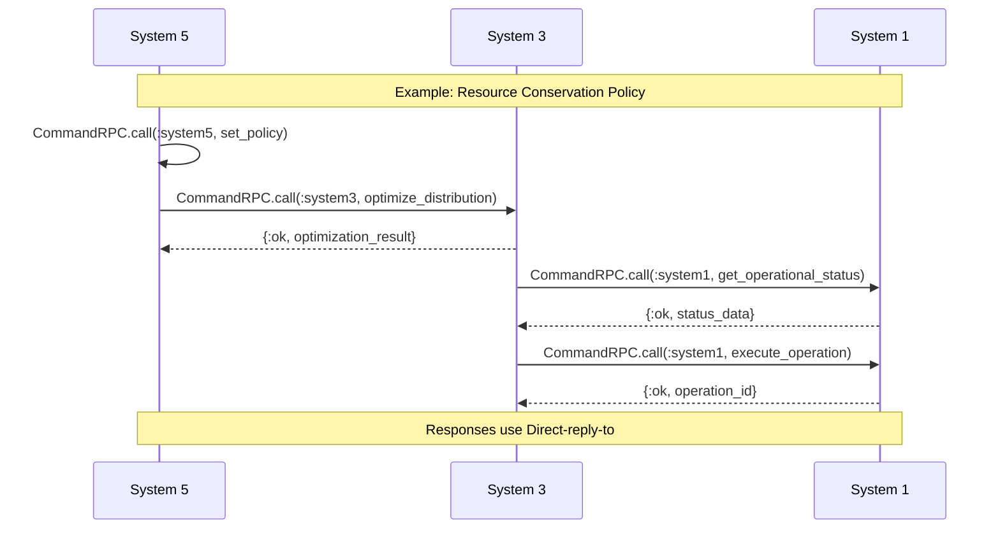
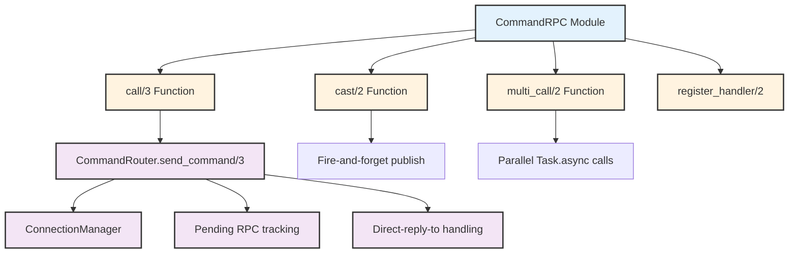
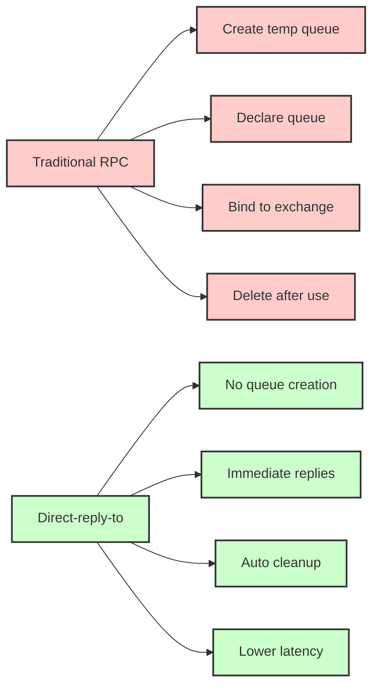

# RPC Command Flow Architecture

## Overview
This diagram shows the implemented AMQP RPC command flow using Direct-reply-to pattern for efficient bidirectional communication between VSM systems. The implementation uses CommandRPC and CommandRouter modules for simplified API.

```mermaid
sequenceDiagram
    participant Client as CommandRPC Client
    participant Router as CommandRouter
    participant ConnMgr as ConnectionManager
    participant Queue as Target Queue
    participant Handler as Command Handler
    participant ReplyTo as amq.rabbitmq.reply-to

    Note over Client,ReplyTo: Actual RPC Implementation Using Direct-reply-to

    %% RPC Call Initiation
    Client->>Router: CommandRPC.call(:system3, command)
    Router->>ConnMgr: get_channel(:rpc)
    ConnMgr->>Router: RPC channel
    Router->>Router: generate_correlation_id()
    
    %% Message Publishing
    Router->>Queue: Publish to vsm.system3.commands<br/>correlation_id: ABC123<br/>reply_to: amq.rabbitmq.reply-to
    Router->>Router: Store pending RPC<br/>Set timeout timer
    
    %% Command Processing
    Queue->>Handler: Deliver command message
    Handler->>Handler: Execute handler function
    Handler->>ReplyTo: Publish response<br/>correlation_id: ABC123
    
    %% Response Handling
    ReplyTo->>Router: Response delivered
    Router->>Router: Match correlation_id<br/>Cancel timeout timer
    Router->>Client: {:ok, result}

    Note over Client,Handler: 5 second default timeout

## Implemented Command Actions

### CommandRPC API Examples
```mermaid
flowchart TD
    API[CommandRPC API] --> Call[call/3]
    API --> Cast[cast/2] 
    API --> Multi[multi_call/2]
    
    Call --> S5Call[System 5 Commands]
    Call --> S3Call[System 3 Commands]
    Call --> S1Call[System 1 Commands]
    
    S5Call --> GetHealth[get_system_health]
    S5Call --> SetPolicy[set_policy]
    S5Call --> Emergency[emergency_override]
    
    S3Call --> AllocRes[allocate_resources]
    S3Call --> OptDist[optimize_distribution]
    S3Call --> EmShut[emergency_shutdown]
    
    S1Call --> GetOp[get_operational_status]
    S1Call --> ExecOp[execute_operation]
    S1Call --> GetSensor[get_sensor_data]
    
    classDef api fill:#e3f2fd,stroke:#333,stroke-width:2px
    classDef method fill:#fff3e0,stroke:#333,stroke-width:2px
    classDef action fill:#e8f5e9,stroke:#333,stroke-width:2px
    
    class API api
    class Call,Cast,Multi method
    class GetHealth,SetPolicy,Emergency,AllocRes,OptDist,EmShut,GetOp,ExecOp,GetSensor action
```

### Actual Command Flow Examples


## RPC Implementation Architecture

### CommandRPC Module Structure


### Actual CommandRPC Implementation
```elixir
# Simple public API in CommandRPC module
def call(target, command, opts \\ []) when is_atom(target) and is_map(command) do
  timeout = Keyword.get(opts, :timeout, @default_timeout)
  
  # Delegates to CommandRouter for actual RPC
  case CommandRouter.send_command(target, command, timeout) do
    {:ok, result} ->
      Logger.debug("✅ RPC call to #{target} succeeded")
      {:ok, result}
      
    {:error, :timeout} ->
      Logger.warn("⏱️  RPC call to #{target} timed out after #{timeout}ms")
      {:error, :timeout}
      
    {:error, reason} = error ->
      Logger.error("❌ RPC call to #{target} failed: #{inspect(reason)}")
      error
  end
end

# Fire-and-forget messaging
def cast(target, command) when is_atom(target) and is_map(command) do
  Task.start(fn ->
    case ConnectionManager.get_channel(:command_cast) do
      {:ok, channel} ->
        message = Jason.encode!(%{
          type: "command",
          command: command,
          timestamp: DateTime.utc_now(),
          source: node(),
          mode: "fire_and_forget"
        })
        
        target_queue = "vsm.#{target}.commands"
        AMQP.Basic.publish(channel, "", target_queue, message)
        
      {:error, reason} ->
        Logger.error("Failed to cast command: #{inspect(reason)}")
    end
  end)
  
  :ok
end
```

### CommandRouter RPC Handler
```elixir
# Inside CommandRouter module
def handle_call({:send_command, target_system, command, timeout}, from, state) do
  case ConnectionManager.get_channel(:rpc) do
    {:ok, rpc_channel} ->
      correlation_id = generate_correlation_id()
      reply_queue = "amq.rabbitmq.reply-to"  # Special RabbitMQ queue
      
      # Ensure reply consumer is active
      state = ensure_reply_consumer(state, rpc_channel, reply_queue)
      
      # Build command message
      message = Jason.encode!(%{
        type: "command",
        command: command,
        correlation_id: correlation_id,
        reply_to: reply_queue,
        timestamp: DateTime.utc_now(),
        source: node()
      })
      
      # Store pending RPC with timeout
      new_state = put_in(state.pending_rpcs[correlation_id], %{
        from: from,
        timeout_ref: Process.send_after(self(), {:rpc_timeout, correlation_id}, timeout)
      })
      
      # Publish to target queue
      target_queue = "vsm.#{target_system}.commands"
      AMQP.Basic.publish(rpc_channel, "", target_queue, message,
        reply_to: reply_queue,
        correlation_id: correlation_id
      )
      
      {:noreply, new_state}
      
    {:error, reason} ->
      {:reply, {:error, reason}, state}
  end
end
```

## Real Command Examples (From ExampleHandlers)

### System 5 Commands
```elixir
# S5 queries overall system health (cross-system RPC)
{:ok, health} = CommandRPC.call(:system5, %{
  "action" => "get_system_health"
})

# S5 sets a conservation policy with S3 coordination
{:ok, policy} = CommandRPC.call(:system5, %{
  "action" => "set_policy",
  "policy_type" => "resource_conservation",
  "parameters" => %{"threshold" => 0.8, "mode" => "aggressive"}
})

# S5 emergency override to any system
{:ok, result} = CommandRPC.call(:system5, %{
  "action" => "emergency_override",
  "target_system" => "system3",
  "override_command" => %{"action" => "emergency_shutdown"}
})
```

### System 3 Commands
```elixir
# S3 allocates resources (queries S1 first)
{:ok, allocation} = CommandRPC.call(:system3, %{
  "action" => "allocate_resources",
  "resource_type" => "compute",  # compute, memory, network, storage
  "amount" => 20,
  "requester" => "policy_enforcement"
})

# S3 optimizes distribution
{:ok, optimization} = CommandRPC.call(:system3, %{
  "action" => "optimize_distribution",
  "optimization_goal" => "minimize_resource_usage",
  "policy_id" => "policy_123"
})

# S3 emergency shutdown (cascades to S1)
{:ok, shutdown} = CommandRPC.call(:system3, %{
  "action" => "emergency_shutdown",
  "reason" => "critical_overload"
})
```

### System 1 Commands  
```elixir
# S1 operational status query
{:ok, status} = CommandRPC.call(:system1, %{
  "action" => "get_operational_status",
  "subsystem" => "production_line_1"
})

# S1 sensor data retrieval
{:ok, sensors} = CommandRPC.call(:system1, %{
  "action" => "get_sensor_data",  
  "sensor_ids" => ["temp_001", "pressure_002", "flow_003"]
})

# S1 execute operation
{:ok, operation} = CommandRPC.call(:system1, %{
  "action" => "execute_operation",
  "operation" => "reduce_throughput",
  "reason" => "high_sensor_readings"
})
```

### Parallel Multi-System Commands
```elixir
# Batch RPC to multiple systems
results = CommandRPC.multi_call([
  {:system1, %{"action" => "get_operational_status"}},
  {:system3, %{"action" => "get_resource_status"}},
  {:system5, %{"action" => "get_active_policies"}}
], timeout: 3000)

# Fire-and-forget notifications
CommandRPC.cast(:system1, %{
  "action" => "log_event",
  "event" => "policy_updated",
  "details" => %{"policy_id" => "pol_123"}
})
```

## Error Handling and Implementation Details

### Timeout Handling in CommandRouter
```elixir
# Automatic timeout handling with correlation ID tracking
def handle_info({:rpc_timeout, correlation_id}, state) do
  case Map.pop(state.pending_rpcs, correlation_id) do
    {nil, _} ->
      {:noreply, state}
      
    {rpc_info, new_pending} ->
      GenServer.reply(rpc_info.from, {:error, :timeout})
      {:noreply, %{state | pending_rpcs: new_pending}}
  end
end
```

### Command Handler Registration
```elixir
# Systems register handlers to process incoming commands
CommandRPC.register_handler(:system3, fn command, _meta ->
  case command["action"] do
    "allocate_resources" ->
      # Handler can make RPC calls to other systems
      {:ok, s1_status} = CommandRPC.call(:system1, %{
        "action" => "get_operational_status",
        "subsystem" => "resource_pool"
      })
      
      # Process and return result
      %{resource_id: "res_123", current_pool: s1_status}
      
    _ ->
      {:error, "Unknown action"}
  end
end)
```

### Event Publishing (Upward Flow)
```elixir
# Events use fanout exchanges for broadcasting
CommandRouter.publish_event(:control, %{
  event: "resource_allocated",
  details: %{resource_id: "res_123", amount: 10}
})

# Available event types and their exchanges:
# :algedonic   -> vsm.algedonic (fanout)
# :coordination -> vsm.coordination (fanout)
# :control     -> vsm.control (fanout)
# :intelligence -> vsm.intelligence (fanout)
# :policy      -> vsm.policy (fanout)
```

## Direct-reply-to Pattern Benefits

### Why RabbitMQ Direct-reply-to?


### Performance Characteristics
- **Default timeout**: 5 seconds (configurable per call)
- **Correlation tracking**: Crypto-generated 16-byte IDs
- **Connection pooling**: Separate channels for RPC vs events
- **No queue declaration overhead**: Direct-reply-to is pre-existing
- **Automatic cleanup**: No manual queue deletion needed

## Implementation Files
- **CommandRPC**: `/lib/vsm_phoenix/amqp/command_rpc.ex` - Simple public API
- **CommandRouter**: `/lib/vsm_phoenix/amqp/command_router.ex` - Core routing logic
- **ExampleHandlers**: `/lib/vsm_phoenix/amqp/example_handlers.ex` - Working examples
- **ConnectionManager**: `/lib/vsm_phoenix/amqp/connection_manager.ex` - Channel management

## Key Implementation Notes

1. **Command Structure**: Commands are simple maps with "action" field, not complex structs
2. **Handler Registration**: Each system registers one handler function that switches on action
3. **Bidirectional Flow**: Commands flow down (S5→S1), events flow up (S1→S5)
4. **Fire-and-forget**: Use `cast/2` for non-critical notifications
5. **Batch Operations**: Use `multi_call/2` for parallel RPC to multiple systems

This implementation provides a clean, efficient RPC mechanism for VSM hierarchical control while maintaining the cybernetic principles of the architecture.