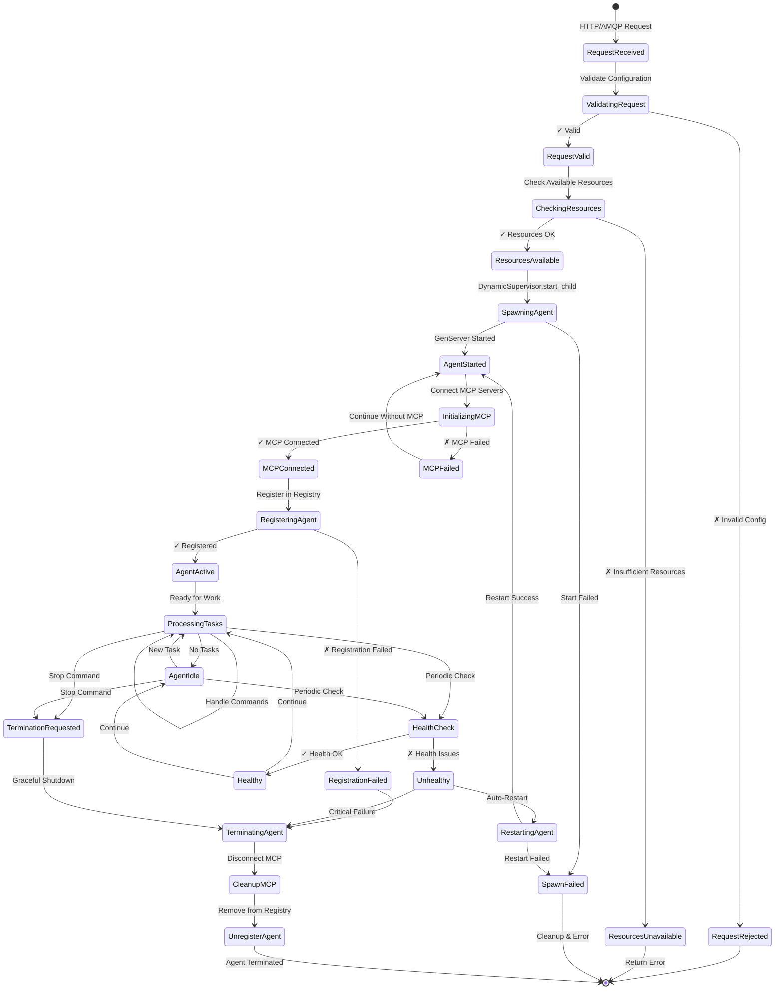
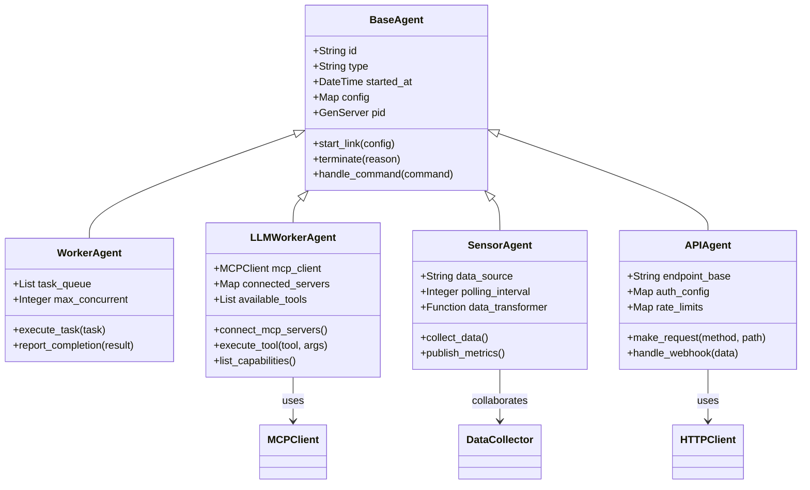
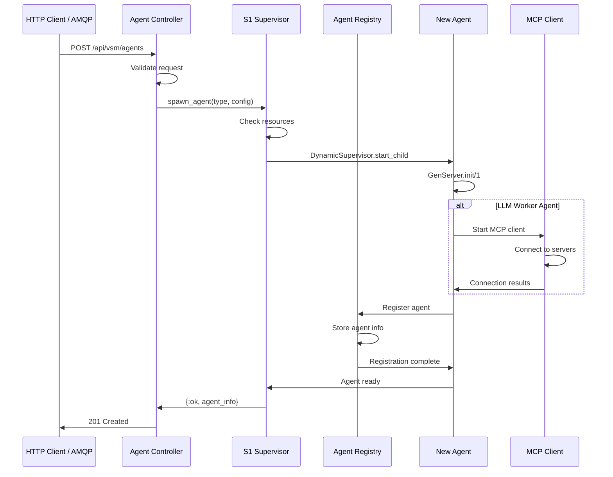
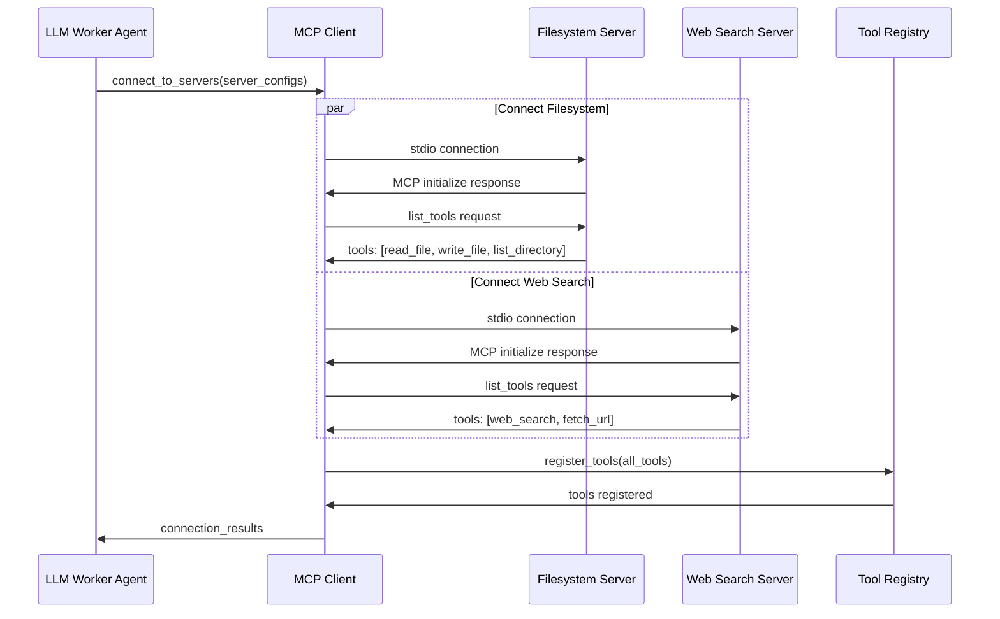
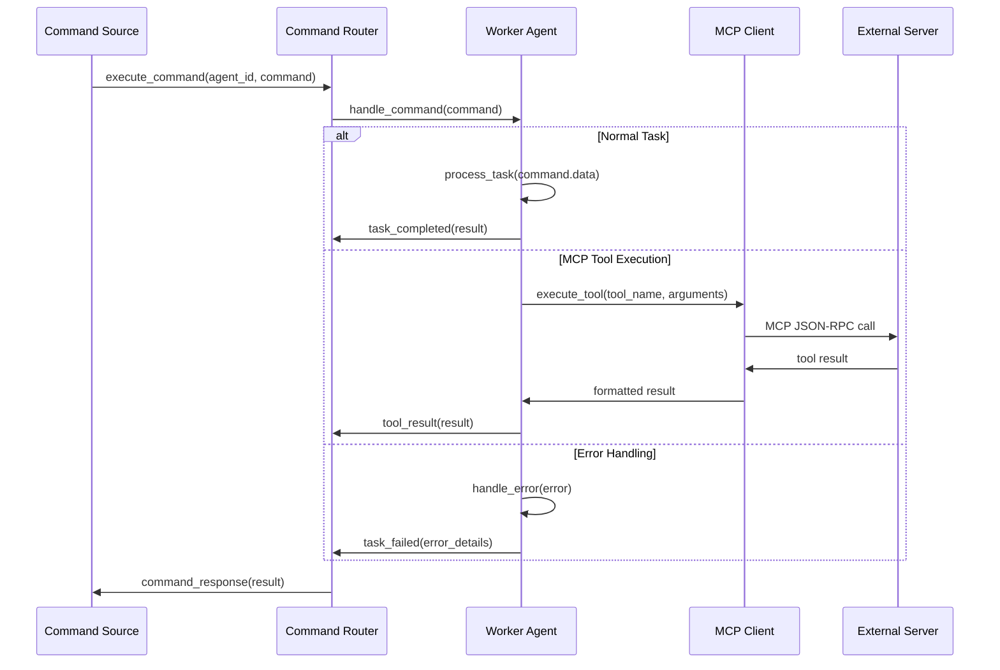
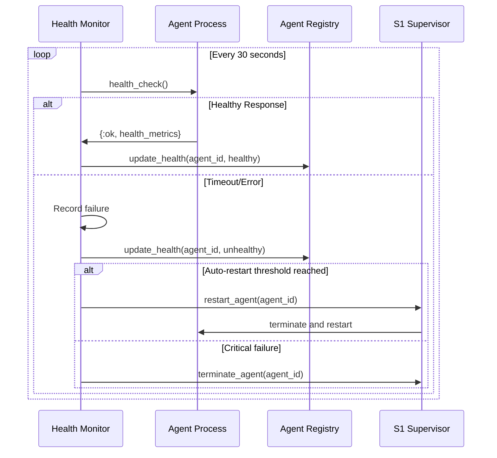

# Agent Lifecycle Architecture

## Overview
This diagram shows the complete agent management lifecycle from spawn to termination, covering all 4 agent types (Worker, LLM Worker, Sensor, API) with automatic MCP integration and health monitoring.



## Agent Types and Specifications

### Agent Type Configuration


## Detailed Lifecycle Flow

### 1. Agent Spawn Process


### 2. MCP Server Auto-Connection


### 3. Task Execution Flow


### 4. Health Monitoring


## Agent Configuration Examples

### Worker Agent Configuration
```elixir
%{
  type: :worker,
  config: %{
    max_concurrent_tasks: 5,
    task_timeout: 30_000,
    retry_failed_tasks: 3,
    task_types: [:data_processing, :file_operations, :calculations],
    resource_limits: %{
      memory_mb: 512,
      cpu_percent: 25
    }
  }
}
```

### LLM Worker Agent Configuration
```elixir
%{
  type: :llm_worker,
  config: %{
    mcp_servers: [
      %{
        name: "filesystem",
        command: "npx",
        args: ["-y", "@modelcontextprotocol/server-filesystem", "/workspace"],
        transport: "stdio"
      },
      %{
        name: "web_search",
        command: "npx", 
        args: ["-y", "@modelcontextprotocol/server-web-search"],
        transport: "stdio"
      }
    ],
    auto_discover_tools: true,
    tool_timeout: 60_000,
    max_tool_memory: "1GB"
  }
}
```

### Sensor Agent Configuration
```elixir
%{
  type: :sensor,
  config: %{
    data_source: :system_metrics,
    polling_interval: 10_000,
    metrics: [:cpu_usage, :memory_usage, :disk_io, :network_io],
    thresholds: %{
      cpu_critical: 90,
      memory_critical: 85,
      disk_critical: 95
    },
    alert_targets: [:system3_control, :dashboard]
  }
}
```

### API Agent Configuration
```elixir
%{
  type: :api,
  config: %{
    base_url: "https://api.external-service.com",
    auth: %{
      type: :bearer_token,
      token: "${API_TOKEN}"
    },
    rate_limits: %{
      requests_per_minute: 100,
      burst_limit: 10
    },
    endpoints: [
      %{path: "/webhook", method: :post, handler: :handle_webhook},
      %{path: "/status", method: :get, handler: :get_status}
    ]
  }
}
```

## Agent State Management

### Agent State Structure
```elixir
defmodule AgentState do
  @type t :: %__MODULE__{
    id: String.t(),
    type: atom(),
    pid: pid(),
    status: :starting | :active | :idle | :busy | :error | :stopping,
    config: map(),
    started_at: DateTime.t(),
    last_heartbeat: DateTime.t(),
    task_queue: list(),
    current_task: map() | nil,
    metrics: map(),
    mcp_client: pid() | nil,
    connected_servers: map(),
    available_tools: list(),
    health_status: :healthy | :degraded | :unhealthy,
    failure_count: integer(),
    restart_count: integer()
  }
  
  defstruct [
    :id, :type, :pid, :status, :config, :started_at, :last_heartbeat,
    :task_queue, :current_task, :metrics, :mcp_client, :connected_servers,
    :available_tools, :health_status, :failure_count, :restart_count
  ]
end
```

### Registry Operations
```elixir
defmodule VsmPhoenix.System1.Registry do
  def register_agent(agent_info) do
    :ets.insert(@table, {agent_info.id, agent_info})
    Phoenix.PubSub.broadcast(VsmPhoenix.PubSub, "system1_operations", 
                           {:agent_registered, agent_info})
  end
  
  def update_agent_status(agent_id, status) do
    case :ets.lookup(@table, agent_id) do
      [{^agent_id, agent_info}] ->
        updated = %{agent_info | status: status, last_heartbeat: DateTime.utc_now()}
        :ets.insert(@table, {agent_id, updated})
        
        Phoenix.PubSub.broadcast(VsmPhoenix.PubSub, "system1_operations",
                               {:agent_status_changed, agent_id, status})
        {:ok, updated}
        
      [] ->
        {:error, :agent_not_found}
    end
  end
  
  def get_agent_metrics(agent_id) do
    case :ets.lookup(@table, agent_id) do
      [{^agent_id, agent_info}] ->
        {:ok, agent_info.metrics}
      [] ->
        {:error, :agent_not_found}
    end
  end
end
```

## Error Handling and Recovery

### Failure Categories
1. **Startup Failures**: Configuration errors, resource unavailability
2. **Runtime Failures**: Task execution errors, MCP connection issues
3. **Health Failures**: Unresponsive agents, memory leaks, performance degradation
4. **External Failures**: MCP server disconnections, API rate limits

### Recovery Strategies
```elixir
defmodule AgentRecovery do
  def handle_agent_failure(agent_id, failure_type) do
    case failure_type do
      :startup_failure ->
        # Check configuration and resources, attempt restart with delay
        schedule_restart(agent_id, delay: 5_000)
        
      :mcp_connection_failure ->
        # Attempt MCP reconnection without full restart
        reconnect_mcp_servers(agent_id)
        
      :performance_degradation ->
        # Reduce task load and monitor
        reduce_agent_load(agent_id)
        schedule_health_check(agent_id, delay: 30_000)
        
      :critical_failure ->
        # Immediate termination and restart
        terminate_and_restart(agent_id)
        
      :repeated_failures ->
        # Escalate to System 3 for resource investigation
        escalate_to_system3(agent_id, failure_history)
    end
  end
end
```

### Graceful Shutdown
```elixir
def terminate(reason, state) do
  Logger.info("Agent #{state.id} terminating: #{inspect(reason)}")
  
  # Finish current task if possible
  if state.current_task do
    complete_or_reschedule_task(state.current_task)
  end
  
  # Disconnect MCP servers
  if state.mcp_client do
    MCPClient.disconnect_all(state.mcp_client)
  end
  
  # Unregister from registry
  Registry.unregister_agent(state.id)
  
  # Publish termination event
  Phoenix.PubSub.broadcast(VsmPhoenix.PubSub, "system1_operations",
                         {:agent_terminated, state.id, reason})
  
  :ok
end
```

## Performance Monitoring

### Agent Metrics Collection
```elixir
def collect_agent_metrics(agent_id) do
  %{
    uptime: calculate_uptime(agent_id),
    tasks_completed: get_completed_task_count(agent_id),
    tasks_failed: get_failed_task_count(agent_id),
    average_task_duration: get_average_task_duration(agent_id),
    memory_usage: get_memory_usage(agent_id),
    cpu_usage: get_cpu_usage(agent_id),
    mcp_connections: get_mcp_connection_count(agent_id),
    mcp_tools_available: get_available_tool_count(agent_id),
    health_score: calculate_health_score(agent_id),
    last_error: get_last_error(agent_id)
  }
end
```

### Performance Optimization
- **Resource Pooling**: Shared MCP connections for similar agents
- **Task Batching**: Combine similar tasks for efficiency
- **Lazy Loading**: Connect MCP servers only when needed
- **Connection Reuse**: Maintain persistent MCP connections
- **Health Prediction**: Proactive restart before failure

## Implementation Files
- **Base Agent**: `/lib/vsm_phoenix/system1/agents/base_agent.ex`
- **LLM Worker**: `/lib/vsm_phoenix/system1/agents/llm_worker_agent.ex`
- **Worker Agent**: `/lib/vsm_phoenix/system1/agents/worker_agent.ex`
- **Sensor Agent**: `/lib/vsm_phoenix/system1/agents/sensor_agent.ex`
- **API Agent**: `/lib/vsm_phoenix/system1/agents/api_agent.ex`
- **Registry**: `/lib/vsm_phoenix/system1/registry.ex`
- **Supervisor**: `/lib/vsm_phoenix/system1/supervisor.ex`
- **Health Monitor**: `/lib/vsm_phoenix/system1/health_monitor.ex`

This comprehensive agent lifecycle system enables dynamic, fault-tolerant operations with automatic MCP integration and sophisticated health monitoring, forming the operational foundation of the VSM system.