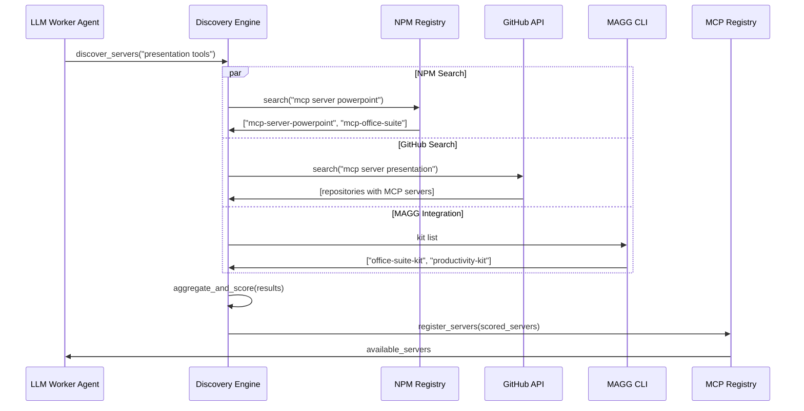
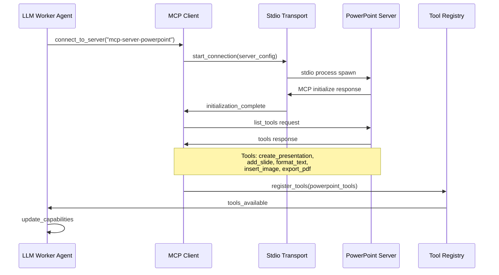
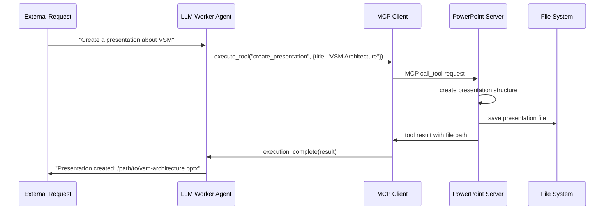
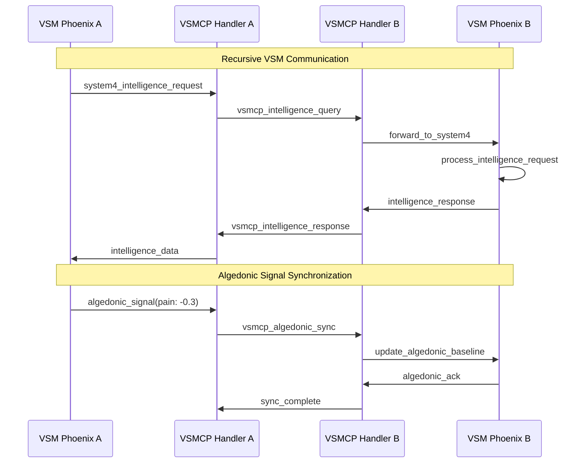

# MCP Integration Architecture

## Overview
This diagram shows the comprehensive Model Context Protocol (MCP) integration with 35+ tools, dynamic server discovery, and the VSMCP recursive protocol for VSM-to-VSM communication.

```mermaid
graph TB
    subgraph "VSM Phoenix Application"
        subgraph "System 1 - Operations"
            LLMAgent[LLM Worker Agents]
            MCPRegistry[MCP Registry]
            ServerCatalog[Server Catalog]
        end
        
        subgraph "MCP Integration Layer"
            MCPClient[MCP Client]
            StdioTransport[Stdio Transport]
            HttpTransport[HTTP Transport]
            ProtocolHandler[Protocol Handler]
            ToolAggregator[Tool Aggregator]
        end
        
        subgraph "Discovery System"
            DiscoveryEngine[Discovery Engine]
            NPMSearch[NPM Search]
            GitHubSearch[GitHub Search]
            LocalScanner[Local Scanner]
            MAGGIntegration[MAGG Integration]
        end
    end

    subgraph "External MCP Servers"
        subgraph "Official Servers"
            Filesystem[Filesystem Server<br/>@modelcontextprotocol/server-filesystem]
            WebSearch[Web Search Server<br/>@modelcontextprotocol/server-web-search]
            GitHub[GitHub Server<br/>@modelcontextprotocol/server-github]
            Slack[Slack Server<br/>@modelcontextprotocol/server-slack]
        end
        
        subgraph "Community Servers"
            PowerPoint[PowerPoint Server<br/>mcp-server-powerpoint]
            Database[Database Server<br/>mcp-server-postgres]
            Email[Email Server<br/>mcp-server-gmail]
            Calendar[Calendar Server<br/>mcp-server-google-calendar]
        end
        
        subgraph "VSM Servers"
            VSMServer1[VSM Phoenix Instance A<br/>VSMCP Protocol]
            VSMServer2[VSM Phoenix Instance B<br/>VSMCP Protocol]
            HiveMind[VSM HiveMind Server<br/>Collective Intelligence]
        end
    end

    subgraph "VSMCP Recursive Protocol"
        VSMCPHandler[VSMCP Handler]
        RecursiveComm[Recursive Communication]
        SystemMapping[System Mapping]
        AlgedonicSync[Algedonic Sync]
    end

    %% Main Integration Flow
    LLMAgent --> MCPClient
    MCPClient --> StdioTransport
    MCPClient --> HttpTransport
    MCPClient --> ProtocolHandler
    ProtocolHandler --> ToolAggregator

    %% Discovery Flow
    DiscoveryEngine --> NPMSearch
    DiscoveryEngine --> GitHubSearch
    DiscoveryEngine --> LocalScanner
    DiscoveryEngine --> MAGGIntegration
    
    DiscoveryEngine --> MCPRegistry
    MCPRegistry --> ServerCatalog
    ServerCatalog --> MCPClient

    %% External Connections
    StdioTransport <--> Filesystem
    StdioTransport <--> WebSearch
    StdioTransport <--> GitHub
    StdioTransport <--> Slack
    
    HttpTransport <--> PowerPoint
    HttpTransport <--> Database
    HttpTransport <--> Email
    HttpTransport <--> Calendar

    %% VSMCP Connections
    VSMCPHandler <--> VSMServer1
    VSMCPHandler <--> VSMServer2
    VSMCPHandler <--> HiveMind
    
    VSMCPHandler --> RecursiveComm
    RecursiveComm --> SystemMapping
    SystemMapping --> AlgedonicSync

    %% Registry Updates
    ToolAggregator --> MCPRegistry
    MCPRegistry --> LLMAgent

    %% Styling
    classDef vsm fill:#e1f5fe,stroke:#333,stroke-width:3px
    classDef mcp fill:#f3e5f5,stroke:#333,stroke-width:2px
    classDef discovery fill:#e8f5e8,stroke:#333,stroke-width:2px
    classDef external fill:#fff3e0,stroke:#333,stroke-width:2px
    classDef vsmcp fill:#fce4ec,stroke:#333,stroke-width:3px

    class LLMAgent,MCPRegistry,ServerCatalog vsm
    class MCPClient,StdioTransport,HttpTransport,ProtocolHandler,ToolAggregator mcp
    class DiscoveryEngine,NPMSearch,GitHubSearch,LocalScanner,MAGGIntegration discovery
    class Filesystem,WebSearch,GitHub,Slack,PowerPoint,Database,Email,Calendar external
    class VSMCPHandler,RecursiveComm,SystemMapping,AlgedonicSync,VSMServer1,VSMServer2,HiveMind vsmcp
```



## MCP Tool Discovery Flow

### 1. Dynamic Server Discovery


### 2. Server Connection and Tool Discovery


### 3. Tool Execution Flow


## VSMCP Recursive Protocol

### VSM-to-VSM Communication


### VSMCP Protocol Specification
```elixir
defmodule VSMCP.Protocol do
  @type message :: %{
    jsonrpc: "2.0",
    id: String.t(),
    method: String.t(),
    params: map()
  }

  @type vsmcp_methods :: 
    :system_status |
    :intelligence_query |
    :algedonic_sync |
    :policy_propagation |
    :resource_negotiation |
    :recursive_spawn

  # System Status Query
  def system_status_request(target_vsm) do
    %{
      jsonrpc: "2.0",
      id: generate_id(),
      method: "vsmcp/system_status",
      params: %{
        requesting_vsm: node_id(),
        systems_requested: [:system4, :system5]
      }
    }
  end

  # Intelligence Collaboration
  def intelligence_query(query_data) do
    %{
      jsonrpc: "2.0", 
      id: generate_id(),
      method: "vsmcp/intelligence_query",
      params: %{
        query_type: query_data.type,
        environmental_data: query_data.environment,
        variety_threshold: query_data.threshold,
        requesting_system: "system4"
      }
    }
  end

  # Algedonic Signal Synchronization
  def algedonic_sync(signal_data) do
    %{
      jsonrpc: "2.0",
      id: generate_id(),
      method: "vsmcp/algedonic_sync", 
      params: %{
        signal_strength: signal_data.strength,
        signal_type: signal_data.type, # :pain | :pleasure
        originating_system: signal_data.system,
        timestamp: DateTime.utc_now(),
        propagation_rule: :broadcast
      }
    }
  end

  # Policy Propagation
  def policy_propagation(policy) do
    %{
      jsonrpc: "2.0",
      id: generate_id(),
      method: "vsmcp/policy_propagation",
      params: %{
        policy_id: policy.id,
        policy_type: policy.type,
        policy_rule: policy.rule,
        scope: policy.scope,
        auto_executable: policy.auto_executable,
        originating_queen: node_id()
      }
    }
  end
end
```

## MCP Server Catalog

### Official MCP Servers
```elixir
@official_servers %{
  "filesystem" => %{
    package: "@modelcontextprotocol/server-filesystem",
    description: "File system operations",
    tools: ["read_file", "write_file", "list_directory", "create_directory"],
    install_command: "npx -y @modelcontextprotocol/server-filesystem",
    transport: :stdio,
    category: :core
  },
  
  "web_search" => %{
    package: "@modelcontextprotocol/server-web-search", 
    description: "Web search and URL fetching",
    tools: ["web_search", "fetch_url", "extract_content"],
    install_command: "npx -y @modelcontextprotocol/server-web-search",
    transport: :stdio,
    category: :web
  },
  
  "github" => %{
    package: "@modelcontextprotocol/server-github",
    description: "GitHub repository operations", 
    tools: ["create_issue", "get_repo_info", "list_commits", "create_pr"],
    install_command: "npx -y @modelcontextprotocol/server-github",
    transport: :stdio,
    category: :development
  },
  
  "slack" => %{
    package: "@modelcontextprotocol/server-slack",
    description: "Slack messaging and channel operations",
    tools: ["send_message", "list_channels", "get_messages", "create_channel"],
    install_command: "npx -y @modelcontextprotocol/server-slack", 
    transport: :stdio,
    category: :communication
  }
}
```

### Community MCP Servers
```elixir
@community_servers %{
  "powerpoint" => %{
    package: "mcp-server-powerpoint",
    description: "Microsoft PowerPoint presentation creation",
    tools: ["create_presentation", "add_slide", "format_text", "insert_image", "export_pdf"],
    install_command: "npm install -g mcp-server-powerpoint",
    transport: :stdio,
    category: :productivity,
    verified: false
  },
  
  "postgres" => %{
    package: "mcp-server-postgres", 
    description: "PostgreSQL database operations",
    tools: ["execute_query", "create_table", "insert_data", "backup_database"],
    install_command: "npm install -g mcp-server-postgres",
    transport: :http,
    category: :database,
    verified: true
  },
  
  "gmail" => %{
    package: "mcp-server-gmail",
    description: "Gmail email management",
    tools: ["send_email", "list_emails", "read_email", "create_draft"],
    install_command: "npm install -g mcp-server-gmail",
    transport: :stdio,
    category: :communication,
    verified: true
  }
}
```

## Tool Aggregation and Routing

### Tool Registry Structure
```elixir
defmodule MCPToolRegistry do
  use GenServer

  defstruct [
    :servers,      # %{server_name => server_info}
    :tools,        # %{tool_name => server_name}
    :capabilities, # %{capability => [servers]}
    :connections   # %{server_name => connection_pid}
  ]

  def register_server(server_name, server_info, tools) do
    GenServer.call(__MODULE__, {:register_server, server_name, server_info, tools})
  end

  def execute_tool(tool_name, arguments) do
    case GenServer.call(__MODULE__, {:get_tool_server, tool_name}) do
      {:ok, server_name} ->
        execute_on_server(server_name, tool_name, arguments)
      {:error, :tool_not_found} ->
        {:error, "Tool #{tool_name} not available"}
    end
  end

  def list_capabilities() do
    GenServer.call(__MODULE__, :list_capabilities)
  end

  # Smart tool routing based on capability
  def find_tools_for_capability(capability) do
    GenServer.call(__MODULE__, {:find_tools, capability})
  end
end
```

### Intelligent Tool Selection
```elixir
defmodule ToolSelector do
  # Select best tool for a given task
  def select_tool_for_task(task_description) do
    capabilities = extract_capabilities(task_description)
    
    case capabilities do
      %{type: :file_operation, action: :read} ->
        {:ok, "filesystem", "read_file"}
        
      %{type: :web_search, query: query} ->
        {:ok, "web_search", "web_search"}
        
      %{type: :presentation, action: :create} ->
        case MCPToolRegistry.find_tools_for_capability(:presentation) do
          [{"powerpoint", tools} | _] -> {:ok, "powerpoint", "create_presentation"}
          [] -> {:error, :no_presentation_tools}
        end
        
      %{type: :communication, platform: :slack} ->
        {:ok, "slack", "send_message"}
        
      _ ->
        {:error, :capability_not_found}
    end
  end

  defp extract_capabilities(description) do
    # Use NLP or pattern matching to extract capabilities
    # This could integrate with LLM for intelligent capability detection
    cond do
      String.contains?(description, ["create presentation", "powerpoint", "slides"]) ->
        %{type: :presentation, action: :create}
        
      String.contains?(description, ["search web", "find online", "lookup"]) ->
        %{type: :web_search, query: extract_query(description)}
        
      String.contains?(description, ["read file", "open file", "file content"]) ->
        %{type: :file_operation, action: :read}
        
      String.contains?(description, ["send message", "slack", "notify team"]) ->
        %{type: :communication, platform: :slack}
        
      true ->
        %{type: :unknown}
    end
  end
end
```

## Advanced MCP Features

### Connection Pooling and Management
```elixir
defmodule MCPConnectionPool do
  use GenServer

  def get_connection(server_name) do
    case GenServer.call(__MODULE__, {:get_connection, server_name}) do
      {:ok, connection} -> 
        {:ok, connection}
      {:error, :not_connected} ->
        # Auto-connect if server is available
        connect_server(server_name)
    end
  end

  def connect_server(server_name) do
    case ServerCatalog.get_server_config(server_name) do
      {:ok, config} ->
        case start_connection(config) do
          {:ok, connection_pid} ->
            GenServer.call(__MODULE__, {:register_connection, server_name, connection_pid})
            {:ok, connection_pid}
          error ->
            error
        end
      error ->
        error
    end
  end

  defp start_connection(%{transport: :stdio} = config) do
    StdioTransport.start_link(config)
  end

  defp start_connection(%{transport: :http} = config) do
    HttpTransport.start_link(config)
  end
end
```

### Error Handling and Resilience
```elixir
defmodule MCPErrorHandler do
  def handle_tool_error(server_name, tool_name, error) do
    case error do
      {:error, :connection_lost} ->
        # Attempt reconnection
        MCPConnectionPool.reconnect_server(server_name)
        
      {:error, :tool_not_found} ->
        # Refresh tool list
        refresh_server_tools(server_name)
        
      {:error, :timeout} ->
        # Increase timeout and retry
        retry_with_timeout(server_name, tool_name, timeout: 60_000)
        
      {:error, :server_error, details} ->
        # Log error and fallback to alternative
        Logger.error("MCP server error: #{inspect(details)}")
        find_alternative_tool(tool_name)
    end
  end

  defp find_alternative_tool(tool_name) do
    case MCPToolRegistry.find_alternative_servers(tool_name) do
      [alternative_server | _] ->
        {:fallback, alternative_server}
      [] ->
        {:error, :no_alternatives}
    end
  end
end
```

### Performance Monitoring
```elixir
defmodule MCPMetrics do
  def record_tool_execution(server_name, tool_name, duration, success) do
    :telemetry.execute(
      [:mcp, :tool, :execution],
      %{duration: duration, success: if(success, do: 1, else: 0)},
      %{server: server_name, tool: tool_name}
    )
  end

  def get_server_metrics(server_name) do
    %{
      connection_uptime: get_connection_uptime(server_name),
      tools_executed: get_tools_executed_count(server_name),
      average_response_time: get_average_response_time(server_name),
      error_rate: get_error_rate(server_name),
      available_tools: get_available_tools_count(server_name)
    }
  end
end
```

## Implementation Files
- **MCP Client**: `/lib/vsm_phoenix/mcp/client.ex`
- **Stdio Transport**: `/lib/vsm_phoenix/mcp/stdio_transport.ex`
- **HTTP Transport**: `/lib/vsm_phoenix/mcp/http_transport.ex`
- **Protocol Handler**: `/lib/vsm_phoenix/mcp/protocol.ex`
- **Tool Registry**: `/lib/vsm_phoenix/mcp/tool_registry.ex`
- **Server Catalog**: `/lib/vsm_phoenix/mcp/server_catalog.ex`
- **Discovery Engine**: `/lib/vsm_phoenix/mcp/discovery_engine.ex`
- **VSMCP Handler**: `/lib/vsm_phoenix/mcp/vsmcp_handler.ex`
- **MAGG Integration**: `/lib/vsm_phoenix/mcp/magg_integration.ex`

This comprehensive MCP integration system enables VSM Phoenix to dynamically acquire capabilities from external systems, communicate with other VSM instances, and create a truly extensible cybernetic architecture.