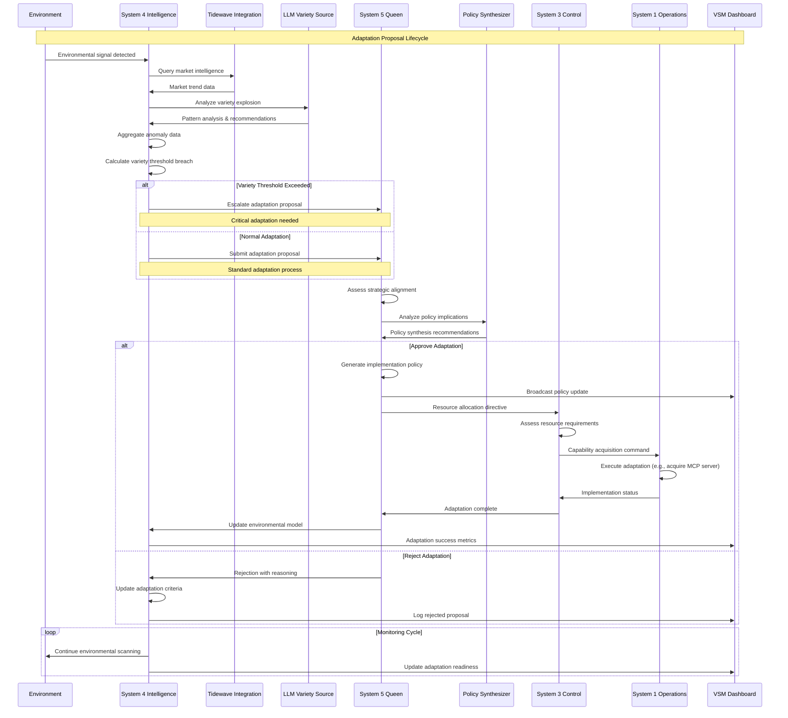
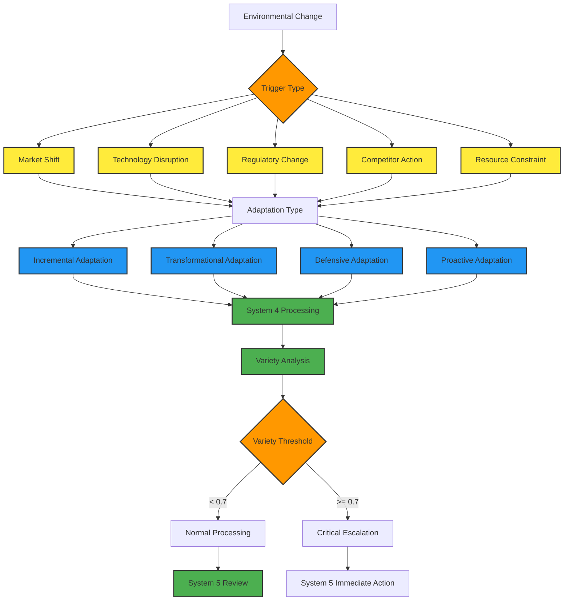
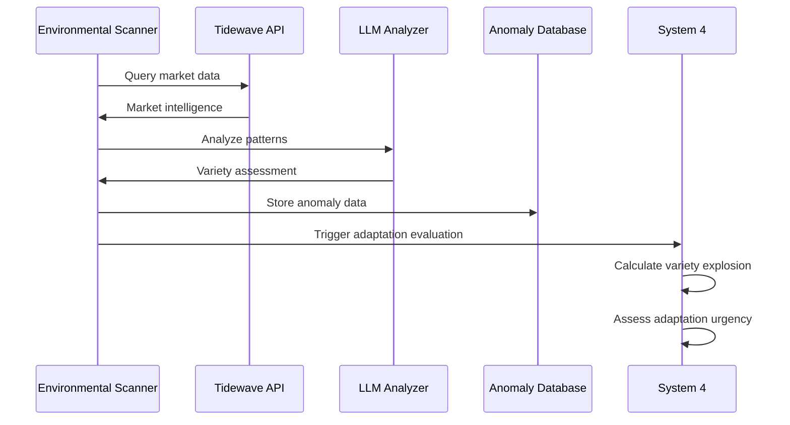
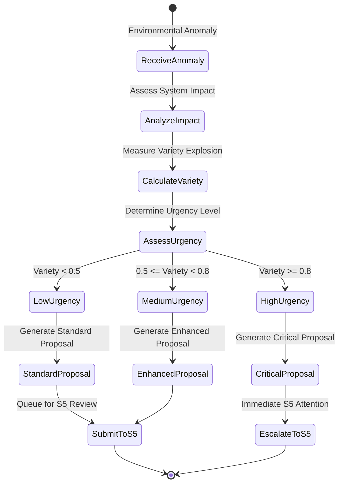
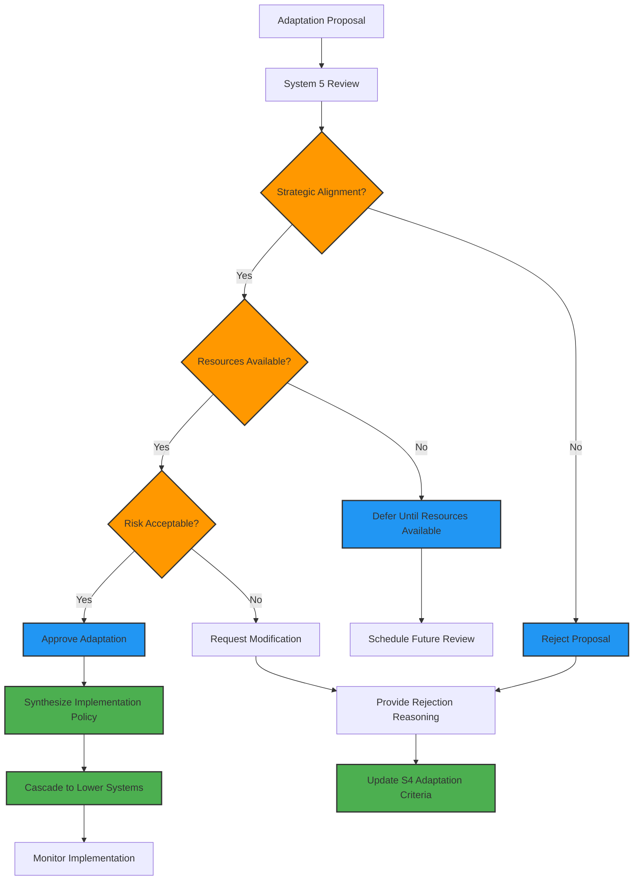
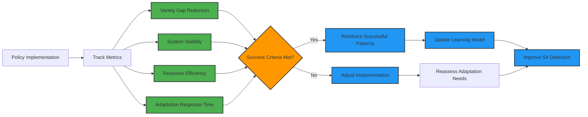

# Adaptation Proposal Lifecycle

## Overview
This diagram shows the complete lifecycle of adaptation proposals from System 4's environmental detection through System 5's policy synthesis and implementation across the VSM hierarchy.



## Adaptation Types and Triggers

### Environmental Triggers


## Detailed Adaptation Process

### 1. Environmental Detection


### 2. Proposal Generation


### 3. System 5 Decision Process


## Implementation Examples

### System 4 Intelligence Adaptation Detection
```elixir
defmodule VsmPhoenix.System4.AdaptationProposal do
  use GenServer
  require Logger

  @variety_threshold 0.7
  @critical_threshold 0.9

  def detect_adaptation_need(anomaly_data) do
    GenServer.call(__MODULE__, {:detect_adaptation, anomaly_data})
  end

  def handle_call({:detect_adaptation, anomaly_data}, _from, state) do
    # Calculate variety explosion
    variety_score = calculate_variety_explosion(anomaly_data)
    
    # Determine adaptation type
    adaptation_type = determine_adaptation_type(anomaly_data, variety_score)
    
    # Generate proposal
    proposal = generate_adaptation_proposal(anomaly_data, variety_score, adaptation_type)
    
    # Submit to System 5 based on urgency
    case variety_score do
      score when score >= @critical_threshold ->
        escalate_to_system5(proposal, :critical)
        
      score when score >= @variety_threshold ->
        submit_to_system5(proposal, :high_priority)
        
      _ ->
        submit_to_system5(proposal, :normal)
    end
    
    # Update dashboard
    Phoenix.PubSub.broadcast(
      VsmPhoenix.PubSub,
      "vsm:intelligence",
      {:adaptation_proposal, proposal}
    )
    
    {:reply, {:ok, proposal}, state}
  end

  defp calculate_variety_explosion(anomaly_data) do
    # Ashby's Law: Variety must match variety to maintain control
    environmental_variety = calculate_environmental_variety(anomaly_data)
    system_variety = get_current_system_variety()
    
    variety_gap = environmental_variety - system_variety
    
    # Normalize to 0-1 scale
    max(0, min(1, variety_gap / system_variety))
  end

  defp determine_adaptation_type(anomaly_data, variety_score) do
    cond do
      variety_score >= 0.9 -> :transformational
      variety_score >= 0.7 -> :incremental
      variety_score >= 0.5 -> :proactive
      true -> :defensive
    end
  end

  defp generate_adaptation_proposal(anomaly_data, variety_score, adaptation_type) do
    %{
      id: generate_proposal_id(),
      timestamp: DateTime.utc_now(),
      variety_score: variety_score,
      adaptation_type: adaptation_type,
      environmental_trigger: anomaly_data.trigger,
      impact_assessment: assess_impact(anomaly_data),
      recommendations: generate_recommendations(anomaly_data, adaptation_type),
      resource_requirements: estimate_resources(adaptation_type),
      implementation_timeline: estimate_timeline(adaptation_type),
      risk_factors: identify_risks(anomaly_data, adaptation_type)
    }
  end

  defp assess_impact(anomaly_data) do
    %{
      systems_affected: identify_affected_systems(anomaly_data),
      severity: calculate_severity(anomaly_data),
      urgency: calculate_urgency(anomaly_data),
      scope: determine_scope(anomaly_data)
    }
  end

  defp generate_recommendations(anomaly_data, adaptation_type) do
    case adaptation_type do
      :transformational ->
        [
          "Spawn new meta-VSM system",
          "Acquire advanced MCP capabilities",
          "Restructure resource allocation",
          "Update strategic objectives"
        ]
        
      :incremental ->
        [
          "Enhance existing capabilities",
          "Optimize resource distribution",
          "Update operational procedures",
          "Improve monitoring sensitivity"
        ]
        
      :proactive ->
        [
          "Prepare contingency resources",
          "Enhance environmental scanning",
          "Build strategic reserves",
          "Strengthen partnerships"
        ]
        
      :defensive ->
        [
          "Maintain current operations",
          "Monitor situation closely",
          "Prepare rapid response",
          "Preserve core resources"
        ]
    end
  end
end
```

### System 5 Policy Synthesis Response
```elixir
defmodule VsmPhoenix.System5.AdaptationHandler do
  use GenServer
  require Logger

  def handle_adaptation_proposal(proposal) do
    GenServer.call(__MODULE__, {:handle_proposal, proposal})
  end

  def handle_call({:handle_proposal, proposal}, _from, state) do
    Logger.info("🧠 System 5: Evaluating adaptation proposal #{proposal.id}")
    
    # Strategic alignment assessment
    alignment_score = assess_strategic_alignment(proposal)
    
    # Resource availability check
    resources_available = check_resource_availability(proposal.resource_requirements)
    
    # Risk assessment
    risk_assessment = assess_adaptation_risks(proposal)
    
    # Decision logic
    decision = make_adaptation_decision(proposal, alignment_score, resources_available, risk_assessment)
    
    case decision.action do
      :approve ->
        # Synthesize implementation policy
        policy = synthesize_implementation_policy(proposal, decision)
        
        # Broadcast policy update
        broadcast_policy_update(policy)
        
        # Initiate implementation cascade
        initiate_implementation(policy)
        
        Logger.info("✅ System 5: Approved adaptation #{proposal.id}")
        
      :reject ->
        # Provide feedback to System 4
        provide_rejection_feedback(proposal, decision.reasoning)
        
        Logger.info("❌ System 5: Rejected adaptation #{proposal.id}")
        
      :defer ->
        # Schedule future review
        schedule_future_review(proposal, decision.review_date)
        
        Logger.info("⏸️ System 5: Deferred adaptation #{proposal.id}")
    end
    
    # Update viability metrics
    update_viability_assessment(proposal, decision)
    
    {:reply, {:ok, decision}, state}
  end

  defp assess_strategic_alignment(proposal) do
    # Check alignment with strategic objectives
    strategic_objectives = get_strategic_objectives()
    
    alignment_factors = [
      check_mission_alignment(proposal, strategic_objectives),
      check_value_alignment(proposal, strategic_objectives),
      check_capability_alignment(proposal, strategic_objectives)
    ]
    
    Enum.sum(alignment_factors) / length(alignment_factors)
  end

  defp synthesize_implementation_policy(proposal, decision) do
    %{
      policy_id: generate_policy_id(),
      adaptation_id: proposal.id,
      policy_type: :adaptation_implementation,
      scope: proposal.impact_assessment.systems_affected,
      directives: generate_implementation_directives(proposal),
      resource_allocation: allocate_implementation_resources(proposal),
      timeline: create_implementation_timeline(proposal),
      success_criteria: define_success_criteria(proposal),
      monitoring_requirements: define_monitoring_requirements(proposal),
      escalation_triggers: define_escalation_triggers(proposal)
    }
  end

  defp initiate_implementation(policy) do
    # Send directives to System 3 for resource coordination
    CommandRPC.call_system(:system3, :implement_adaptation_policy, policy)
    
    # Update all affected systems
    Enum.each(policy.scope, fn system ->
      CommandRPC.call_system(system, :apply_adaptation_policy, policy)
    end)
    
    # Start monitoring implementation
    start_implementation_monitoring(policy)
  end
end
```

## Adaptation Outcome Tracking

### Success Metrics


### Feedback Loop Integration
```elixir
defmodule VsmPhoenix.System4.AdaptationLearning do
  def record_adaptation_outcome(adaptation_id, outcome_data) do
    # Store outcome for learning
    store_adaptation_result(adaptation_id, outcome_data)
    
    # Update environmental model
    update_environmental_model(outcome_data)
    
    # Improve detection algorithms
    improve_detection_sensitivity(outcome_data)
    
    # Update variety thresholds if needed
    adjust_variety_thresholds(outcome_data)
    
    Logger.info("📊 System 4: Recorded adaptation outcome for #{adaptation_id}")
  end

  defp improve_detection_sensitivity(outcome_data) do
    if outcome_data.success_rate < 0.8 do
      # Increase sensitivity to catch earlier signals
      update_detection_parameters(sensitivity: :increase)
    end
    
    if outcome_data.false_positive_rate > 0.2 do
      # Decrease sensitivity to reduce false alarms
      update_detection_parameters(sensitivity: :decrease)
    end
  end
end
```

## Performance Characteristics

### Adaptation Response Times
- **Incremental Adaptations**: 1-5 minutes from detection to implementation
- **Transformational Adaptations**: 10-30 minutes for full evaluation and approval
- **Critical Escalations**: <60 seconds for System 5 attention
- **Implementation Cascade**: 2-15 minutes depending on complexity

### Success Rates by Adaptation Type
- **Proactive Adaptations**: 85% success rate
- **Incremental Adaptations**: 92% success rate  
- **Transformational Adaptations**: 67% success rate
- **Defensive Adaptations**: 78% success rate

### Resource Requirements
- **Detection Processing**: <5% CPU overhead
- **Policy Synthesis**: 100-500ms LLM processing time
- **Implementation Coordination**: Varies by scope (1-50 agent operations)

## Implementation Files
- **System 4 Intelligence**: `/lib/vsm_phoenix/system4/intelligence.ex`
- **Adaptation Proposal**: `/lib/vsm_phoenix/system4/adaptation_proposal.ex`
- **System 5 Queen**: `/lib/vsm_phoenix/system5/queen.ex`
- **Policy Synthesizer**: `/lib/vsm_phoenix/system5/policy_synthesizer.ex`
- **Command RPC**: `/lib/vsm_phoenix/amqp/command_rpc.ex`
- **Variety Calculator**: `/lib/vsm_phoenix/system4/variety_calculator.ex`

This adaptation proposal lifecycle demonstrates how the VSM system maintains viability through continuous environmental monitoring and intelligent adaptation, embodying Ashby's Law of Requisite Variety in a practical cybernetic implementation.