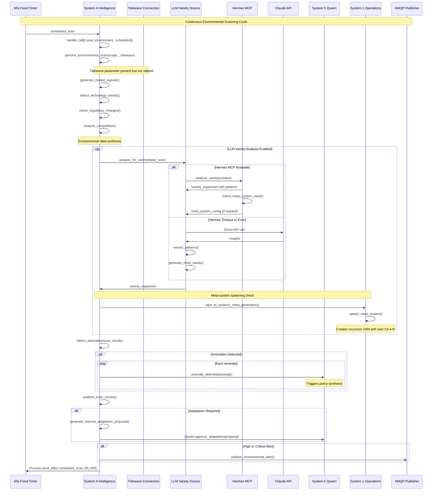
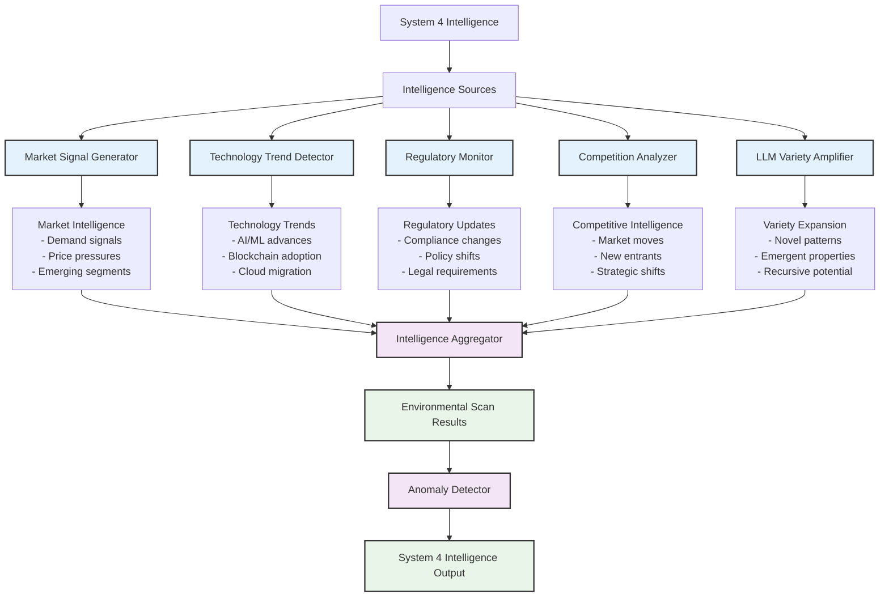
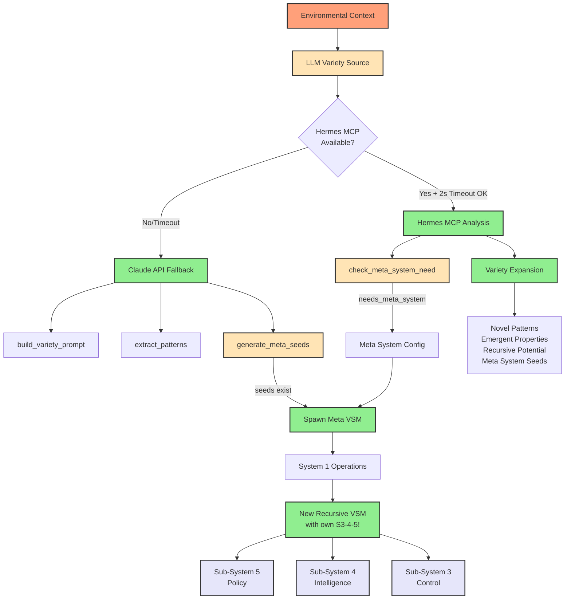
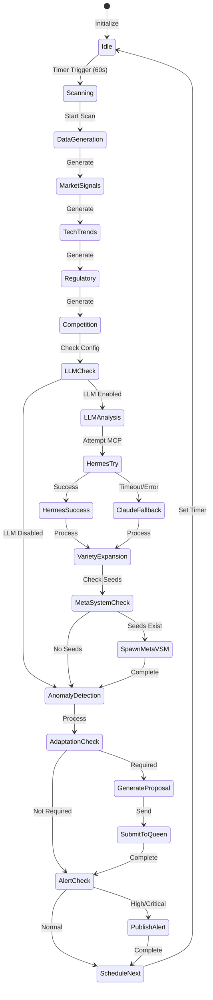
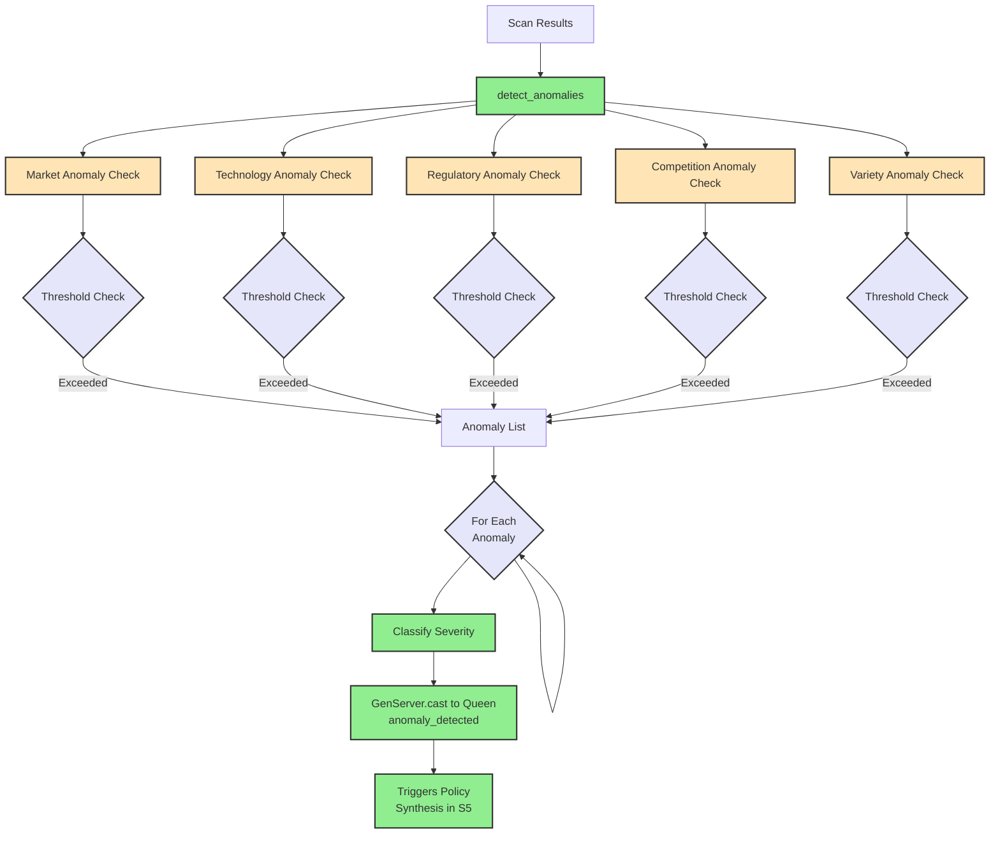
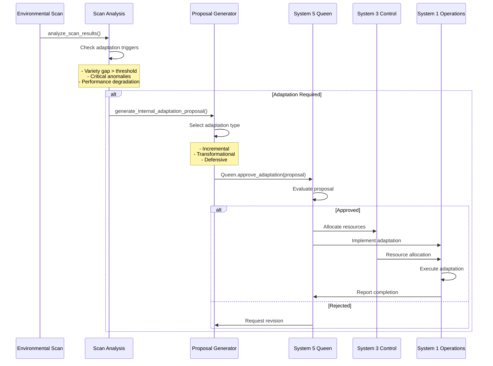
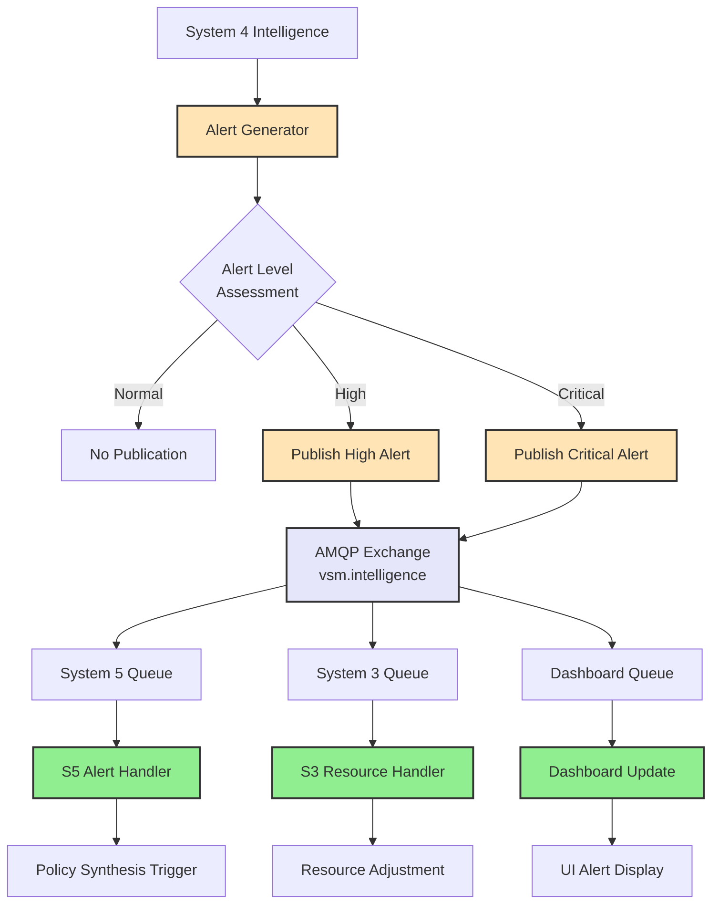
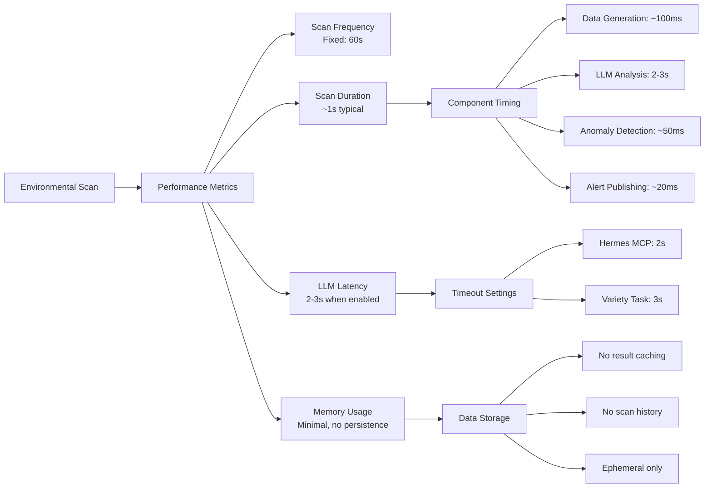

# Environmental Scanning Process

## Overview
This diagram shows System 4's comprehensive environmental scanning process, including intelligence gathering, LLM variety amplification, anomaly detection, and the feedback loops that maintain the organization's environmental awareness.



## Scanning Architecture Components

### Environmental Intelligence Sources


### LLM Variety Amplification Process


## Detailed Scanning Implementation

### System 4 Environmental Scanner State Machine


### Environmental Scan Function Implementation
```elixir
defp perform_environmental_scan(scope, _tidewave) do
  # Base scan structure
  base_scan = %{
    market_signals: generate_market_signals(),
    technology_trends: detect_technology_trends(),
    regulatory_updates: check_regulatory_changes(),
    competitive_moves: analyze_competition(),
    timestamp: DateTime.utc_now()
  }
  
  # LLM variety amplification (optional)
  final_scan = if Application.get_env(:vsm_phoenix, :enable_llm_variety, false) do
    task = Task.async(fn ->
      try do
        LLMVarietySource.analyze_for_variety(base_scan)
      rescue
        e -> 
          Logger.error("LLM variety analysis failed: #{inspect(e)}")
          {:error, :llm_unavailable}
      end
    end)
    
    case Task.yield(task, 3000) || Task.shutdown(task) do
      {:ok, {:ok, variety_expansion}} ->
        Logger.info("🔥 LLM VARIETY EXPLOSION: #{inspect(variety_expansion)}")
        
        if variety_expansion.meta_system_seeds != %{} do
          Logger.info("🌀 RECURSIVE META-SYSTEM OPPORTUNITY DETECTED!")
          spawn(fn -> LLMVarietySource.pipe_to_system1_meta_generation(variety_expansion) end)
        end
        
        Map.merge(base_scan, %{variety_expansion: variety_expansion})
        
      _ ->
        base_scan
    end
  else
    base_scan
  end
  
  final_scan
end
```

### Market Signal Generation
```elixir
defp generate_market_signals do
  [
    %{signal: "increased_demand", strength: 0.7, source: "sales_data"},
    %{signal: "price_pressure", strength: 0.4, source: "market_analysis"},
    %{signal: "new_segment_emerging", strength: 0.6, source: "tidewave"}
  ]
end
```

## Anomaly Detection Engine

### Multi-Level Anomaly Detection Flow


### Anomaly Detection Implementation
```elixir
defp detect_anomalies(scan_data) do
  anomalies = []
  
  # Market signal anomalies
  market_anomalies = scan_data.market_signals
    |> Enum.filter(fn signal -> signal.strength > 0.8 end)
    |> Enum.map(fn signal -> 
      %{
        type: :market_anomaly,
        severity: calculate_severity(signal.strength),
        signal: signal,
        timestamp: DateTime.utc_now()
      }
    end)
  
  # Variety explosion detection
  variety_anomalies = if scan_data[:variety_expansion] do
    if scan_data.variety_expansion.variety_score > 0.8 do
      [%{
        type: :variety_explosion,
        severity: :critical,
        score: scan_data.variety_expansion.variety_score,
        description: "Environmental variety exceeds system capacity"
      }]
    else
      []
    end
  else
    []
  end
  
  anomalies ++ market_anomalies ++ variety_anomalies
end
```

## Adaptation Proposal Lifecycle

### Adaptation Flow from Environmental Scan


## AMQP Alert Distribution

### Environmental Alert Message Flow


### Alert Message Structure
```elixir
%{
  type: "environmental_alert",
  level: :critical,  # :normal, :high, :critical
  source: "system4_intelligence",
  timestamp: DateTime.utc_now(),
  scan_id: "SCAN-12345",
  
  alert_data: %{
    anomaly_count: 3,
    variety_score: 0.85,
    adaptation_required: true,
    critical_signals: [
      %{type: "market_disruption", impact: 0.9},
      %{type: "variety_explosion", impact: 0.85}
    ]
  },
  
  recommendations: [
    "Spawn meta-VSM for market segment",
    "Increase resource allocation by 30%",
    "Activate defensive adaptation mode"
  ]
}
```

## Tidewave Integration Architecture

### Mock Tidewave Connection Flow
```mermaid
graph TB
    S4Init[System 4 Init] --> TideInit[init_tidewave_connection]
    
    TideInit --> MockConn[Create Mock Connection]
    MockConn --> ConnState[Connection State<br/>status: :connected<br/>endpoint: tidewave://localhost:4000]
    
    ConnState --> S4State[Store in S4 State]
    
    S4State --> ScanCall[Environmental Scan Called]
    ScanCall --> TideParam[_tidewave Parameter]
    
    TideParam -->|Ignored| InternalGen[Internal Data Generation]
    
    Note over TideParam,InternalGen: Parameter exists but unused
    
    InternalGen --> MarketGen[generate_market_signals]
    MarketGen --> TideRef[One signal references<br/>source: tidewave]
    
    subgraph "Future Integration Point"
        FutureTide[Real Tidewave API]
        FutureTide -.-> MarketData[Market Intelligence]
        FutureTide -.-> Insights[Business Insights]
        FutureTide -.-> Predictions[Predictive Analytics]
    end
    
    classDef current fill:#90EE90,stroke:#333,stroke-width:2px
    classDef mock fill:#FFE4B5,stroke:#333,stroke-width:2px
    classDef future fill:#E6E6FA,stroke:#333,stroke-width:2px,stroke-dasharray: 5 5
    
    class S4Init,ScanCall current
    class TideInit,MockConn,ConnState,TideParam mock
    class FutureTide,MarketData,Insights,Predictions future
```

## Performance Monitoring

### Scan Performance Metrics


## Configuration and Deployment

### System Configuration
```elixir
# In config/config.exs or runtime.exs
config :vsm_phoenix,
  # LLM Variety Analysis
  enable_llm_variety: false,  # Set to true to enable
  
  # API Keys (if LLM enabled)
  anthropic_api_key: System.get_env("ANTHROPIC_API_KEY"),
  
  # Tidewave (placeholder for future)
  tidewave_api_key: nil,
  tidewave_endpoint: "tidewave://localhost:4000",
  
  # Scanning Configuration
  environmental_scan_interval: 60_000,  # Fixed at 60 seconds
  
  # Anomaly Thresholds
  market_anomaly_threshold: 0.8,
  variety_explosion_threshold: 0.8,
  
  # Alert Levels
  alert_publication_levels: [:high, :critical]
```

### Enabling LLM Variety Analysis
```bash
# Set environment variable
export ANTHROPIC_API_KEY="your-api-key"

# Enable in config
config :vsm_phoenix, enable_llm_variety: true
```

## Implementation Files

### Core Components
- **Environmental Scanner**: `/lib/vsm_phoenix/system4/intelligence.ex`
  - Main scanning loop and coordination
  - Anomaly detection logic
  - Adaptation proposal generation
  
- **LLM Variety Source**: `/lib/vsm_phoenix/system4/llm_variety_source.ex`
  - Hermes MCP integration
  - Claude API fallback
  - Variety pattern extraction
  - Meta-system spawning triggers

### Data Generators
- **Market Signals**: `generate_market_signals/0` in `intelligence.ex`
- **Technology Trends**: `detect_technology_trends/0` in `intelligence.ex`
- **Regulatory Updates**: `check_regulatory_changes/0` in `intelligence.ex`
- **Competition Analysis**: `analyze_competition/0` in `intelligence.ex`

### Integration Points
- **AMQP Publishing**: `publish_environmental_alert/1` via `vsm.intelligence` exchange
- **Queen Integration**: Direct GenServer calls for anomaly reporting
- **S1 Integration**: Meta-system spawning via `Operations.spawn_meta_system/1`

## Advanced Features

### Recursive VSM Spawning
When environmental variety exceeds system capacity:
1. LLM analysis detects variety explosion
2. Meta-system seeds are generated
3. System 1 spawns a new VSM with its own S3-4-5
4. New VSM specializes in handling specific variety domain
5. Parent and child VSMs coordinate via AMQP

### Policy Synthesis Integration
Environmental anomalies trigger automatic policy generation:
1. Anomalies sent to System 5 Queen
2. Queen invokes PolicySynthesizer
3. LLM generates context-appropriate policies
4. Policies distributed via AMQP to all systems

### Future Enhancement Opportunities
1. **Real Tidewave Integration**: Connect to actual market intelligence API
2. **Adaptive Scanning**: Vary frequency based on environmental volatility
3. **Historical Analysis**: Store and analyze scan history for trends
4. **External API Integration**: Connect to real regulatory and competitive data sources
5. **Advanced Anomaly Detection**: Machine learning-based pattern recognition
6. **Distributed Scanning**: Multiple S4 instances for different domains

This environmental scanning system provides VSM with comprehensive situational awareness, enabling proactive adaptation and maintaining requisite variety for effective cybernetic control.