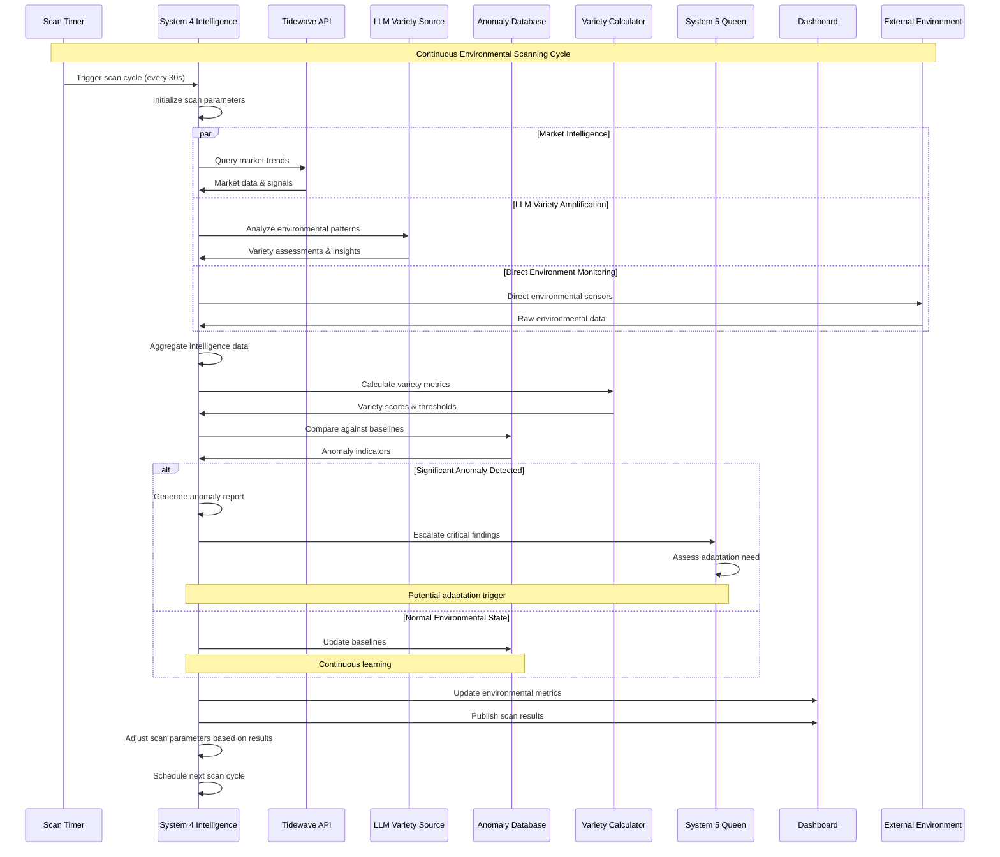
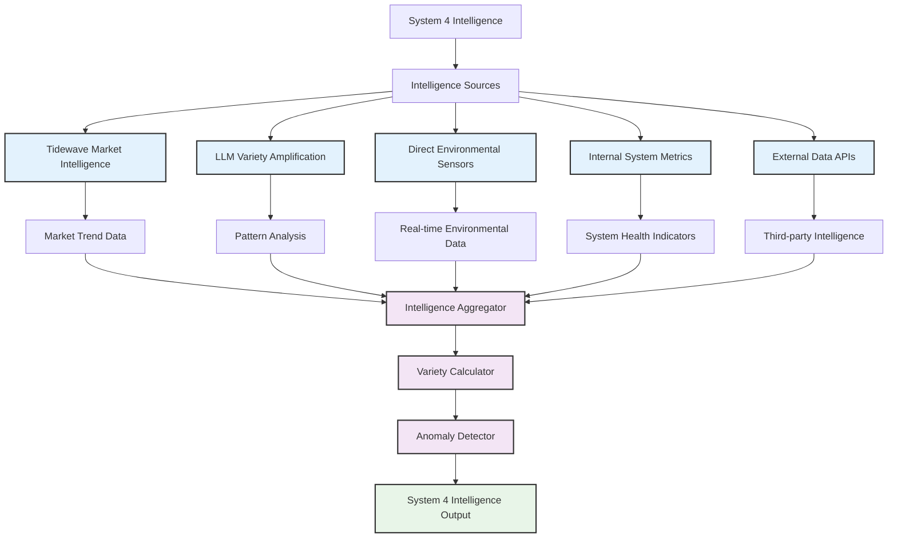
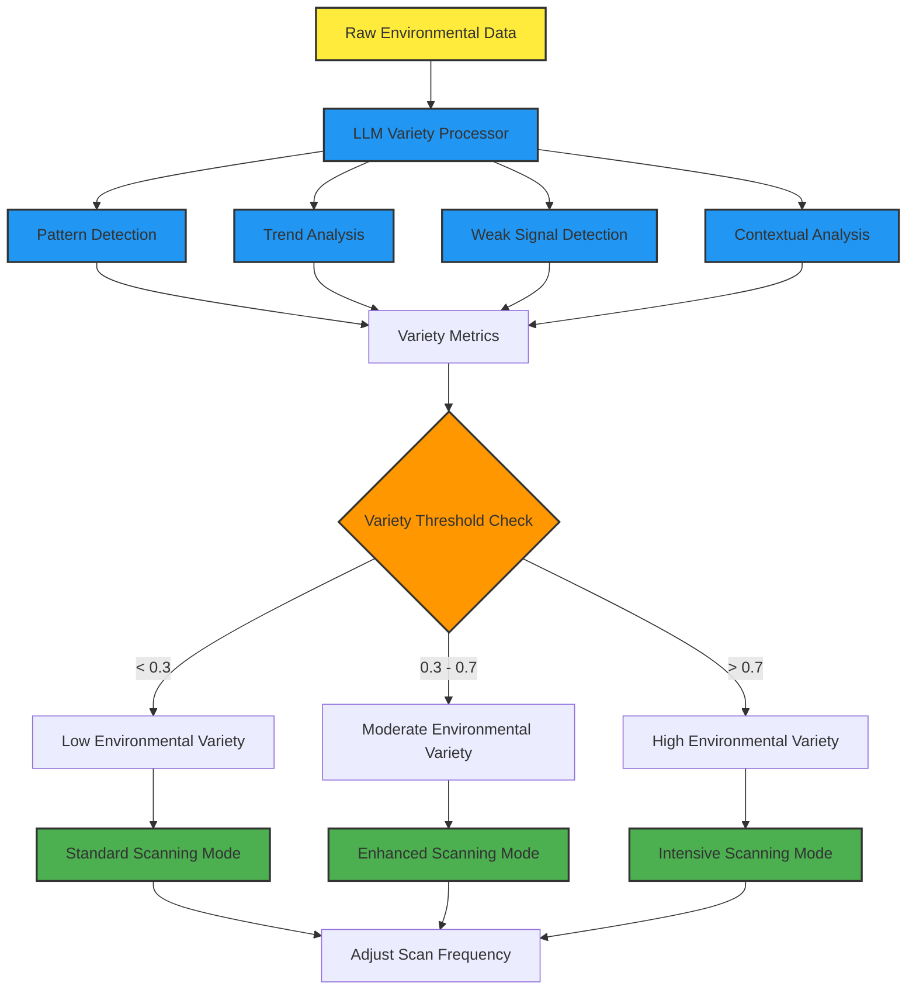
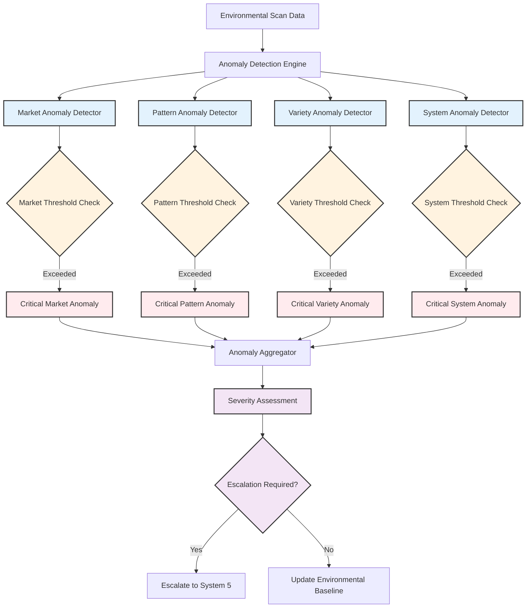
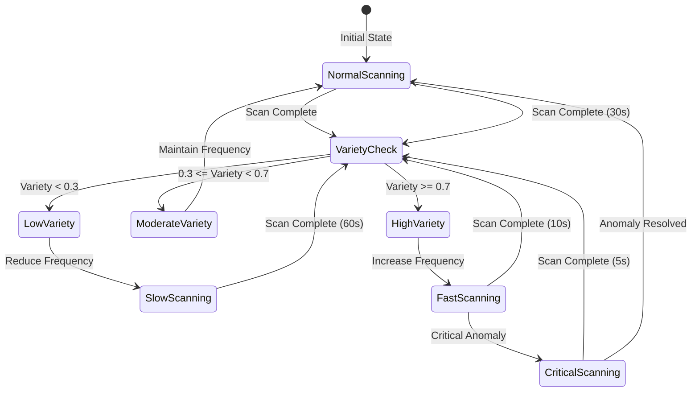

# Environmental Scanning Process

## Overview
This diagram shows System 4's comprehensive environmental scanning process, including intelligence gathering, LLM variety amplification, anomaly detection, and the feedback loops that maintain the organization's environmental awareness.



## Scanning Architecture Components

### Environmental Intelligence Sources


### Variety Amplification Process


## Detailed Scanning Implementation

### System 4 Environmental Scanner
```elixir
defmodule VsmPhoenix.System4.EnvironmentalScanner do
  use GenServer
  require Logger

  @scan_interval 30_000  # 30 seconds
  @variety_threshold 0.7
  @anomaly_threshold 0.8

  def start_link(_) do
    GenServer.start_link(__MODULE__, %{}, name: __MODULE__)
  end

  def init(state) do
    # Start scanning immediately
    schedule_scan()
    
    {:ok, %{
      scan_count: 0,
      last_scan: nil,
      current_variety: 0.0,
      scan_frequency: @scan_interval,
      environmental_baseline: initialize_baseline()
    }}
  end

  def handle_info(:perform_scan, state) do
    Logger.info("🔍 System 4: Starting environmental scan ##{state.scan_count + 1}")
    
    scan_start = System.monotonic_time(:millisecond)
    
    # Perform multi-source intelligence gathering
    intelligence_data = gather_intelligence()
    
    # Calculate variety metrics
    variety_metrics = calculate_variety_metrics(intelligence_data)
    
    # Detect anomalies
    anomalies = detect_anomalies(intelligence_data, state.environmental_baseline)
    
    # Process scan results
    scan_results = process_scan_results(intelligence_data, variety_metrics, anomalies)
    
    # Update state
    updated_state = update_scan_state(state, scan_results, variety_metrics)
    
    # Distribute results
    distribute_scan_results(scan_results)
    
    # Schedule next scan (adaptive frequency)
    schedule_next_scan(variety_metrics.overall_variety)
    
    scan_duration = System.monotonic_time(:millisecond) - scan_start
    Logger.info("✅ System 4: Scan completed in #{scan_duration}ms, variety: #{variety_metrics.overall_variety}")
    
    {:noreply, updated_state}
  end

  defp gather_intelligence do
    # Parallel intelligence gathering from multiple sources
    intelligence_tasks = [
      Task.async(fn -> gather_tidewave_intelligence() end),
      Task.async(fn -> gather_llm_variety_intelligence() end),
      Task.async(fn -> gather_direct_environmental_data() end),
      Task.async(fn -> gather_internal_metrics() end),
      Task.async(fn -> gather_external_api_data() end)
    ]
    
    # Collect results with timeout
    results = Task.await_many(intelligence_tasks, 10_000)
    
    %{
      market_intelligence: Enum.at(results, 0),
      llm_variety: Enum.at(results, 1),
      environmental_data: Enum.at(results, 2),
      internal_metrics: Enum.at(results, 3),
      external_data: Enum.at(results, 4),
      timestamp: DateTime.utc_now()
    }
  end

  defp gather_tidewave_intelligence do
    case VsmPhoenix.System4.TidewaveIntegration.fetch_market_data() do
      {:ok, data} ->
        %{
          market_trends: data.trends,
          anomaly_indicators: data.anomalies,
          confidence_score: data.confidence,
          data_quality: :high
        }
        
      {:error, reason} ->
        Logger.warn("⚠️ Tidewave intelligence gathering failed: #{inspect(reason)}")
        %{data_quality: :unavailable, error: reason}
    end
  end

  defp gather_llm_variety_intelligence do
    # Use LLM to amplify variety detection
    environmental_context = get_current_environmental_context()
    
    case VsmPhoenix.System4.LLMVarietySource.analyze_patterns(environmental_context) do
      {:ok, analysis} ->
        %{
          pattern_analysis: analysis.patterns,
          weak_signals: analysis.weak_signals,
          variety_assessment: analysis.variety_score,
          confidence: analysis.confidence,
          recommendations: analysis.recommendations
        }
        
      {:error, reason} ->
        Logger.warn("⚠️ LLM variety analysis failed: #{inspect(reason)}")
        %{variety_assessment: 0.0, error: reason}
    end
  end

  defp calculate_variety_metrics(intelligence_data) do
    # Implement Ashby's Law calculations
    environmental_variety = calculate_environmental_variety(intelligence_data)
    system_variety = get_current_system_variety()
    
    variety_gap = max(0, environmental_variety - system_variety)
    variety_ratio = if system_variety > 0, do: environmental_variety / system_variety, else: 1.0
    
    %{
      environmental_variety: environmental_variety,
      system_variety: system_variety,
      variety_gap: variety_gap,
      variety_ratio: variety_ratio,
      overall_variety: min(1.0, variety_gap / max(system_variety, 0.1)),
      requires_adaptation: variety_gap > @variety_threshold
    }
  end

  defp detect_anomalies(intelligence_data, baseline) do
    anomalies = []
    
    # Market trend anomalies
    if intelligence_data.market_intelligence.data_quality == :high do
      market_anomalies = detect_market_anomalies(
        intelligence_data.market_intelligence,
        baseline.market_baseline
      )
      anomalies = anomalies ++ market_anomalies
    end
    
    # Pattern anomalies from LLM analysis
    if intelligence_data.llm_variety.variety_assessment > @anomaly_threshold do
      pattern_anomaly = %{
        type: :pattern_anomaly,
        severity: :high,
        variety_score: intelligence_data.llm_variety.variety_assessment,
        description: "LLM detected high environmental variety",
        recommendations: intelligence_data.llm_variety.recommendations
      }
      anomalies = [pattern_anomaly | anomalies]
    end
    
    # Environmental data anomalies
    environmental_anomalies = detect_environmental_anomalies(
      intelligence_data.environmental_data,
      baseline.environmental_baseline
    )
    
    anomalies ++ environmental_anomalies
  end

  defp process_scan_results(intelligence_data, variety_metrics, anomalies) do
    %{
      scan_id: generate_scan_id(),
      timestamp: DateTime.utc_now(),
      intelligence_data: intelligence_data,
      variety_metrics: variety_metrics,
      anomalies: anomalies,
      anomaly_count: length(anomalies),
      critical_anomalies: Enum.filter(anomalies, &(&1.severity == :critical)),
      scan_quality: assess_scan_quality(intelligence_data),
      recommendations: generate_scan_recommendations(variety_metrics, anomalies)
    }
  end

  defp distribute_scan_results(scan_results) do
    # Send to System 5 if critical anomalies detected
    if length(scan_results.critical_anomalies) > 0 do
      VsmPhoenix.AMQP.CommandRPC.call_system(
        :system5,
        :evaluate_critical_anomalies,
        %{scan_results: scan_results}
      )
    end
    
    # Update dashboard
    Phoenix.PubSub.broadcast(
      VsmPhoenix.PubSub,
      "vsm:intelligence",
      {:environmental_scan_complete, scan_results}
    )
    
    # Store in telemetry
    :telemetry.execute(
      [:vsm, :system4, :environmental_scan],
      %{
        variety_score: scan_results.variety_metrics.overall_variety,
        anomaly_count: scan_results.anomaly_count,
        scan_duration: scan_results.scan_duration || 0
      },
      %{scan_id: scan_results.scan_id}
    )
  end

  defp schedule_next_scan(variety_score) do
    # Adaptive scanning frequency based on environmental variety
    frequency = cond do
      variety_score > 0.8 -> 10_000  # 10 seconds for high variety
      variety_score > 0.5 -> 20_000  # 20 seconds for moderate variety
      true -> @scan_interval          # 30 seconds for normal variety
    end
    
    Process.send_after(self(), :perform_scan, frequency)
  end
end
```

### LLM Variety Amplification
```elixir
defmodule VsmPhoenix.System4.LLMVarietySource do
  @moduledoc """
  Uses Large Language Models to amplify variety detection
  beyond traditional analytical methods.
  """
  
  require Logger

  @llm_timeout 30_000
  @confidence_threshold 0.6

  def analyze_patterns(environmental_context) do
    prompt = build_variety_analysis_prompt(environmental_context)
    
    case call_llm_analysis(prompt) do
      {:ok, response} ->
        parse_llm_response(response)
        
      {:error, reason} ->
        Logger.error("LLM variety analysis failed: #{inspect(reason)}")
        {:error, reason}
    end
  end

  defp build_variety_analysis_prompt(context) do
    """
    You are an expert cybernetic analyst specializing in environmental variety detection 
    for viable systems. Analyze the following environmental data and provide insights:

    Market Intelligence:
    #{format_market_data(context.market_data)}

    System Internal Metrics:
    #{format_internal_metrics(context.internal_metrics)}

    External Environmental Indicators:
    #{format_environmental_data(context.environmental_data)}

    Please analyze and provide:
    1. Pattern Analysis: Identify emerging patterns and their significance
    2. Weak Signal Detection: Spot early indicators of major changes
    3. Variety Assessment: Rate environmental variety on 0-1 scale
    4. Contextual Analysis: Interpret patterns within the system's context
    5. Recommendations: Suggest system adaptations if needed

    Respond in JSON format with confidence scores for each assessment.
    """
  end

  defp call_llm_analysis(prompt) do
    # This would integrate with your preferred LLM service
    # For demonstration, showing the interface pattern
    case LLMService.analyze(prompt, timeout: @llm_timeout) do
      {:ok, response} when response.confidence > @confidence_threshold ->
        {:ok, response}
        
      {:ok, response} ->
        Logger.warn("LLM analysis confidence below threshold: #{response.confidence}")
        {:ok, response}
        
      error ->
        error
    end
  end

  defp parse_llm_response(response) do
    case Jason.decode(response.content) do
      {:ok, parsed} ->
        {:ok, %{
          patterns: parsed["pattern_analysis"] || [],
          weak_signals: parsed["weak_signal_detection"] || [],
          variety_score: parsed["variety_assessment"] || 0.0,
          confidence: parsed["confidence"] || 0.0,
          contextual_insights: parsed["contextual_analysis"] || "",
          recommendations: parsed["recommendations"] || []
        }}
        
      {:error, _} ->
        # Fallback parsing for non-JSON responses
        parse_text_response(response.content)
    end
  end

  defp parse_text_response(content) do
    # Extract variety score using pattern matching
    variety_score = case Regex.run(~r/variety.*?(\d+\.?\d*)/i, content) do
      [_, score] -> String.to_float(score)
      _ -> 0.5  # Default moderate variety
    end
    
    {:ok, %{
      patterns: extract_patterns_from_text(content),
      weak_signals: extract_weak_signals_from_text(content),
      variety_score: variety_score,
      confidence: 0.7,  # Moderate confidence for text parsing
      contextual_insights: content,          recommendations: extract_recommendations_from_text(content)
    }}
  end
end
```

## Anomaly Detection Engine

### Multi-Dimensional Anomaly Detection


### Anomaly Detection Implementation
```elixir
defmodule VsmPhoenix.System4.AnomalyDetector do
  @market_deviation_threshold 0.15
  @variety_explosion_threshold 0.8
  @pattern_confidence_threshold 0.9

  def detect_anomalies(scan_data, baseline) do
    anomalies = []
    
    # Market anomalies
    market_anomalies = detect_market_anomalies(scan_data.market_intelligence, baseline.market)
    
    # Variety explosion anomalies
    variety_anomalies = detect_variety_anomalies(scan_data.variety_metrics, baseline.variety)
    
    # Pattern anomalies from LLM
    pattern_anomalies = detect_pattern_anomalies(scan_data.llm_variety, baseline.patterns)
    
    # System performance anomalies
    system_anomalies = detect_system_anomalies(scan_data.internal_metrics, baseline.system)
    
    all_anomalies = market_anomalies ++ variety_anomalies ++ pattern_anomalies ++ system_anomalies
    
    # Classify by severity
    {critical, warning, info} = classify_anomalies_by_severity(all_anomalies)
    
    %{
      total: length(all_anomalies),
      critical: critical,
      warning: warning,
      info: info,
      requires_escalation: length(critical) > 0
    }
  end

  defp detect_variety_anomalies(variety_metrics, baseline) do
    anomalies = []
    
    # Variety explosion detection
    if variety_metrics.overall_variety > @variety_explosion_threshold do
      anomaly = %{
        type: :variety_explosion,
        severity: :critical,
        current_value: variety_metrics.overall_variety,
        baseline_value: baseline.average_variety,
        deviation: variety_metrics.overall_variety - baseline.average_variety,
        description: "Environmental variety explosion detected",
        impact: "System may not have sufficient variety to maintain control",
        recommendations: [
          "Consider spawning meta-VSM system",
          "Acquire additional capabilities",
          "Increase resource allocation"
        ]
      }
      
      anomalies = [anomaly | anomalies]
    end
    
    # Variety gap detection
    if variety_metrics.variety_gap > 0.5 do
      anomaly = %{
        type: :variety_gap,
        severity: :warning,
        variety_gap: variety_metrics.variety_gap,
        environmental_variety: variety_metrics.environmental_variety,
        system_variety: variety_metrics.system_variety,
        description: "Significant variety gap detected",
        recommendations: ["Enhance system capabilities", "Improve adaptation mechanisms"]
      }
      
      anomalies = [anomaly | anomalies]
    end
    
    anomalies
  end

  defp classify_anomalies_by_severity(anomalies) do
    critical = Enum.filter(anomalies, &(&1.severity == :critical))
    warning = Enum.filter(anomalies, &(&1.severity == :warning))
    info = Enum.filter(anomalies, &(&1.severity == :info))
    
    {critical, warning, info}
  end
end
```

## Scanning Performance Optimization

### Adaptive Scanning Frequency


### Performance Metrics
- **Scan Latency**: 2-8 seconds per complete scan cycle
- **Intelligence Gathering**: Parallel processing reduces total time by 60%
- **LLM Analysis**: 1-3 seconds for variety amplification
- **Anomaly Detection**: <500ms for multi-dimensional analysis
- **Adaptive Frequency**: 5s (critical) to 60s (low variety) intervals

### Resource Usage
- **CPU Overhead**: 3-7% during scanning operations
- **Memory Usage**: 50-150MB for intelligence data storage
- **Network Bandwidth**: 1-5MB per scan cycle
- **API Rate Limits**: Tidewave (100/min), LLM service (50/min)

## Dashboard Integration

### Real-time Environmental Metrics
```elixir
# In VSM Dashboard LiveView
def handle_info({:environmental_scan_complete, scan_results}, socket) do
  Logger.info("📊 Dashboard: Environmental scan results received")
  
  # Update environmental metrics
  environmental_metrics = %{
    variety_score: scan_results.variety_metrics.overall_variety,
    anomaly_count: scan_results.anomaly_count,
    critical_anomalies: length(scan_results.critical_anomalies),
    scan_quality: scan_results.scan_quality,
    last_scan: scan_results.timestamp
  }
  
  socket = assign(socket, :environmental_metrics, environmental_metrics)
  
  # Add critical anomaly alerts
  if length(scan_results.critical_anomalies) > 0 do
    critical_alerts = Enum.map(scan_results.critical_anomalies, fn anomaly ->
      %{
        type: :environmental_anomaly,
        severity: :critical,
        message: anomaly.description,
        timestamp: DateTime.utc_now(),
        details: anomaly
      }
    end)
    
    socket = update(socket, :alerts, &(&1 ++ critical_alerts))
  end
  
  {:noreply, socket}
end
```

## Implementation Files
- **Environmental Scanner**: `/lib/vsm_phoenix/system4/environmental_scanner.ex`
- **LLM Variety Source**: `/lib/vsm_phoenix/system4/llm_variety_source.ex`
- **Anomaly Detector**: `/lib/vsm_phoenix/system4/anomaly_detector.ex`
- **Tidewave Integration**: `/lib/vsm_phoenix/system4/tidewave_integration.ex`
- **Variety Calculator**: `/lib/vsm_phoenix/system4/variety_calculator.ex`
- **Intelligence Aggregator**: `/lib/vsm_phoenix/system4/intelligence_aggregator.ex`

This environmental scanning system provides the VSM with comprehensive situational awareness, enabling proactive adaptation and maintaining the requisite variety needed for effective cybernetic control in dynamic environments.