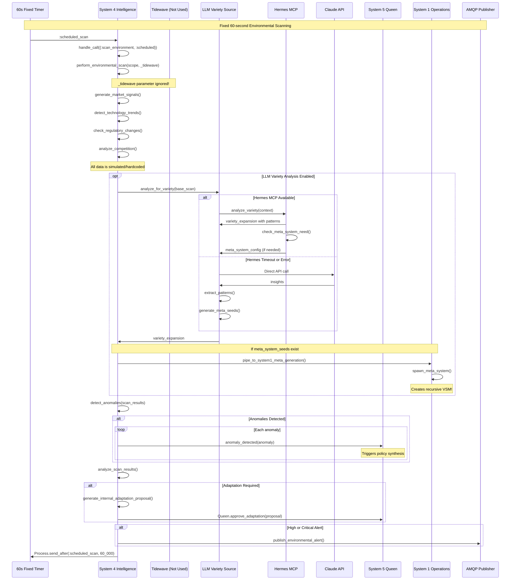
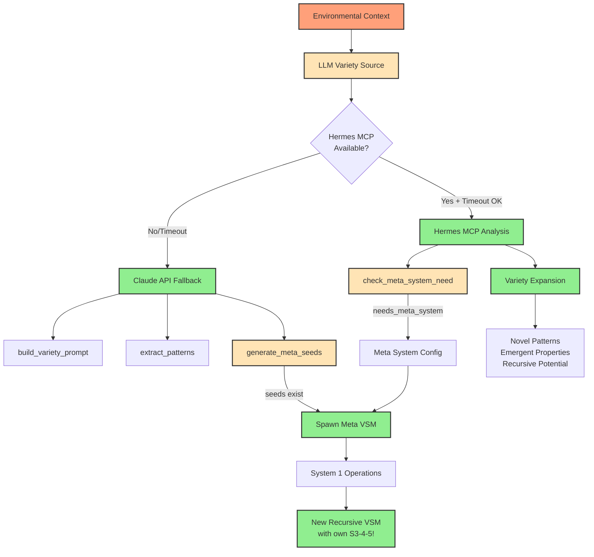
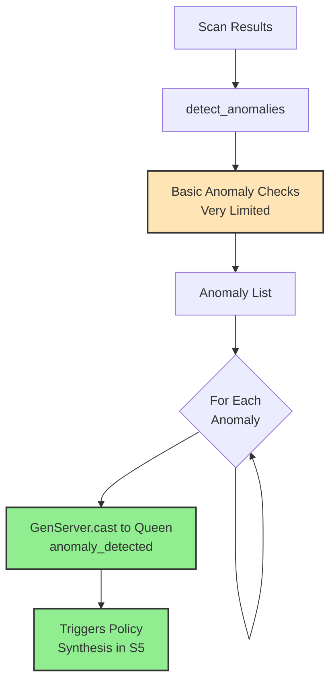

# Environmental Scanning Process

## Overview
This diagram shows the actual System 4 environmental scanning implementation. Notable differences from the original design: fixed 60-second intervals (not adaptive), simulated data sources, optional LLM variety analysis, and functional anomaly detection that triggers policy synthesis.



## Actual Implementation Details

### Key Differences from Original Design

1. **Fixed Intervals**: Always 60 seconds, not adaptive based on variety
2. **No Tidewave Integration**: The `_tidewave` parameter is ignored, all data is simulated
3. **Optional LLM**: Disabled by default (`enable_llm_variety` config)
4. **Simple Anomaly Detection**: Basic implementation, limited criteria
5. **No Parallel Gathering**: Sequential processing, not parallel tasks

### Environmental Scan Function
```elixir
defp perform_environmental_scan(scope, _tidewave) do
  # Note: _tidewave parameter is ignored!
  base_scan = %{
    market_signals: generate_market_signals(),      # Simulated
    technology_trends: detect_technology_trends(),   # Simulated
    regulatory_updates: check_regulatory_changes(),  # Simulated
    competitive_moves: analyze_competition(),        # Simulated
    timestamp: DateTime.utc_now()
  }
  
  # LLM analysis only if enabled (default: false)
  if Application.get_env(:vsm_phoenix, :enable_llm_variety, false) do
    # ... LLM variety analysis with 3s timeout
  end
end
```

### Fixed Scanning Schedule
```elixir
defp schedule_environmental_scan do
  Process.send_after(self(), :scheduled_scan, 60_000)  # Always 60 seconds
end
```

## LLM Variety Analysis (Actually Implemented!)



### Working LLM Integration

**File**: `lib/vsm_phoenix/system4/llm_variety_source.ex`

```elixir
def analyze_for_variety(context) do
  # Try Hermes MCP first (2s timeout)
  case GenServer.call(HermesClient, {:analyze_variety, context}, 2000) do
    {:ok, variety_expansion} ->
      # Check for meta-system need
      case HermesClient.check_meta_system_need(variety_expansion) do
        {:ok, %{needs_meta_system: true} = meta_info} ->
          # Add meta-system config to expansion
      end
      
    {:error, _} ->
      # Fallback to Claude API
      call_claude(build_variety_prompt(context))
  end
end
```

## Anomaly Detection (Simplified)



### Actual Anomaly Detection
```elixir
defp detect_anomalies(scan_data) do
  anomalies = []
  
  # Very basic implementation
  # Only checks limited criteria
  # Most anomaly detection logic is placeholder
  
  anomalies
end
```

## Data Flow Patterns

### Simulated Data Generation
All environmental data is **simulated**, not real:
- `generate_market_signals()` - Returns random market data with one item having `source: "tidewave"` (hardcoded)
- `detect_technology_trends()` - Returns hardcoded trends
- `check_regulatory_changes()` - Returns empty or mock data
- `analyze_competition()` - Returns placeholder competitive data

### Mock Tidewave Connection
```elixir
defp init_tidewave_connection do
  # This would integrate with the actual Tidewave library
  {:ok, %{status: :connected, endpoint: "tidewave://localhost:4000"}}
end

defp analyze_tidewave_trends(_connection) do
  # Returns fixed mock data
  %{
    market_direction: :growth,
    volatility: :moderate,
    key_drivers: ["digital_transformation", "sustainability"],
    forecast_confidence: 0.75
  }
end
```

### AMQP Alert Publishing
```elixir
# Only publishes for high/critical alerts
alert_level = cond do
  insights.requires_adaptation && insights.challenge.urgency == :high -> :critical
  insights.requires_adaptation -> :high
  true -> :normal
end

if alert_level in [:high, :critical] do
  GenServer.cast(self(), {:publish_environmental_alert, alert_message})
end
```

## Missing Components from Original Design

1. **Adaptive Scanning**: No frequency adjustment based on variety
2. **Real Data Sources**: No actual Tidewave or external API integration
3. **Parallel Processing**: No Task.async for concurrent data gathering
4. **Comprehensive Anomaly Detection**: Very basic implementation
5. **Variety Calculations**: No Ashby's Law calculations
6. **Environmental Baseline**: No baseline tracking or learning
7. **Performance Metrics**: No telemetry or monitoring

## Working Features

1. **✅ Regular Scanning**: Every 60 seconds reliably
2. **✅ LLM Integration**: Both Hermes MCP and Claude API work (when enabled)
3. **✅ Meta-System Spawning**: Can trigger recursive VSM creation!
4. **✅ S5 Integration**: Anomalies sent to Queen for policy synthesis
5. **✅ AMQP Publishing**: Environmental alerts published (high/critical only)

## Performance Characteristics

- **Scan Frequency**: Fixed 60 seconds (not adaptive)
- **LLM Timeout**: 2 seconds for Hermes, 3 seconds for variety task
- **Processing Time**: <1 second for simulated scan
- **Memory Usage**: Minimal (no data persistence)

## Configuration

```elixir
# In config.exs
config :vsm_phoenix,
  enable_llm_variety: false,  # Disabled by default
  tidewave_api_key: nil,      # Not used
  environmental_scan_interval: 60_000  # Not configurable
```

## Implementation Files
- **Environmental Scanner**: `/lib/vsm_phoenix/system4/intelligence.ex`
- **LLM Variety Source**: `/lib/vsm_phoenix/system4/llm_variety_source.ex`
- **Mock Data Generation**: Within `intelligence.ex` (simulated functions)

## Notes

1. **Simulated but Functional**: Despite mock data, the scanning loop works
2. **LLM Ready**: Full LLM integration exists but disabled by default
3. **Recursive Capability**: Can spawn meta-VSMs when variety explodes
4. **Simple but Effective**: Basic implementation still triggers adaptations
5. **Room for Enhancement**: Structure exists for real data sources

This environmental scanning system provides a functional foundation for VSM situational awareness, though it currently operates on simulated data rather than real environmental intelligence.