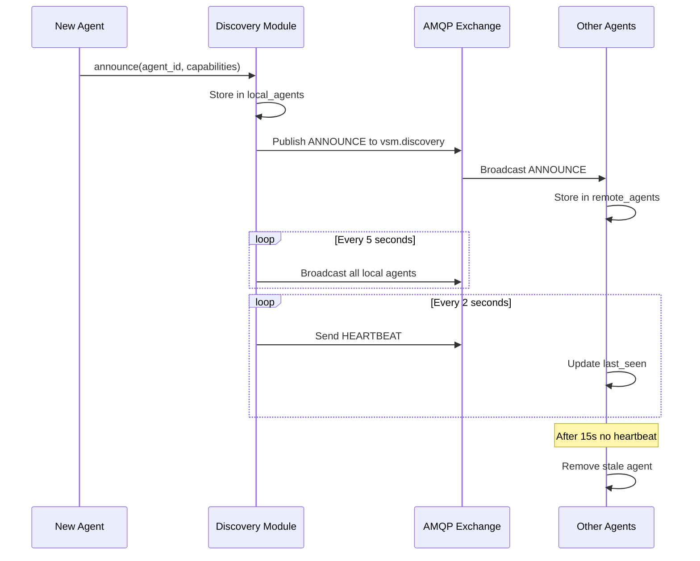
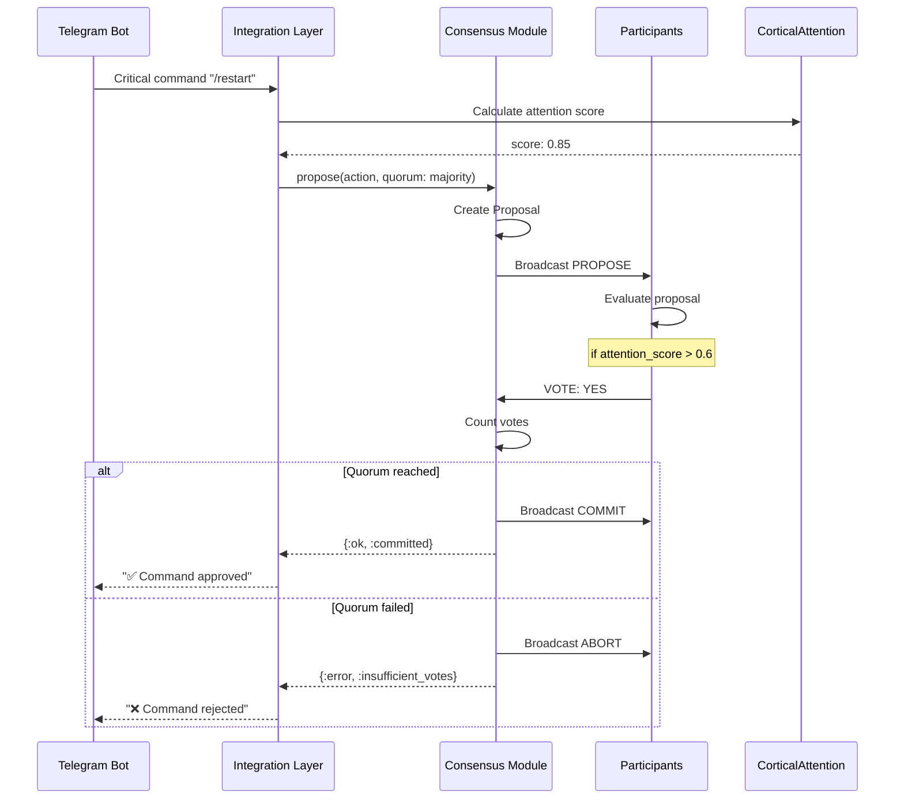
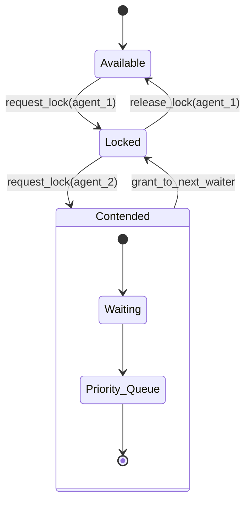
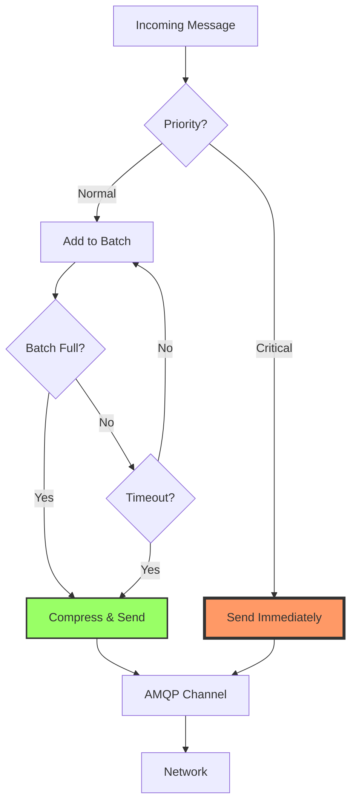
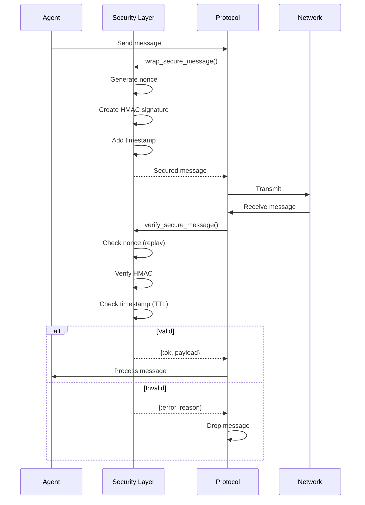
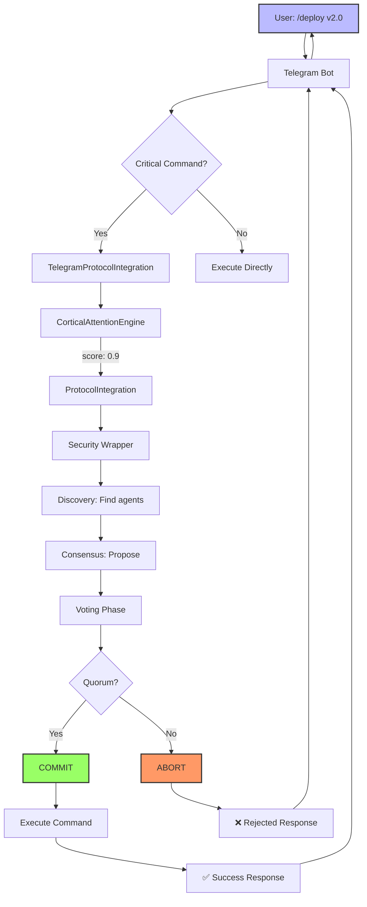

# Advanced aMCP Protocol Extensions - Message Flows

## 1. Agent Discovery Flow



## 2. Consensus Decision Flow



## 3. Distributed Lock Flow



## 4. Network Optimization Flow



## 5. Security Integration Flow



## 6. Complete Telegram Command Flow



## Message Routing Patterns

### Discovery Exchange Routing
```
vsm.discovery
├── discovery.announce     → All agents
├── discovery.query        → Query processors
├── discovery.respond      → Query initiator
├── discovery.heartbeat    → All agents
└── discovery.goodbye      → All agents
```

### Consensus Exchange Routing
```
vsm.consensus
├── consensus.propose      → All participants
├── consensus.vote         → Proposal coordinator
├── consensus.commit       → All participants
├── consensus.abort        → All participants
├── lock.request          → Lock manager
└── lock.grant            → Waiting agents
```

## Performance Optimization Strategies

### 1. Message Batching Logic
```elixir
# Batch decision factors
batch_decision = fn message ->
  cond do
    message.priority >= 0.9 -> :send_now
    batch.message_count >= 50 -> :flush_batch
    batch.total_bytes >= 64_000 -> :flush_batch
    batch.age >= 100 -> :flush_batch
    true -> :add_to_batch
  end
end
```

### 2. Compression Strategy
```elixir
# Compression decision
compress? = fn payload ->
  byte_size(payload) > 1024 and 
  not is_already_compressed?(payload)
end
```

### 3. Gossip Propagation
```elixir
# Select random peers for gossip
peers_to_gossip = fn all_peers ->
  all_peers
  |> Enum.reject(&(&1 == self()))
  |> Enum.take_random(@gossip_fanout)
end
```

## Error Handling Patterns

### 1. Discovery Failures
- **Missing Heartbeat**: Agent marked as dead after 15s
- **Network Partition**: Gossip ensures eventual consistency
- **Invalid Announcement**: Logged and dropped

### 2. Consensus Failures
- **Timeout**: Proposal aborted, requester notified
- **Split Vote**: Follows quorum rules (majority/all)
- **Leader Failure**: New election triggered

### 3. Network Failures
- **Channel Loss**: Automatic reconnection via ConnectionManager
- **Message Loss**: Application-level acknowledgments
- **Overload**: Circuit breaker pattern prevents cascade

## Integration Points

### With Existing VSM Components

1. **CorticalAttentionEngine**
   - Calculates message priorities
   - Influences consensus voting
   - Determines batch urgency

2. **Security Infrastructure**
   - All messages HMAC signed
   - Nonce validation prevents replay
   - TTL enforcement

3. **CRDT Store**
   - State synchronization between agents
   - Conflict-free replicated data
   - Eventually consistent

4. **Causality Tracking**
   - Message correlation
   - Event chain tracking
   - Debugging support

## Monitoring and Observability

### Key Metrics to Track

```elixir
# Discovery health
- agents.discovered.count
- agents.active.count
- heartbeats.sent.rate
- gossip.messages.rate

# Consensus performance
- proposals.total.count
- proposals.accepted.rate
- consensus.latency.p99
- elections.triggered.count

# Network efficiency
- messages.batched.count
- compression.ratio.avg
- bandwidth.saved.bytes
- latency.adaptive.current

# Integration usage
- secure.operations.count
- telegram.consensus.commands
- crdt.syncs.performed
- vsm.spawns.coordinated
```

## Best Practices

1. **Always use Protocol Integration** for cross-agent coordination
2. **Set appropriate priorities** based on operation criticality
3. **Monitor consensus latency** and adjust timeouts accordingly
4. **Enable compression** for large payloads
5. **Use discovery queries** sparingly (cache results)
6. **Implement custom voting logic** for domain-specific decisions
7. **Handle all error cases** in consensus callbacks